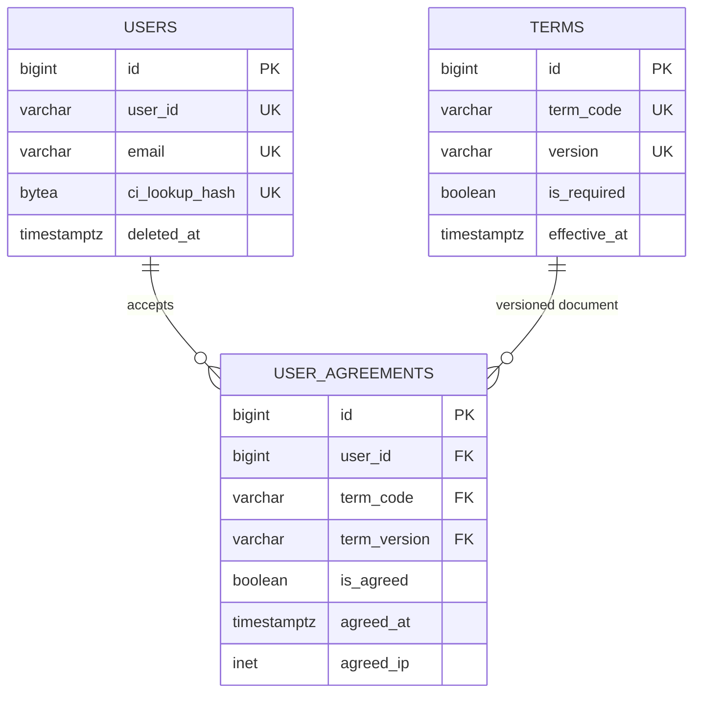

# 회원가입 PostgreSQL 설계

이 문서는 프론트엔드 회원가입 명세 Version 1.0을 PostgreSQL 17과 현재 프로젝트의 SQLAlchemy/Alembic 규칙에 맞춰 구현한 결과다. 회원가입 API, OTP, 토큰, CI/DI 암복호화 코드는 이 범위에 포함하지 않는다.

## 구조와 역할



- `public.users`: 가입이 완료된 계정의 핵심 정보다. `user_id`, email, 전화번호, 인증 결과, 회원/계정 상태와 soft delete 시각을 보관한다.
- `public.terms`: 서버가 허용할 약관 코드와 버전의 catalog다. 전문 자체는 배포/법무 workflow와 결합되지 않도록 `content_reference`로 연결한다. 전문을 DB에 보관하기로 결정하면 별도 immutable content column 또는 문서 저장소 정책을 추가한다.
- `public.user_agreements`: 사용자별·약관별·버전별 동의 audit row다. `(term_code, term_version)`은 반드시 `terms`에 존재해야 하며 한 사용자가 동일 버전에 중복 동의할 수 없다.

## PostgreSQL 재설계와 제약

- MySQL `AUTO_INCREMENT`는 `GENERATED BY DEFAULT AS IDENTITY`, `TINYINT(1)`은 `BOOLEAN`, `DATETIME(3)`은 timezone-aware timestamp, IP 문자열은 `INET`로 바꿨다.
- `users.updated_at`은 `trg_users_updated_at` trigger가 direct SQL과 ORM update 모두에서 갱신한다.
- `user_id`는 소문자 영문/숫자 6~16자다. 프론트는 대문자도 허용하므로 백엔드는 최종 insert 전에 소문자로 정규화해야 한다. 이 규칙으로 대소문자만 다른 로그인 ID 중복을 막는다.
- email도 백엔드가 trim 후 소문자로 정규화해야 한다. DB의 lowercase CHECK와 UNIQUE가 대소문자 우회를 막는다. 이메일 정규화는 local-part 변경이나 `+tag` 제거까지 확대하지 않는다.
- `birthdate`는 프론트/본인확인 payload와 동일한 YYMMDD 6자리를 보존한다. 달력상 유효성과 세기 판정은 인증 사업자 응답을 기준으로 백엔드가 검증해야 한다.
- 전화번호는 국내형 `0`으로 시작하는 10~11자리만 허용하며 unique가 아니다. 국제 번호 지원이 필요해지면 E.164 column/policy migration이 필요하다.
- `member_type`은 `ASSOCIATE | FULL`, `account_status`는 `ACTIVE | DORMANT | SUSPENDED | WITHDRAWN` CHECK로 제한한다. 명세에 값 정의가 없는 `telecom_carrier`, `gender`는 변경 비용을 피하려고 강한 enum/CHECK를 두지 않았다.
- 인증 boolean과 인증 시각은 함께 있거나 함께 없어야 한다. 탈퇴 상태에는 `deleted_at`이 필요하다.
- 동의/비동의와 `agreed_at`도 서로 일치해야 한다. `is_required`는 당시 약관 속성의 audit snapshot이며, 가입 transaction에서 catalog 값으로 복사해야 한다.

## CI/DI 보안 경계

CI/DI plaintext column은 만들지 않았다.

- `ci_encrypted`, `di_encrypted`: backend가 KMS/Key Vault에서 관리하는 키로 randomized authenticated encryption(AES-256-GCM 등)을 적용한 ciphertext를 `BYTEA`로 저장한다.
- `ci_lookup_hash`: 별도 lookup key를 사용한 HMAC-SHA-256 결과 32 bytes를 저장한다. UNIQUE index로 동일인 중복 가입을 판정한다. 단순 SHA-256은 입력 공간 공격에 취약하므로 사용하지 않는다.
- 암호화 key와 HMAC key는 분리하고 DB, seed, 로그, source control에 넣지 않는다. key rotation 시 ciphertext와 lookup hash의 versioning 전략을 백엔드/인프라가 추가로 정해야 한다.
- DI는 현재 조회 요구가 없어 encrypted 값만 저장한다. DI 검색 요구가 생길 때만 별도 keyed lookup hash를 추가한다.

## Index와 soft delete 정책

- `uq_users_user_id`, `uq_users_email`: 로그인/중복 확인과 uniqueness를 함께 담당한다.
- `uq_users_ci_lookup_hash`: CI 기반 동일인 조회와 중복 방지를 함께 담당한다.
- `ix_users_phone_number`: 전화번호 검색용이다. 전화번호 재할당과 탈퇴 이력 때문에 unique로 만들지 않았다.
- `uq_terms_code_version`: 약관 payload 검증용 point lookup이며 별도 중복 index는 만들지 않았다.
- `uq_user_agreements_user_term_version`: 중복 audit row를 막는다.
- `ix_user_agreements_user_agreed_at`: 사용자 동의 이력을 시간순 조회한다.

현재 기본 정책은 원 명세처럼 탈퇴 후에도 `user_id`, email, CI uniqueness를 유지한다. 전화번호는 재사용 가능하다. 탈퇴 후 ID/email 재사용을 허용하려면 보존·익명화 법무정책을 먼저 합의한 뒤 active row에만 적용되는 partial unique index로 별도 migration해야 한다.

## PostgreSQL과 Redis/Backend 책임

| 흐름 | PostgreSQL write | Backend temporary store/Redis |
| --- | --- | --- |
| `POST /auth/phone/send-code` | 없음 | 이름, 생년월일, 전화번호, pending agreements, OTP hash, attempts, TTL, verification ID |
| `POST /auth/phone/verify` | 없음 | OTP 소비, phone verification token 및 single-use 상태 |
| `POST /auth/email/send-code` | 없음 | email OTP hash, attempts, TTL, verification ID |
| `POST /auth/email/verify` | 없음 | OTP 소비, email verification token 및 single-use 상태 |
| `POST /users/signup` | `users` + `user_agreements` | 두 token 검증/소비 및 pending signup 정리 |

OTP, raw code, 만료시각, 시도 횟수, verification ID/token, pending signup row를 PostgreSQL에 만들지 않는다. 최종 가입에서는 backend가 두 token의 target과 pending 개인정보/동의 내용을 결합하고, server-side validation 후 다음을 한 transaction으로 실행한다.

```text
BEGIN
  INSERT users RETURNING id
  INSERT user_agreements ... (현재 필요한 약관 수)
  mark verification tokens consumed atomically in the temporary-store workflow
COMMIT
```

DB transaction이 실패하면 temporary token을 재시도 불가능하게 먼저 소비해서는 안 된다. Redis 단독 연산과 PostgreSQL transaction은 원자적이지 않으므로 idempotency key/outbox 또는 예약-확정 상태 전이를 백엔드 설계에서 합의해야 한다.

## Migration, seed, 검증

저장소 루트에서 실행한다.

```bash
docker compose --profile data up -d --build postgres data
docker compose exec data alembic upgrade head
```

현재 승인된 회원가입 약관 기준은 버전 `1`, 발효 시각 `2026-08-14T00:00:00+09:00`이다. 명세의 `2025-12-18`은 운영 버전으로 사용하지 않는다. Seed script는 idempotent하며 로컬 전용 버전을 별도로 만들 때는 버전 자체에 `dev-`를 명시한다.

```bash
docker compose exec data python scripts/seed_signup_terms.py \
  --version 1 \
  --effective-at 2026-08-14T00:00:00+09:00

docker compose exec data python scripts/verify_signup_schema.py \
  --term-version 1
docker compose exec data pytest -q
docker compose exec data alembic check
```

검증 script는 table/index/6개 seed, 정상 user와 복수 agreement insert, user ID/email UNIQUE, 잘못된 user ID CHECK, 존재하지 않는 user FK 실패를 실제 PostgreSQL에서 확인한 뒤 모든 test write를 rollback한다. Seed data는 약관 제목과 metadata뿐이며 개인정보나 CI/DI를 포함하지 않는다.

운영 DB에서 아직 승인된 약관 seed가 없다면 `--create-temporary-terms`를 추가한다. 이 옵션으로 생성한 약관과 나머지 검증 데이터는 같은 rollback-only transaction에 포함되어 DB에 남지 않는다.

## 추가 합의 및 Azure PostgreSQL 이전

- 운영 약관의 실제 version, 발효 시각, 필수 여부, immutable 전문 URL과 변경/폐기 workflow
- YYMMDD 세기 판정, 이름 문자 정책, 통신사/gender 표준값, 국제 전화번호 지원 여부
- 탈퇴 보존기간, 익명화 범위, ID/email/CI 재사용 정책
- CI/DI cipher envelope 형식, key version, Azure Key Vault 권한과 rotation/runbook
- signup idempotency와 PostgreSQL commit/Redis token 소비 사이의 실패 복구 방식
- agreement audit row의 수정 금지 권한/감사 정책과 회원 삭제 시 `ON DELETE CASCADE`가 법적 보존요건에 맞는지 여부

Azure Database for PostgreSQL에서는 `DATABASE_URL`만 교체하고 TLS(`sslmode=require` 이상)를 사용한다. 배포 전 Azure 지원 PostgreSQL 버전, connection limit/pooling, private endpoint/firewall, migration 실행 identity의 DDL 권한, backup/PITR, timezone(UTC), monitoring과 slow-query index 사용률을 확인한다. `INET`, `BYTEA`, identity, PL/pgSQL trigger는 PostgreSQL 표준 기능 범위이며 별도 extension을 요구하지 않는다.
