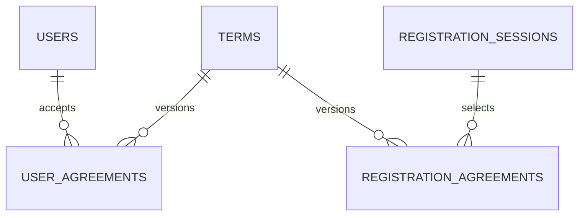

# 현재 PostgreSQL 데이터 명세

## 기준

이 문서는 현재 `develop`의 SQLAlchemy 모델과 Alembic migration history를 기준으로 PostgreSQL의 역할을 요약한다.

- 현재 Alembic 구현 기준: `20260816_0011`
- 금융/API 대용량 Raw source of truth: Azure Blob Storage
- PostgreSQL 역할: 회원가입/약관/가입 진행 상태 등 관계형 서비스 데이터
- 과거 금융/API PostgreSQL `raw`, `processed` schema: retire 완료

과거 16GB 금융 Raw landing DB의 상세 snapshot은 [`archive/DATABASE_SPECIFICATION_20260815.md`](archive/DATABASE_SPECIFICATION_20260815.md)에 보존한다. 해당 문서는 현재 운영 명세가 아니다.

## 현재 데이터 경계

```text
Public Data API
  ↓
Azure Blob raw (JSONL.gz)
  ↓
Azure Blob processed (Parquet)
  ↓
Azure Blob features (Parquet)

PostgreSQL
  └─ membership / registration relational data

Redis
  └─ OTP / token / session / rate limit 등 단기 상태
```

금융 API 원문 JSON 전체를 PostgreSQL에 중복 저장하지 않는다.

## 현재 public 테이블

| Table | 목적 |
| --- | --- |
| `users` | 가입 완료 회원 |
| `terms` | 약관 catalog/version |
| `user_agreements` | 회원별 약관 동의 감사 이력 |
| `registration_sessions` | 가입 완료 전 임시 개인정보/검증 상태 |
| `registration_agreements` | 가입 진행 중 약관 선택 상태 |
| `alembic_version` | migration head 관리 |

세부 컬럼/제약은 `data/db/models/membership.py`, `docs/REGISTRATION_DATA_SPECIFICATION.md`, `docs/REGISTRATION_DATA_ERD.md`를 함께 본다.

## 관계



## 핵심 정규화 원칙

- `users.phone_verified_at`, `users.email_verified_at`으로 인증 완료 여부를 판단하며 별도 boolean을 중복 저장하지 않는다.
- `user_agreements`는 `term_id`로 특정 약관 version을 참조한다.
- 가입 완료 전 상태는 `registration_sessions`, `registration_agreements`에 분리한다.
- OTP hash, attempts, verification token single-use 상태, rate limit은 PostgreSQL 영구 데이터가 아니라 Redis 영역이다.
- CI/DI 평문 및 암호화 key를 DB/로그에 저장하지 않는다.

## Migration history

`20260816_0010`은 과거 금융/API PostgreSQL `raw`와 `processed` schema retirement를 migration history에 공식 기록한다. `20260816_0011`은 회원가입 구조를 3NF 기준으로 확장/정리한다.

과거 migration 파일은 오래된 runtime 설계를 의미하는 것이 아니라 새 DB를 head까지 재현하기 위한 역사이므로 삭제하지 않는다.

적용:

```bash
docker compose --env-file .env.azure --profile data run --rm --no-deps data alembic upgrade head
```

확인:

```bash
docker compose --env-file .env.azure --profile data run --rm --no-deps data alembic current
```

## 금융 데이터와 PostgreSQL

현재 금융 batch 파이프라인은 PostgreSQL을 거치지 않는다.

```text
Azure Blob raw
→ profile / validation / normalization
→ Azure Blob processed
→ feature engineering
→ Azure Blob features
```

향후 백엔드에서 빠른 관계형 조회가 필요한 금융 결과가 생기면, 대용량 Raw landing을 복원하는 대신 필요한 serving table을 별도 이슈에서 목적에 맞게 설계한다.
