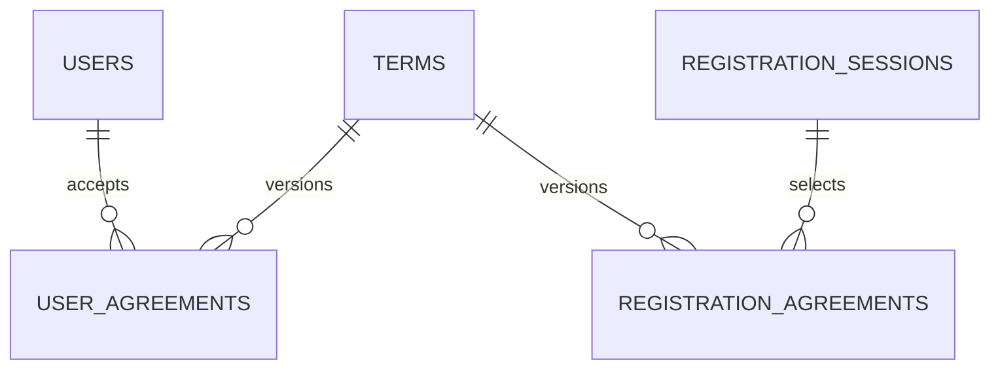

# 현재 PostgreSQL 데이터 명세

## 기준

이 문서는 현재 `develop`의 SQLAlchemy 모델과 Alembic migration history를 기준으로 PostgreSQL의 역할을 요약한다.

- 현재 Alembic 구현 기준: `20260824_0016`
- 금융/API 대용량 Raw source of truth: Azure Blob Storage
- PostgreSQL 역할: 관계형 서비스 데이터와 Frontend 조회용 KRX/OpenDART 정제 결과
- 과거 금융/API PostgreSQL `raw`, `processed` schema: retire 완료

과거 16GB 금융 Raw landing DB의 상세 snapshot은 [`archive/DATABASE_SPECIFICATION_20260815.md`](archive/DATABASE_SPECIFICATION_20260815.md)에 보존한다. 해당 문서는 현재 운영 명세가 아니다.

## 현재 데이터 경계

```text
Public Data API
  ↓
Azure Blob raw (JSONL.gz)
  ↓
Azure Blob processed (Parquet)
  ↓
Azure Blob features (Parquet)

PostgreSQL
  ├─ membership / registration / virtual trading relational data
  ├─ OpenDART serving tables (원문은 Blob)
  └─ KRX market serving tables (원문은 Blob)

Redis
  └─ OTP / token / session / rate limit 등 단기 상태
```

금융 API 원문 JSON 전체를 PostgreSQL에 중복 저장하지 않는다.

## 현재 public 테이블

| Table | 목적 |
| --- | --- |
| `users` | 가입 완료 회원 |
| `terms` | 약관 catalog/version |
| `user_agreements` | 회원별 약관 동의 감사 이력 |
| `registration_sessions` | 가입 완료 전 임시 개인정보/검증 상태 |
| `registration_agreements` | 가입 진행 중 약관 선택 상태 |
| `investment_onboardings` | 전략·투자 예정 금액·운용방식과 가상계좌 준비 상태 |
| `virtual_accounts` | 사용자별 단일 내부 가상투자 계좌 |
| `companies` | DART 기업 마스터와 종목코드 매핑 |
| `company_financial_accounts` | 공시 재무제표의 계정별 정제 행 |
| `company_financials` | FastAPI용 핵심 재무지표 집계 |
| `company_disclosures` | 접수번호 기준 기업 공시 목록 |
| `market_stocks` | KRX 종목기본정보 최신 상태 |
| `market_stock_prices` | 종목·거래일별 KRX OHLCV·시가총액 |
| `market_indices` | 지수·거래일별 KRX OHLCV |
| `alembic_version` | migration head 관리 |

세부 컬럼/제약은 `data/db/models/membership.py`, `docs/REGISTRATION_DATA_SPECIFICATION.md`, `docs/REGISTRATION_DATA_ERD.md`를 함께 본다.

## 관계



## 핵심 정규화 원칙

- `users.phone_verified_at`, `users.email_verified_at`으로 인증 완료 여부를 판단하며 별도 boolean을 중복 저장하지 않는다.
- `user_agreements`는 `term_id`로 특정 약관 version을 참조한다.
- 가입 완료 전 상태는 `registration_sessions`, `registration_agreements`에 분리한다.
- OTP hash, attempts, verification token single-use 상태, rate limit은 PostgreSQL 영구 데이터가 아니라 Redis 영역이다.
- CI/DI 평문 및 암호화 key를 DB/로그에 저장하지 않는다.

## Migration history

`20260816_0010`은 과거 금융/API PostgreSQL `raw`와 `processed` schema retirement를 migration history에 공식 기록한다. `20260816_0011`은 회원가입 구조를 3NF 기준으로 확장/정리하고, `20260823_0012`는 가상거래를, `20260824_0013`은 OpenDART serving table을, `20260824_0014`는 투자성향·전략 추천 이력을, `20260824_0015`는 가상투자 시작 상태를, `20260824_0016`은 KRX 화면 조회용 serving table을 추가한다.

과거 migration 파일은 오래된 runtime 설계를 의미하는 것이 아니라 새 DB를 head까지 재현하기 위한 역사이므로 삭제하지 않는다.

적용:

```bash
docker compose --profile data run --rm --no-deps data alembic upgrade head
```

확인:

```bash
docker compose --profile data run --rm --no-deps data alembic current
```

## OpenDART PostgreSQL 명세

모든 아래 컬럼의 Source는 `OpenDART`이며 `created_at`, `updated_at`만 시스템 DB 시각이다.
Raw JSON/XML/ZIP 전체를 PostgreSQL에 복제하지 않고 Azure Blob에 별도 보존한다.

### `companies`

| Column | Type | Nullable | PK | FK | Unique | Index | Description |
| --- | --- | --- | --- | --- | --- | --- | --- |
| `id` | BIGINT IDENTITY | No | Yes | - | Yes | PK | 내부 식별자 |
| `corp_code` | VARCHAR(8) | No | No | - | Yes | Unique | DART 고유번호 |
| `stock_code` | VARCHAR(12) | Yes | No | - | No | Yes | 선행 0을 보존한 거래소 종목코드 |
| `corp_name` | VARCHAR(200) | No | No | - | No | Yes | 기업 한글명 |
| `corp_name_eng`, `stock_name` | VARCHAR(200) | Yes | No | - | No | No | 영문 기업명, 종목명 |
| `market` | VARCHAR(10) | Yes | No | - | No | No | OpenDART `corp_cls` |
| `ceo_name` | VARCHAR(200) | Yes | No | - | No | No | 대표자명 |
| `jurir_no`, `bizr_no` | VARCHAR(20) | Yes | No | - | No | No | 법인·사업자 등록번호 |
| `address`, `homepage_url`, `ir_url` | TEXT | Yes | No | - | No | No | 주소와 공개 URL |
| `phone_number` | VARCHAR(100) | Yes | No | - | No | No | 공개 대표 전화 |
| `industry_code` | VARCHAR(20) | Yes | No | - | No | No | 업종코드 |
| `established_date`, `dart_modify_date` | DATE | Yes | No | - | No | No | 설립일, corpCode 수정일 |
| `accounting_month` | VARCHAR(2) | Yes | No | - | No | No | 결산월 |
| `created_at`, `updated_at` | TIMESTAMPTZ | No | No | - | No | No | 생성·수정 시각 |

### `company_financial_accounts`

| Column | Type | Nullable | PK | FK | Unique | Index | Description |
| --- | --- | --- | --- | --- | --- | --- | --- |
| `id` | BIGINT IDENTITY | No | Yes | - | Yes | PK | 내부 식별자 |
| `corp_code` | VARCHAR(8) | No | No | `companies.corp_code` | Composite | Yes | DART 고유번호 |
| `stock_code` | VARCHAR(12) | Yes | No | - | No | `(stock_code,business_year)` | 종목코드 |
| `business_year`, `report_code` | VARCHAR(4), VARCHAR(5) | No | No | - | Composite | Yes | 사업연도·보고서코드 |
| `fs_div`, `sj_div` | VARCHAR(10) | No | No | - | Composite | No | 연결/개별, 재무제표 구분 |
| `account_id` | VARCHAR(200) | No | No | - | Composite | No | IFRS/DART 계정 ID; 없으면 계정명 fallback |
| `account_name` | VARCHAR(200) | No | No | - | No | No | 공시 계정명 |
| `current_amount`, `previous_amount` | NUMERIC(30,2) | Yes | No | - | No | No | 당기·전기 금액 |
| `currency` | VARCHAR(10) | No | No | - | No | No | 통화, 기본 KRW |
| `created_at`, `updated_at` | TIMESTAMPTZ | No | No | - | No | No | 생성·수정 시각 |

Unique는 `(corp_code,business_year,report_code,fs_div,sj_div,account_id)`다.

### `company_financials`

| Column | Type | Nullable | PK | FK | Unique | Index | Description |
| --- | --- | --- | --- | --- | --- | --- | --- |
| `id` | BIGINT IDENTITY | No | Yes | - | Yes | PK | 내부 식별자 |
| `corp_code` | VARCHAR(8) | No | No | `companies.corp_code` | Composite | No | DART 고유번호 |
| `stock_code` | VARCHAR(12) | Yes | No | - | No | `(stock_code,business_year)` | 종목코드 |
| `business_year`, `report_code`, `fs_div` | VARCHAR | No | No | - | Composite | Yes | 보고서 식별자 |
| `quarter` | VARCHAR(10) | No | No | - | No | No | Q1/Q2/Q3/FY |
| `revenue`, `operating_income`, `net_income` | NUMERIC(30,2) | Yes | No | - | No | No | 손익 핵심지표 |
| `total_assets`, `total_liabilities`, `total_equity` | NUMERIC(30,2) | Yes | No | - | No | No | 재무상태 핵심지표 |
| `operating_cash_flow`, `investing_cash_flow`, `financing_cash_flow` | NUMERIC(30,2) | Yes | No | - | No | No | 현금흐름 핵심지표 |
| `created_at`, `updated_at` | TIMESTAMPTZ | No | No | - | No | No | 생성·수정 시각 |

Unique는 `(corp_code,business_year,report_code,fs_div)`다.

### `company_disclosures`

| Column | Type | Nullable | PK | FK | Unique | Index | Description |
| --- | --- | --- | --- | --- | --- | --- | --- |
| `id` | BIGINT IDENTITY | No | Yes | - | Yes | PK | 내부 식별자 |
| `receipt_no` | VARCHAR(20) | No | No | - | Yes | Unique | OpenDART 접수번호 |
| `corp_code` | VARCHAR(8) | No | No | `companies.corp_code` | No | Yes | DART 고유번호 |
| `stock_code` | VARCHAR(12) | Yes | No | - | No | Yes | 종목코드 |
| `corp_name` | VARCHAR(200) | No | No | - | No | No | 기업명 |
| `report_name` | VARCHAR(500) | No | No | - | No | No | 보고서명 |
| `filer_name` | VARCHAR(200) | Yes | No | - | No | No | 공시 제출인명 |
| `receipt_date` | DATE | No | No | - | No | Yes | 접수일 |
| `remarks` | TEXT | Yes | No | - | No | No | OpenDART 비고 |
| `created_at`, `updated_at` | TIMESTAMPTZ | No | No | - | No | No | 생성·수정 시각 |

## 금융 데이터와 PostgreSQL

분석용 금융 batch 파이프라인은 PostgreSQL을 거치지 않는다.

```text
Azure Blob raw
→ profile / validation / normalization
→ Azure Blob processed
→ feature engineering
→ Azure Blob features
```

대용량 Raw landing을 복원하지 않고 StockDetail이 필요한 KRX 정제 결과만 다음 serving table에 저장한다. 원문 source of truth는 계속 Azure Blob이다.

### KRX serving table

| Table | Key | 주요 값 | 갱신 방식 |
| --- | --- | --- | --- |
| `market_stocks` | `stock_code` | ISIN, 명칭, 시장, 상장일, 상장주식수, 증권·섹터 구분 | KRX 종목기본정보 기준 최신 상태 UPSERT |
| `market_stock_prices` | `(stock_code, trade_date)` unique | 일별 OHLCV, 전일대비, 등락률, 거래대금, 시가총액 | KRX 일별매매정보 멱등 UPSERT |
| `market_indices` | `(index_code, trade_date)` unique | 지수 일별 OHLCV, 전일대비, 등락률, 거래대금, 시가총액 | KRX 지수정보 멱등 UPSERT |

`market_stock_prices.stock_code`는 `market_stocks.stock_code`를 참조하므로 동기화는 종목 마스터를 먼저 적재한다. 종목코드는 `VARCHAR(6)`으로 선행 0을 보존하며, 원천 결측값은 임의의 0으로 채우지 않는다. `source='KRX'`, `as_of`에는 동기화 기준일을 기록한다.

Strategy Backtest는 별도 결과 테이블이나 합성 시세를 만들지 않고 이 serving table을 읽기 전용으로 사용한다. 시작일 직전 시총으로 universe를 고정하고 factor 계산에는 해당 리밸런싱일 이하의 가격만 사용하며, 신규 편입은 리밸런싱일 종가가 있는 종목으로 제한한다. `close_price`는 원천 비수정 종가이므로 `listed_shares` 변동일을 corporate action 경계로 보고 당일 수익률을 연결하지 않으며, 해당 경계가 팩터 lookback 안에 있는 종목은 후보에서 제외한다. 거래정지로 관측이 비는 기존 보유종목은 재개 종가를 마지막 관측 종가와 비교한다. 가치 factor에 필요한 재무 공시 가능일이 현재 `company_financials`에 없으므로 최신 재무를 과거에 소급 적용하지 않는다.
