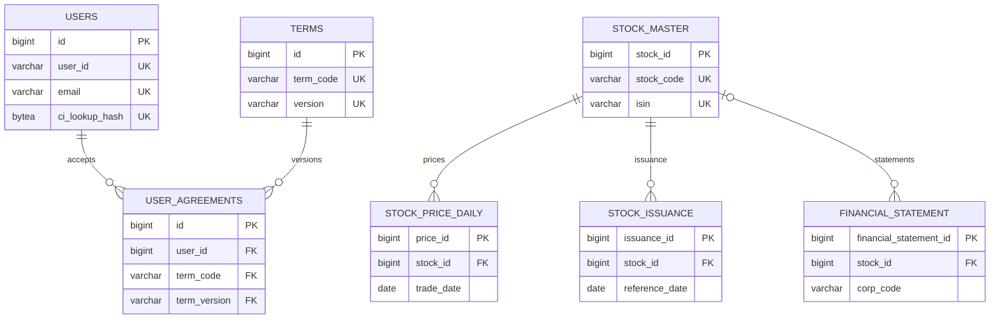

# Azure PostgreSQL 통합 데이터 명세서

## 1. 문서 기준

| 항목 | 값 |
| --- | --- |
| 기준 DB | Azure Database for PostgreSQL `pg-db-fein.postgres.database.azure.com` |
| PostgreSQL | 17.10 |
| Alembic revision | `20260815_0009` |
| 조사 시각 | 2026-08-15 (Asia/Seoul) |
| 전체 DB 크기 | 약 16 GB |
| 업무 schema | `public`, `raw`, `processed` |
| 제외 대상 | PostgreSQL system catalog, `public.alembic_version`의 상세 업무 명세 |

이 문서는 실제 Azure PostgreSQL catalog의 컬럼·제약·index와 현재 repository의 SQLAlchemy 모델을 함께 기준으로 작성했다. 행 수와 용량은 조사 시점 snapshot이며 계속 변할 수 있다. `pg_total_relation_size` 기반 용량에는 table, index, TOAST가 포함된다.

## 2. Schema와 데이터 흐름

- `public`: 서비스 영구 데이터. 가입 완료 사용자, 약관 catalog, 사용자 동의 이력을 저장한다.
- `raw`: 역사적 schema 이름이다. 정규화 금융 데이터, Blob metadata/checkpoint, legacy migration source를 저장한다.
- `processed`: Factor, 재무비율 등 파생 데이터용이며 현재 table이 없다.
- Azure Blob `raw`: API 원문의 source of truth다.
- Azure Blob `processed`/`features`: 대용량 Parquet 분석·학습 자료를 저장한다.
- Redis/Backend: OTP, verification token, pending signup 등 단기 상태를 관리하며 PostgreSQL 명세에서 제외한다.



## 3. 현재 데이터 현황

| Table | 정확한 행 수 | 전체 용량 | 설명 |
| --- | ---: | ---: | --- |
| `public.users` | 0 | 96 kB | 가입 완료 사용자 |
| `public.terms` | 6 | 48 kB | 운영 약관 catalog |
| `public.user_agreements` | 0 | 64 kB | 사용자 약관 동의 이력 |
| `raw.stock_master` | 3,221 | 1,672 kB | 종목 master |
| `raw.stock_price_daily` | 3,378,757 | 1,960 MB | 종목별 일봉 |
| `raw.market_index_daily` | 190,360 | 162 MB | 시장지수 일봉 |
| `raw.stock_issuance` | 1 | 80 kB | 발행·상장 현황 정규화본 |
| `raw.financial_statement` | 1 | 112 kB | 재무제표 정규화본 |
| `raw.macro_indicator` | 1 | 80 kB | 거시지표 정규화본 |
| `raw.public_data_record` | 24,070,779 | 14 GB | 공공데이터 API 원문 landing |
| `raw.public_data_collection_checkpoint` | 55 | 72 kB | 수집 재개 checkpoint |
| `raw.data_object` | 526 | - | Blob 객체 metadata/reference |
| `raw.public_data_migration_manifest` | 525 | - | Legacy Raw 이전 manifest |

`raw.public_data_record` 데이터셋별 현황:

| Dataset | 행 수 |
| --- | ---: |
| `disclosure` | 80,045 |
| `financial_statement` | 1,239,611 |
| `market_index` | 467,358 |
| `security_product` | 5,362,704 |
| `stock_dividend` | 71,681 |
| `stock_issuance` | 10,135,621 |
| `stock_master` | 3,211,333 |
| `stock_price` | 3,502,426 |

2026-08-15 Blob migration은 전체 24,070,779행, dataset별 count, 525개 file checksum, 전체 payload hash를 검증했다. 상세 수치는 [RAW_BLOB_MIGRATION_REPORT.md](RAW_BLOB_MIGRATION_REPORT.md)를 참고한다. 원본 table은 삭제하지 않아 DB/table 크기는 작업 전과 같다.

## 4. 공통 타입과 규칙

| 패턴 | 규칙 |
| --- | --- |
| Identity PK | `BIGINT GENERATED BY DEFAULT AS IDENTITY` |
| 생성·수정 시각 | `TIMESTAMPTZ`, 기본값 `now()` |
| 금액 | 주로 `NUMERIC(28,2)` |
| 가격 | `NUMERIC(20,4)` |
| 비율·조정계수 | 부동소수 오차를 피하는 `NUMERIC` |
| 원문 | PostgreSQL `JSONB` |
| IP | PostgreSQL `INET` |
| 암호문 | `BYTEA` |
| FK 삭제 | 금융 정규화 데이터는 `RESTRICT`, 사용자 동의는 사용자 삭제 시 `CASCADE` |

Data 서비스의 `TimestampMixin`은 ORM update 시 `updated_at`을 갱신한다. `public.users`는 direct SQL도 보장하도록 `trg_users_updated_at` trigger를 추가로 사용한다.

현재 확인된 주요 코드값:

| 구분 | 값 | 현재 건수/비고 |
| --- | --- | --- |
| 시장 | `KOSPI` | 1,003종목 |
| 시장 | `KOSDAQ` | 2,062종목 |
| 시장 | `KONEX` | 156종목 |
| 주가 유형 | `unadjusted`, `adjusted` | DB CHECK로 제한 |
| 재무제표 범위 | `CFS` | 현재 정규화 row 1건 |
| 보고서 코드 | `11013` | 현재 정규화 row 1건 |
| 거시지표 주기 | `M` | 현재 월별 row 1건 |
| Checkpoint 상태 | `complete` | 52건 |
| Checkpoint 상태 | `failed` | 2건 |

## 5. `public` schema

### 5.1 `public.users`

가입이 완료된 계정만 저장한다. OTP, verification ID/token과 pending signup은 저장하지 않는다.

| Column | Type | NULL | Default | Key/규칙 | 설명 |
| --- | --- | --- | --- | --- | --- |
| `id` | `BIGINT IDENTITY` | N | - | PK | 내부 사용자 식별자 |
| `user_id` | `VARCHAR(16)` | N | - | UNIQUE, `^[a-z0-9]{6,16}$` | 로그인 ID. Backend가 lowercase 정규화 |
| `password_hash` | `VARCHAR(255)` | N | - | - | Backend에서 생성한 Argon2id/bcrypt 등 password hash |
| `name` | `VARCHAR(30)` | N | - | trim 길이 1~30 | 본인확인 이름 |
| `birthdate` | `VARCHAR(6)` | N | - | 숫자 6자리 | YYMMDD 본인확인 값 |
| `phone_number` | `VARCHAR(11)` | N | - | `^0[0-9]{9,10}$`, INDEX | 하이픈 없는 국내 전화번호 |
| `phone_verified` | `BOOLEAN` | N | `false` | 인증시각과 일관성 CHECK | 전화 인증 여부 |
| `phone_verified_at` | `TIMESTAMPTZ` | Y | - | 인증 여부와 일관성 CHECK | 전화 인증 완료 시각 |
| `email` | `VARCHAR(255)` | N | - | UNIQUE, lowercase CHECK | 로그인/연락 이메일 |
| `email_verified` | `BOOLEAN` | N | `false` | 인증시각과 일관성 CHECK | 이메일 인증 여부 |
| `email_verified_at` | `TIMESTAMPTZ` | Y | - | 인증 여부와 일관성 CHECK | 이메일 인증 완료 시각 |
| `ci_encrypted` | `BYTEA` | Y | - | - | CI randomized authenticated ciphertext |
| `ci_lookup_hash` | `BYTEA` | Y | - | UNIQUE | CI 중복 조회용 HMAC-SHA-256 32 bytes |
| `di_encrypted` | `BYTEA` | Y | - | - | DI randomized authenticated ciphertext |
| `telecom_carrier` | `VARCHAR(20)` | Y | - | - | 인증기관이 반환한 통신사 |
| `gender` | `VARCHAR(1)` | Y | - | - | 인증기관이 반환한 성별 코드 |
| `member_type` | `VARCHAR(20)` | N | `ASSOCIATE` | `ASSOCIATE`, `FULL` | 회원 유형 |
| `account_status` | `VARCHAR(20)` | N | `ACTIVE` | `ACTIVE`, `DORMANT`, `SUSPENDED`, `WITHDRAWN` | 계정 상태 |
| `last_login_at` | `TIMESTAMPTZ` | Y | - | - | 최종 로그인 시각 |
| `created_at` | `TIMESTAMPTZ` | N | `now()` | - | 생성 시각 |
| `updated_at` | `TIMESTAMPTZ` | N | `now()` | UPDATE trigger | 최종 수정 시각 |
| `deleted_at` | `TIMESTAMPTZ` | Y | - | `WITHDRAWN`이면 필수 | soft delete 시각 |

Constraints:

- PK: `pk_users(id)`
- UNIQUE: `uq_users_user_id`, `uq_users_email`, `uq_users_ci_lookup_hash`
- 인증 flag가 true이면 대응하는 verified timestamp가 반드시 존재하며 false이면 timestamp가 없어야 한다.
- `WITHDRAWN` 상태에는 `deleted_at`이 반드시 존재한다.

Indexes:

- `ix_users_phone_number(phone_number)`
- PK/UNIQUE constraint가 생성하는 B-tree indexes

민감정보 정책:

- CI/DI plaintext, 암호화 key, HMAC key를 DB·log·seed에 저장하지 않는다.
- `ci_lookup_hash`는 단순 SHA-256이 아니라 별도 secret key를 사용하는 HMAC이어야 한다.
- Cipher column은 key version, nonce, ciphertext, authentication tag를 식별할 수 있는 envelope 형식을 사용한다.

### 5.2 `public.terms`

서버가 허용하는 약관 코드와 버전을 관리한다. 약관 전문은 `content_reference`가 가리키는 immutable 문서 저장소에서 관리할 수 있다.

| Column | Type | NULL | Default | Key/규칙 | 설명 |
| --- | --- | --- | --- | --- | --- |
| `id` | `BIGINT IDENTITY` | N | - | PK | 내부 약관 식별자 |
| `term_code` | `VARCHAR(30)` | N | - | `(term_code, version)` UNIQUE, nonblank | 약관 코드 |
| `version` | `VARCHAR(20)` | N | - | `(term_code, version)` UNIQUE, nonblank | 약관 버전 |
| `title` | `VARCHAR(200)` | N | - | - | 약관명 |
| `content_reference` | `VARCHAR(500)` | Y | - | - | 약관 전문의 immutable URL/object reference |
| `is_required` | `BOOLEAN` | N | - | - | 가입 필수 여부 |
| `effective_at` | `TIMESTAMPTZ` | N | - | - | 발효 시각 |
| `created_at` | `TIMESTAMPTZ` | N | `now()` | - | catalog 등록 시각 |

현재 운영 약관:

| Code | Version | Title | Required | Effective at |
| --- | --- | --- | --- | --- |
| `A1_THIRD_PARTY` | `1` | 제3자 정보 제공 동의 | Y | 2026-08-14 00:00:00 +09:00 |
| `A2_UNIQUE_ID` | `1` | 고유식별정보 처리 동의 | Y | 2026-08-14 00:00:00 +09:00 |
| `A3_CARRIER` | `1` | 통신사 이용약관 동의 | Y | 2026-08-14 00:00:00 +09:00 |
| `A4_KCB` | `1` | KCB 본인확인 서비스 동의 | Y | 2026-08-14 00:00:00 +09:00 |
| `B_PRIVACY` | `1` | 개인정보 수집 및 이용 동의 | Y | 2026-08-14 00:00:00 +09:00 |
| `C_ASSOCIATE_TERMS` | `1` | 준회원 이용약관 동의 | Y | 2026-08-14 00:00:00 +09:00 |

현재 `content_reference`는 모두 NULL이다. 서비스 노출 전 약관 전문 위치를 확정해야 한다.

### 5.3 `public.user_agreements`

사용자가 특정 버전의 약관에 동의하거나 동의하지 않은 사실을 row 단위로 보존한다.

| Column | Type | NULL | Default | Key/규칙 | 설명 |
| --- | --- | --- | --- | --- | --- |
| `id` | `BIGINT IDENTITY` | N | - | PK | 동의 이력 식별자 |
| `user_id` | `BIGINT` | N | - | FK → `users.id`, DELETE CASCADE | 사용자 |
| `term_code` | `VARCHAR(30)` | N | - | 복합 FK → `terms` | 약관 코드 |
| `term_version` | `VARCHAR(20)` | N | - | 복합 FK → `terms` | 동의한 약관 버전 |
| `is_required` | `BOOLEAN` | N | - | - | 동의 당시 필수 여부 snapshot |
| `is_agreed` | `BOOLEAN` | N | - | `agreed_at`과 일관성 CHECK | 동의 여부 |
| `agreed_at` | `TIMESTAMPTZ` | Y | - | 동의 시 필수 | 동의 시각 |
| `agreed_ip` | `INET` | Y | - | - | 동의 요청 IP |
| `user_agent` | `VARCHAR(512)` | Y | - | - | 동의 요청 User-Agent |

Constraints/Indexes:

- UNIQUE: `(user_id, term_code, term_version)`
- FK: `(term_code, term_version) → terms(term_code, version) ON DELETE RESTRICT`
- FK: `user_id → users.id ON DELETE CASCADE`
- INDEX: `(user_id, agreed_at)`
- `is_agreed=true`이면 `agreed_at`이 필요하고 false이면 NULL이어야 한다.

## 6. `raw` schema

### 6.1 `raw.stock_master`

종목 코드별 최신 정규화 상장 master다.

| Column | Type | NULL | Default | 설명 |
| --- | --- | --- | --- | --- |
| `stock_id` | `BIGINT IDENTITY` | N | - | PK |
| `reference_date` | `DATE` | N | - | master 기준일 |
| `stock_code` | `VARCHAR(12)` | N | - | KRX 종목 단축코드, UNIQUE |
| `isin` | `VARCHAR(12)` | Y | - | 국제증권식별번호, UNIQUE |
| `market_type` | `VARCHAR(20)` | N | - | KOSPI/KOSDAQ 등 시장 구분 |
| `stock_name` | `VARCHAR(200)` | N | - | 종목명 |
| `corporation_registration_number` | `VARCHAR(20)` | Y | - | 법인등록번호 |
| `corporation_name` | `VARCHAR(200)` | Y | - | 법인명 |
| `source` | `VARCHAR(100)` | N | `FSC_KRX_LISTED_STOCK` | 원천 식별자 |
| `source_payload` | `JSONB` | Y | - | 원천 응답 snapshot |
| `created_at` | `TIMESTAMPTZ` | N | `now()` | 생성 시각 |
| `updated_at` | `TIMESTAMPTZ` | N | `now()` | 수정 시각 |

- PK: `stock_id`; UNIQUE: `stock_code`, `isin`
- INDEX: `(market_type, stock_code)`, `(reference_date)`

### 6.2 `raw.stock_price_daily`

종목별 일간 OHLCV와 수정 여부를 저장한다.

| Column | Type | NULL | Default | 설명 |
| --- | --- | --- | --- | --- |
| `price_id` | `BIGINT IDENTITY` | N | - | PK |
| `stock_id` | `BIGINT` | N | - | FK → `stock_master.stock_id`, DELETE RESTRICT |
| `trade_date` | `DATE` | N | - | 거래일 |
| `price_type` | `VARCHAR(16)` | N | `unadjusted` | `unadjusted` 또는 `adjusted` |
| `open_price` | `NUMERIC(20,4)` | Y | - | 시가 |
| `high_price` | `NUMERIC(20,4)` | Y | - | 고가 |
| `low_price` | `NUMERIC(20,4)` | Y | - | 저가 |
| `close_price` | `NUMERIC(20,4)` | N | - | 종가 |
| `volume` | `BIGINT` | Y | - | 거래량, 0 이상 |
| `trading_value` | `NUMERIC(28,2)` | Y | - | 거래대금 |
| `adjustment_factor` | `NUMERIC(20,10)` | Y | - | 수정계수 |
| `currency` | `VARCHAR(3)` | N | `KRW` | 통화 |
| `source` | `VARCHAR(100)` | N | `FSC_STOCK_PRICE` | 원천 식별자 |
| `source_payload` | `JSONB` | Y | - | 원천 응답 snapshot |
| `created_at` | `TIMESTAMPTZ` | N | `now()` | 생성 시각 |
| `updated_at` | `TIMESTAMPTZ` | N | `now()` | 수정 시각 |

- UNIQUE: `(stock_id, trade_date, price_type)`
- INDEX: `(stock_id, trade_date)`, `(trade_date, stock_id)`
- CHECK: `price_type IN ('unadjusted','adjusted')`, `volume >= 0`

### 6.3 `raw.market_index_daily`

KOSPI/KOSDAQ/채권/파생상품 등 시장지수 일봉이다.

| Column | Type | NULL | Default | 설명 |
| --- | --- | --- | --- | --- |
| `market_index_id` | `BIGINT IDENTITY` | N | - | PK |
| `index_code` | `VARCHAR(100)` | N | - | 지수/series 식별 코드 |
| `trade_date` | `DATE` | N | - | 기준일 |
| `open_value` | `NUMERIC(20,6)` | Y | - | 시가 지수 |
| `high_value` | `NUMERIC(20,6)` | Y | - | 고가 지수 |
| `low_value` | `NUMERIC(20,6)` | Y | - | 저가 지수 |
| `close_value` | `NUMERIC(20,6)` | N | - | 종가 지수 |
| `change_rate` | `NUMERIC(16,10)` | Y | - | 등락률 |
| `source` | `VARCHAR(100)` | N | `KRX_INDEX` | 원천 식별자 |
| `source_payload` | `JSONB` | Y | - | 원천 응답 snapshot |
| `created_at` | `TIMESTAMPTZ` | N | `now()` | 생성 시각 |
| `updated_at` | `TIMESTAMPTZ` | N | `now()` | 수정 시각 |

- UNIQUE: `(index_code, trade_date)`
- INDEX: `(index_code, trade_date)`, `(trade_date, index_code)`

### 6.4 `raw.stock_issuance`

기준일별 발행주식수와 상장·폐지 정보를 저장한다.

| Column | Type | NULL | Default | 설명 |
| --- | --- | --- | --- | --- |
| `issuance_id` | `BIGINT IDENTITY` | N | - | PK |
| `stock_id` | `BIGINT` | N | - | FK → `stock_master.stock_id`, DELETE RESTRICT |
| `reference_date` | `DATE` | N | - | 기준일 |
| `issued_shares` | `BIGINT` | Y | - | 발행주식수, 0 이상 |
| `par_value` | `NUMERIC(20,4)` | Y | - | 액면가 |
| `listing_date` | `DATE` | Y | - | 상장일 |
| `delisting_date` | `DATE` | Y | - | 상장폐지일 |
| `source` | `VARCHAR(100)` | N | `FSC_STOCK_ISSUANCE` | 원천 식별자 |
| `source_payload` | `JSONB` | Y | - | 원천 응답 snapshot |
| `created_at` | `TIMESTAMPTZ` | N | `now()` | 생성 시각 |
| `updated_at` | `TIMESTAMPTZ` | N | `now()` | 수정 시각 |

- UNIQUE: `(stock_id, reference_date)`
- INDEX: `(stock_id, reference_date)`, `(reference_date, stock_id)`
- CHECK: `issued_shares >= 0`

### 6.5 `raw.financial_statement`

OpenDART 재무제표를 point-in-time 기준으로 저장한다. 백테스트에는 반드시 `available_date <= backtest_date` 조건을 사용한다.

| Column | Type | NULL | Default | 설명 |
| --- | --- | --- | --- | --- |
| `financial_statement_id` | `BIGINT IDENTITY` | N | - | PK |
| `stock_id` | `BIGINT` | Y | - | FK → `stock_master.stock_id`, 매핑 전이면 NULL |
| `corp_code` | `VARCHAR(8)` | N | - | OpenDART 고유번호 |
| `receipt_number` | `VARCHAR(20)` | Y | - | 공시 접수번호, UNIQUE |
| `business_year` | `VARCHAR(4)` | N | - | 사업연도 |
| `report_code` | `VARCHAR(5)` | N | - | 보고서 코드 |
| `fiscal_period` | `VARCHAR(20)` | N | - | 회계기간 식별값 |
| `statement_scope` | `VARCHAR(3)` | N | - | 연결/별도 범위(CFS/OFS 등) |
| `report_date` | `DATE` | N | - | 보고 기준일 |
| `disclosure_date` | `DATE` | N | - | 공시일 |
| `available_date` | `DATE` | N | - | 분석에서 실제 사용 가능한 최초일 |
| `currency` | `VARCHAR(3)` | N | `KRW` | 통화 |
| `assets` | `NUMERIC(28,2)` | Y | - | 자산총계 |
| `current_assets` | `NUMERIC(28,2)` | Y | - | 유동자산 |
| `liabilities` | `NUMERIC(28,2)` | Y | - | 부채총계 |
| `current_liabilities` | `NUMERIC(28,2)` | Y | - | 유동부채 |
| `equity` | `NUMERIC(28,2)` | Y | - | 자본총계 |
| `revenue` | `NUMERIC(28,2)` | Y | - | 매출액 |
| `operating_income` | `NUMERIC(28,2)` | Y | - | 영업이익 |
| `net_income` | `NUMERIC(28,2)` | Y | - | 당기순이익 |
| `interest_expense` | `NUMERIC(28,2)` | Y | - | 이자비용 |
| `account_data` | `JSONB` | Y | - | 계정별 상세 정규화 자료 |
| `source` | `VARCHAR(100)` | N | `OPENDART` | 원천 식별자 |
| `source_payload` | `JSONB` | Y | - | 원천 응답 snapshot |
| `created_at` | `TIMESTAMPTZ` | N | `now()` | 생성 시각 |
| `updated_at` | `TIMESTAMPTZ` | N | `now()` | 수정 시각 |

- UNIQUE: `(corp_code, business_year, report_code, fiscal_period, statement_scope)`, `receipt_number`
- INDEX: `(stock_id, available_date)`, `(available_date, stock_id)`, `(corp_code, business_year, report_code)`
- CHECK: `available_date >= report_date`

### 6.6 `raw.macro_indicator`

한국은행 ECOS 등 거시경제 시계열 관측값이다.

| Column | Type | NULL | Default | 설명 |
| --- | --- | --- | --- | --- |
| `macro_indicator_id` | `BIGINT IDENTITY` | N | - | PK |
| `indicator_code` | `VARCHAR(100)` | N | - | 지표 코드 |
| `indicator_name` | `VARCHAR(200)` | Y | - | 지표명 |
| `observation_date` | `DATE` | N | - | 관측 기준일 |
| `frequency` | `VARCHAR(10)` | N | - | D/M/Q/Y 등 주기 |
| `value` | `NUMERIC(28,10)` | N | - | 관측값 |
| `unit` | `VARCHAR(50)` | Y | - | 단위 |
| `source` | `VARCHAR(100)` | N | `BOK_ECOS` | 원천 식별자 |
| `source_payload` | `JSONB` | Y | - | 원천 응답 snapshot |
| `created_at` | `TIMESTAMPTZ` | N | `now()` | 생성 시각 |
| `updated_at` | `TIMESTAMPTZ` | N | `now()` | 수정 시각 |

- UNIQUE: `(indicator_code, observation_date, frequency)`
- INDEX: `(indicator_code, observation_date)`, `(observation_date, indicator_code)`

### 6.7 `raw.public_data_record` (Legacy migration source)

2026-08-15 이전 공공데이터포털 API item을 보관한 legacy landing table이다. 신규 Collector 쓰기는 중단됐고 Blob migration 검증과 유예 기간 동안 read-only source로 유지한다. 자동 DROP/TRUNCATE하지 않는다.

| Column | Type | NULL | Default | 설명 |
| --- | --- | --- | --- | --- |
| `record_id` | `BIGINT IDENTITY` | N | - | PK |
| `dataset` | `VARCHAR(50)` | N | - | 내부 데이터셋 분류 |
| `operation` | `VARCHAR(100)` | N | - | 공공 API operation 이름 |
| `payload_hash` | `VARCHAR(64)` | N | - | canonical payload SHA-256 hex |
| `reference_date` | `DATE` | Y | - | 추출 가능한 기준일 |
| `stock_code` | `VARCHAR(20)` | Y | - | 추출 가능한 종목코드 |
| `isin` | `VARCHAR(20)` | Y | - | 추출 가능한 ISIN |
| `corporation_registration_number` | `VARCHAR(20)` | Y | - | 추출 가능한 법인등록번호 |
| `corporation_name` | `VARCHAR(200)` | Y | - | 추출 가능한 법인명 |
| `payload` | `JSONB` | N | - | API item 전체 원문 |
| `created_at` | `TIMESTAMPTZ` | N | `now()` | 최초 적재 시각 |
| `updated_at` | `TIMESTAMPTZ` | N | `now()` | 최종 갱신 시각 |

- UNIQUE: `(dataset, operation, payload_hash)`
- INDEX: `(dataset, operation, reference_date)`, `(stock_code, reference_date)`, `(corporation_registration_number, reference_date)`
- `payload` 내부 key는 operation별 공식 응답 schema를 따르는 가변 구조다. 고정 DB column으로 가정하지 말고 `dataset + operation`을 schema discriminator로 사용한다.

### 6.8 `raw.public_data_collection_checkpoint`

대용량 기간 수집을 API operation별로 중단 지점에서 재개하기 위한 상태다.

| Column | Type | NULL | Default | 설명 |
| --- | --- | --- | --- | --- |
| `checkpoint_id` | `BIGINT IDENTITY` | N | - | PK |
| `dataset` | `VARCHAR(50)` | N | - | 데이터셋 분류 |
| `operation` | `VARCHAR(100)` | N | - | API operation 이름 |
| `range_start` | `DATE` | N | - | 수집 시작일(포함) |
| `range_end` | `DATE` | N | - | 수집 종료일(포함) |
| `rows_per_page` | `INTEGER` | N | - | 요청 page 크기 |
| `next_page` | `INTEGER` | N | `1` | 재개할 다음 page |
| `total_count` | `BIGINT` | Y | - | API가 보고한 전체 건수 |
| `received_count` | `BIGINT` | N | `0` | 현재까지 받은 건수 |
| `status` | `VARCHAR(20)` | N | `pending` | `pending/running/complete/failed` 운용 상태 |
| `last_error` | `TEXT` | Y | - | 마지막 오류 요약 |
| `created_at` | `TIMESTAMPTZ` | N | `now()` | 생성 시각 |
| `updated_at` | `TIMESTAMPTZ` | N | `now()` | 최종 상태 갱신 시각 |

- UNIQUE: `(dataset, operation, range_start, range_end)`
- INDEX: `(status, updated_at)`

### 6.9 `raw.data_object`

Raw payload 없이 Blob reference, file SHA-256, batch hash, record count, source range, file size, 상태만 저장한다. `(container, blob_path)`가 유일하며 Collector의 DB commit이 재시도돼도 중복 metadata가 생기지 않는다.

### 6.10 `raw.public_data_migration_manifest`

Legacy table의 dataset/operation별 ID chunk 진행을 기록한다. source min/max ID, migrated row count, Blob path/size/SHA-256, started/completed 시각과 상태를 추적하며 완료 chunk는 재실행 시 건너뛴다.

## 7. 공공데이터 operation catalog

Legacy table과 Blob raw record에 존재할 수 있는 현재 52개 operation이다.

| Dataset | Operations |
| --- | --- |
| `stock_issuance` | `getStocIssuInfo_V3`, `getLockUpRetuInfo_V3`, `getItemBasiInfo_V3`, `getStocIssuStat_V3` |
| `stock_price` | `getStockPriceInfo`, `getPreemptiveRightCertificatePriceInfo`, `getSecuritiesPriceInfo`, `getPreemptiveRightSecuritiesPriceInfo` |
| `stock_dividend` | `getDiviInfo_V2` |
| `security_product` | `getETFPriceInfo`, `getETNPriceInfo`, `getELWPriceInfo` |
| `market_index` | `getStockMarketIndex`, `getBondMarketIndex`, `getDerivationProductMarketIndex` |
| `financial_statement` | `getIncoStat_V2`, `getBs_V2`, `getSummFinaStat_V2` |
| `stock_master` | `getItemInfo` |
| `disclosure` | `getDiviDiscInfo_V2`, `getCapiIncrWithConsDiscInfo_V2`, `getBonuIssuDiscInfo_V2`, `getCapiIncrWithConsBonuIssuDiscInfo_V2`, `getGeneMeetStocPublNotiDiscInfo_V2`, `getAsseTranPutBackOptiDiscInfo_V2`, `getDishDiscInfo_V2`, `getBusiSuspDiscInfo_V2`, `getReviProcDiscInfo_V2`, `getDissReasDiscInfo_V2`, `getReduCapiDiscInfo_V2`, `getProcByCredBankDiscInfo_V2`, `getLitiEtcDiscInfo_V2`, `getOffsSecuMarkListDiscInfo_V2`, `getOffsSecuMarkDeliDiscInfo_V2`, `getCbRighIssuDiscInfo_V2`, `getBwRighIssuDiscInfo_V2`, `getEbRighIssuDiscInfo_V2`, `getAmorCoCoBondDisclInfo_V2`, `getTreaStocRepuDiscInfo_V2`, `getTreaStocSellDiscInfo_V2`, `getBusiInhetDiscInfo_V2`, `getBusiConvDiscInfo_V2`, `getStocSubsCertInheDiscInfo_V2`, `getStocSubsCertConvDiscInfo_V2`, `getDebeRighInheDiscInfo_V2`, `getDebeRighConvDiscInfo_V2`, `getMnaDiscInfo_V2`, `getSpilUpDiscInfo_V2`, `getDiviCombDiscInfo_V2`, `getStocExchTranDiscInfo_V2`, `getStocOptiRepo_V2`, `getOutsDireHumaResoAffaRepo_V2` |

## 8. `processed` schema

현재 table이 없다. 계획된 구조는 다음과 같다.

- `processed.stock_factor_daily`: `(stock_id, trade_date, factor_name, factor_version)` 단위 Factor
- `processed.financial_ratio`: `(stock_id, fiscal_period, available_date, ratio_name, formula_version)` 단위 재무비율

파생 데이터에는 계산식/모델 version과 `available_date`를 반드시 포함해 재현성과 look-ahead bias 방지를 보장해야 한다. 실제 table이 migration으로 생성되기 전까지 이 항목은 계획 명세이며 현재 DB 명세가 아니다.

## 9. 주요 transaction과 보존 정책

회원가입:

1. Backend가 Redis의 phone/email verification과 pending signup을 검증한다.
2. PostgreSQL transaction에서 `users`를 INSERT하고 `id`를 받는다.
3. 현재 필수 약관을 서버 catalog와 대조한 뒤 `user_agreements`를 여러 건 INSERT한다.
4. 하나라도 실패하면 전체 PostgreSQL transaction을 rollback한다.
5. PostgreSQL commit과 Redis token 소비 사이의 장애 복구는 idempotency/outbox 또는 예약-확정 상태 전이로 처리해야 한다.

금융 데이터:

- 모든 신규 공공 API item은 Azure Blob JSONL/gzip에 먼저 보존한다.
- 지원되는 대표 operation은 정규화 table에 UPSERT한다.
- 원문 hash가 같으면 content-addressed Blob을 재사용하고, 원문이 변경되면 새 object로 이력을 남긴다.
- Blob 성공 뒤 정규화 UPSERT와 checkpoint를 같은 DB transaction에서 확정한다.
- 정규화 금융 FK 삭제는 `RESTRICT`로 이력 손실을 방지한다.

## 10. 운영상 미확정·주의 사항

- `terms.content_reference` 6건이 모두 NULL이므로 실제 약관 전문 URL 또는 object reference가 필요하다.
- `users`와 `user_agreements`는 현재 0건이다.
- `raw.stock_issuance`, `raw.financial_statement`, `raw.macro_indicator` 정규화 table은 각 1건으로, landing data 규모에 비해 정규화 pipeline 적용 범위가 작다.
- Checkpoint에는 실패 상태가 존재하므로 수집 완료 판정 시 기간·operation별 상태를 확인해야 한다.
- `raw.public_data_record` 약 14 GB는 Blob 검증과 팀 승인 뒤 별도 change로 정리한다. 이번 migration은 원본을 삭제하지 않는다.
- 사용자 soft delete 후 ID/email/CI 재사용 여부와 `user_agreements ON DELETE CASCADE`가 법적 보존 요건에 맞는지 확정해야 한다.
- `public_data_record.payload`의 operation별 field dictionary는 외부 API가 변경할 수 있으므로 공식 API 명세 version과 함께 별도 관리해야 한다.

## 11. 재현 가능한 확인 명령

```bash
docker compose --env-file .env.azure run --rm --no-deps data alembic current
docker compose --env-file .env.azure run --rm --no-deps data alembic check
docker compose --env-file .env.azure run --rm --no-deps data \
  python scripts/db_inventory.py --exact
```

정확한 대형 table 행 수 집계는 full scan이 발생할 수 있으므로 운영 중 반복 실행하지 않는다.
