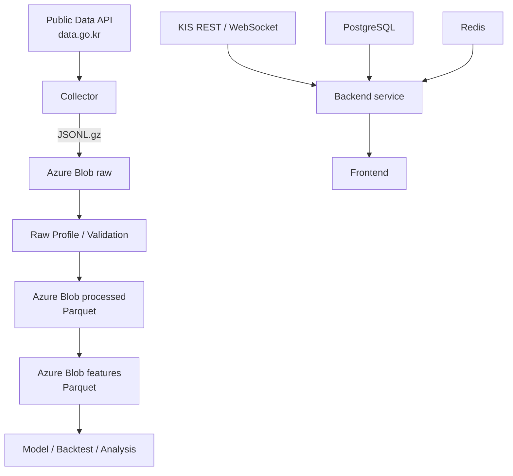

# 데이터 아키텍처

## 현재 기준

금융 데이터의 source of truth는 Azure Blob Storage의 `raw` 컨테이너다. 금융 Raw/Processed/Features 파이프라인은 PostgreSQL을 경유하지 않는다.



OpenDART, KRX, ECOS는 source별 collector와 같은 불변 Raw 원칙으로 보강한다. KRX 정제 결과 중 StockDetail 조회에 필요한 종목·일별시세·지수만 PostgreSQL serving table에도 멱등 적재한다. KIS는 실시간/최신 시세와 모의투자 등 서비스용 온라인 경로이며 오프라인 학습 Raw 파이프라인과 분리한다.

## 저장소별 책임

| 저장소 | 책임 | 현재 사용 |
| --- | --- | --- |
| Azure Blob `raw` | API 원문 보존, 재처리 기준 | 금융 Raw source of truth |
| Azure Blob `processed` | 검증/정규화된 분석용 Parquet | 모델/EDA의 정제 입력 |
| Azure Blob `features` | 버전된 모델용 Dataset | 학습/백테스트 입력 |
| PostgreSQL | 서비스 관계형 데이터 | 회원가입/약관/가입 진행 상태 |
| Redis | 짧은 TTL 상태 | OTP/cache/session/rate limit 등 |

금융 API 원문 JSON 전체를 PostgreSQL에 중복 적재하지 않는다.

## Raw 객체 규칙

Canonical Raw path:

```text
raw/
└── data-go-kr/{dataset}/operation={operation}/year=YYYY/month=MM/{sha256}.jsonl.gz
```

- `payload.basDt`가 partition/filter의 권위 있는 기준일이다.
- `day=DD`, `migration/` prefix, page-number filename은 canonical 신규 경로에서 사용하지 않는다.
- 같은 payload batch는 동일 hash 경로를 사용한다.
- Raw payload는 수정하지 않고 envelope metadata만 추가한다.
- Raw는 immutable하게 보존한다.

Raw JSONL 한 줄의 현재 신규 수집 형태:

```json
{
  "dataset": "stock_price",
  "operation": "getStockPriceInfo",
  "source": "data-go-kr",
  "collectedAt": "...",
  "payloadHash": "...",
  "payload": {
    "basDt": "20260813",
    "srtnCd": "005930",
    "clpr": "72500"
  }
}
```

과거 migration으로 생성된 일부 Raw envelope에는 복원용 `legacy` metadata가 존재할 수 있으나 신규 collector는 이를 생성하지 않는다.

## Processed

```text
processed/{dataset}/operation={operation}/schema=v1/year=YYYY/month=MM/part-00000.parquet
```

Raw profile을 타입 계약으로 사용해 날짜/정수/실수/문자열을 정규화한다. 코드·ID는 숫자처럼 보여도 문자열을 보존하며 빈 문자열은 NULL로 통일한다. 월별 quality manifest에 source blob, accepted/rejected, conversion error, Git SHA를 기록한다.

## Features

```text
features/{dataset}/version=v1/year=YYYY/month=MM/part-00000.parquet
```

현재 핵심 Dataset은 다음과 같다.

- `model_stock_daily`: training ready
- `market_index_daily`: training ready
- `security_master_latest`: reference only
- `financial_snapshot`: availability date 확보 전 research only
- `financial_company_year_latest`: availability date 확보 전 research only

재무 `base_date`를 실제 공개일로 간주하지 않는다. OpenDART 접수일 등 실제 availability timestamp가 확보되기 전에는 역사적 주가와 point-in-time JOIN하지 않는다.

## 실행 위치

대용량 변환 계산은 개발자 로컬 Docker의 `data` 컨테이너에서 수행하고 Azure Blob을 source/sink로 사용한다. 즉 Azure Blob은 저장소이고, 현재 전체 build의 CPU/RAM 계산은 로컬 Docker가 담당한다.

```text
Windows / Docker Desktop
        ↓
data container (Python)
        ↓ read
Azure Blob raw
        ↓ write
Azure Blob processed / features
```

## PostgreSQL 경계

현재 PostgreSQL 금융 `raw`/`processed` schema는 retire되었다. 현재 관계형 데이터는 회원가입/약관 영역이 중심이며 Alembic `20260816_0011`이 현재 구현 기준이다.

금융 대용량 분석 데이터를 다시 PostgreSQL에 적재하는 것은 현재 파이프라인의 전제가 아니며, 백엔드 조회 요구가 생길 때 필요한 serving table만 별도 설계한다.
