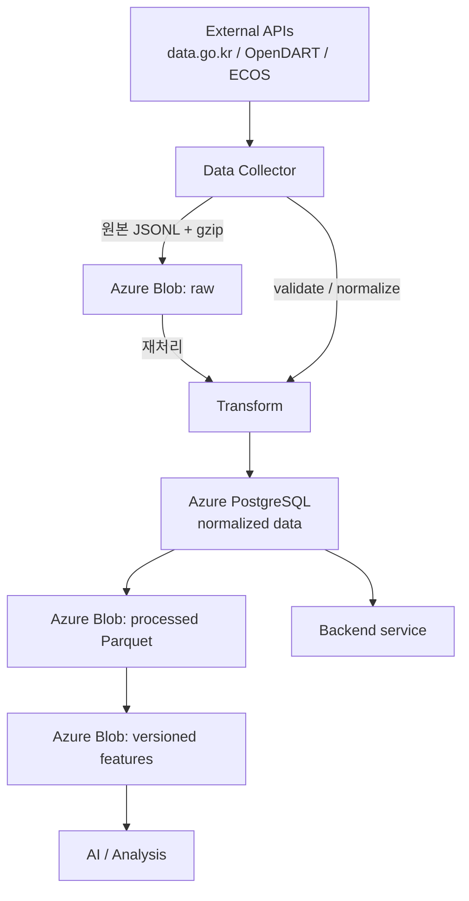

# 데이터 아키텍처

## 최종 흐름



## 저장소별 책임

| Consumer | 저장소 | 사용 대상 |
| --- | --- | --- |
| Data collector | Blob `raw` → PostgreSQL | 원본 보존 후 정규화 UPSERT/checkpoint |
| Backend | PostgreSQL | 사용자, 약관, 정규화 금융 데이터, 조회용 모델 결과 |
| AI/Data analysis | Blob `processed`/`features`, PostgreSQL | 대량 학습은 Parquet, 관계형 slice는 SQL |
| Local developer | Docker PostgreSQL + sample | schema, loader, notebook, 작은 pipeline test |

Redis는 OTP/cache/session 같은 임시 상태만 담당하며 Raw/학습 데이터 저장소가 아니다.

## Raw 객체 규칙

```text
raw container
└── data-go-kr/<dataset>/operation=<operation>/
    year=YYYY/month=MM/day=DD/
    page-00000001-<batch-sha256>.jsonl.gz
```

Legacy migration은 `migration/` prefix를 추가한다. 각 JSONL row는 `dataset`, `operation`, `source`, `collectedAt`, `payloadHash`, `payload`를 가지며 migration row에는 복원용 legacy ID/search metadata도 포함한다. gzip `mtime=0`으로 직렬화하고 압축 file SHA-256을 Blob metadata와 PostgreSQL manifest에 기록한다.

## 원자성, 중복, 장애 복구

Collector의 commit 경계는 다음과 같다.

1. API page fetch
2. content-addressed Blob upload 또는 기존 object 확인
3. 정규화 UPSERT와 `raw.data_object` 기록
4. checkpoint update
5. PostgreSQL commit

2 이전 실패는 DB를 변경하지 않는다. 2 이후 DB 실패는 checkpoint가 전진하지 않아 같은 page를 재시도하고 기존 Blob을 재사용한다. API 응답 내용이 바뀌면 batch hash와 path가 달라져 수정 응답도 보존한다.

## Lifecycle

- Raw는 immutable이며 원본 재처리와 감사 목적으로 보존한다.
- Processed는 날짜 partition으로 재생성할 수 있다.
- Feature는 feature/formula/model/schema version, source range, Git SHA를 기록한다.
- Archive tier/lifecycle 자동화는 접근 패턴과 팀 보존기간 합의 후 별도 적용한다.
- Legacy PostgreSQL payload는 전체 count/hash/reprocessing/backup 검증과 팀 승인 전 삭제하지 않는다.
