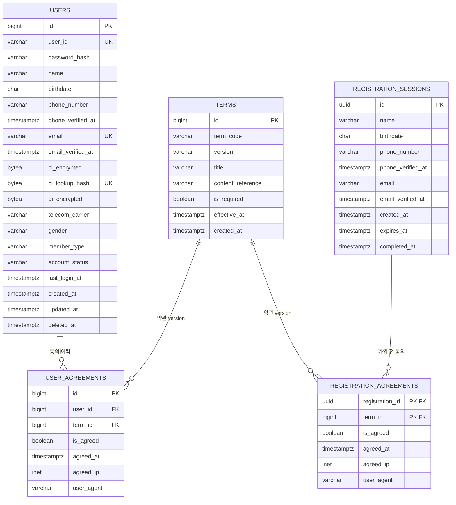
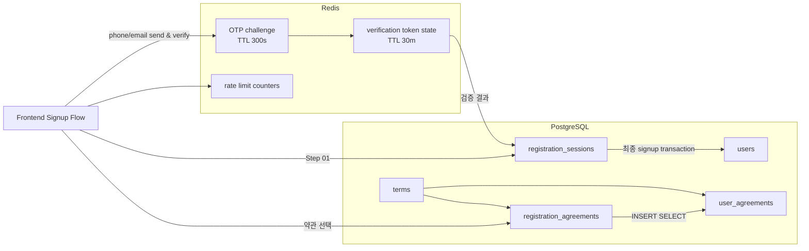
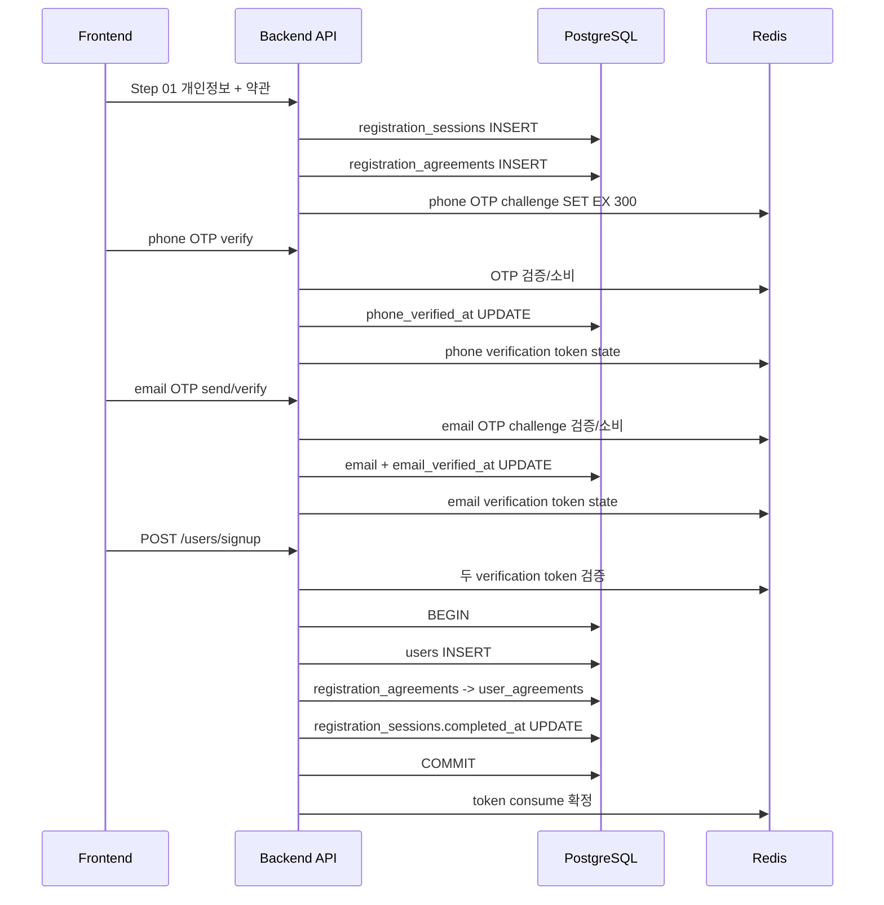

# 회원가입 데이터 구조도 (ERD)

> 상태: 목표 설계안(Target Design)
> 기준 이슈: #24
> 상세 컬럼 정의: `docs/REGISTRATION_DATA_SPECIFICATION.md`

## 1. PostgreSQL ERD



## 2. 관계 요약

```text
                           TERMS
                         /       \
                        /         \
                       N           N
                      /             \
                     1               1
       USER_AGREEMENTS          REGISTRATION_AGREEMENTS
              N                         N
              |                         |
              1                         1
            USERS              REGISTRATION_SESSIONS
```

실제 cardinality는 다음과 같다.

- `users 1 : N user_agreements`
- `terms 1 : N user_agreements`
- `registration_sessions 1 : N registration_agreements`
- `terms 1 : N registration_agreements`

`user_agreements`와 `registration_agreements`는 각각 사용자/가입 세션과 약관 version 사이의 교차 관계다.

## 3. Redis를 포함한 전체 데이터 구조



## 4. 가입 완료 시 데이터 전환



## 5. 3NF 관점의 핵심 분리

### 약관 속성은 `terms`에만 존재

```text
terms.id
  -> term_code
  -> version
  -> title
  -> content_reference
  -> is_required
  -> effective_at
```

따라서 `user_agreements`와 `registration_agreements`에는 위 속성을 반복 저장하지 않고 `term_id`만 둔다.

### 인증 여부는 timestamp로 표현

```text
phone_verified_at IS NOT NULL -> 휴대폰 인증 완료
email_verified_at IS NOT NULL -> 이메일 인증 완료
```

별도 `phone_verified`, `email_verified` boolean을 저장하지 않는다.

### 임시 가입 상태와 가입 완료 상태를 분리

```text
registration_sessions / registration_agreements
                  |
                  | signup 성공
                  v
users / user_agreements
```

가입 실패/이탈 데이터가 `users`에 섞이지 않고, 가입 완료 회원 테이블은 실제 계정만 보유한다.

## 6. 삭제 정책

```text
users ---------------------- RESTRICT ---> user_agreements
terms ---------------------- RESTRICT ---> user_agreements
terms ---------------------- RESTRICT ---> registration_agreements
registration_sessions ------ CASCADE ----> registration_agreements
```

- 회원 탈퇴는 `users` physical delete보다 `deleted_at` soft delete를 기본으로 한다.
- 감사용 `user_agreements`는 회원 탈퇴와 함께 자동 삭제하지 않는다.
- 가입 전 임시 세션은 만료/정리 시 `registration_agreements`와 함께 삭제 가능하다.
