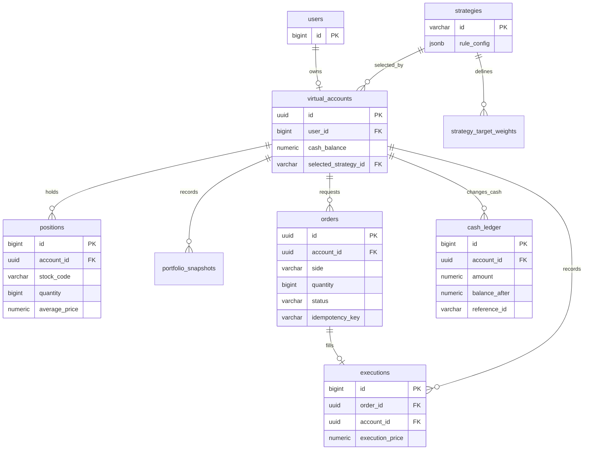

# 가상투자 ERD

```mermaid
erDiagram
  users ||--o| virtual_accounts : owns
  strategies ||--o{ virtual_accounts : selected_by
  virtual_accounts ||--o{ positions : holds
  virtual_accounts ||--o{ portfolio_snapshots : records
  strategies ||--o{ strategy_target_weights : defines
  virtual_accounts ||--o{ orders : requests
  orders ||--o| executions : fills
  virtual_accounts ||--o{ executions : records
  virtual_accounts ||--o{ cash_ledger : changes_cash

  users { bigint id PK }
  strategies { varchar id PK jsonb rule_config }
  virtual_accounts { uuid id PK bigint user_id FK numeric cash_balance varchar selected_strategy_id FK }
  positions { bigint id PK uuid account_id FK varchar stock_code bigint quantity numeric average_price }
  orders { uuid id PK uuid account_id FK varchar side bigint quantity varchar status varchar idempotency_key }
  executions { bigint id PK uuid order_id FK uuid account_id FK numeric execution_price }
  cash_ledger { bigint id PK uuid account_id FK numeric amount numeric balance_after varchar reference_id }
```

시장 현재가는 관계형 테이블에 저장하지 않는다: `KIS → Redis price:{stock_code} → 조회 시 평가`. Azure Blob의 과거 금융 데이터는 학습/백테스트 데이터로 별도 유지한다.
