# 2026 알고리즘 트레이딩 기술백서 — SeSAC 3차 프로젝트 1팀 특화판

> 기준일: 2026-08-14 (Asia/Seoul)  
> 대상: KOSPI·KOSDAQ 및 국내 상장 ETF, 개인자금 10억원 이하, 일봉 중심, Python/FastAPI/PostgreSQL/Redis/React 기반  
> 목적: 공개적으로 알려진 주식 매매 알고리즘의 지형을 정리하고, 현재 저장소에서 구현할 현실적 우선순위를 결정한다.  
> 주의: 연구·제품설계 문서이며 투자성과, 특정 펀드의 비공개 전략, 법률 판단을 보장하지 않는다.

## 0. 결론부터 보기

이 팀이 먼저 만들 시스템은 **국내 상장 ETF의 듀얼모멘텀·추세 필터·변동성 타게팅**이다. 다음은 **유동성 상위 한국 주식의 모멘텀·품질·저변동성 복합 랭킹**, 세 번째는 **LightGBM 횡단면 랭커**다. HFT, 마켓메이킹, 옵션 변동성 차익, 강화학습, LLM 자율주문은 데이터·체결·규제·운영비가 현재 단계와 맞지 않는다.

권장 순서는 `정확한 point-in-time 데이터 → 단순 규칙 기준선 → 비용 포함 walk-forward → 이벤트형 교차검증 → 모의투자 → 주문별 사용자 승인`이다. 현재 저장소의 서비스 골격은 유지하고 `data/`에 시점 일관 데이터 계층, `ai/`에 연구·모델 계층, `backend/`에 위험·승인·주문 상태기계, `frontend/`에 근거와 승인 화면을 추가한다.

성과 수치는 모두 실제 한국 데이터로 재현하기 전에는 가설이다. 특히 높은 백테스트 CAGR, “AI 승률”, 유명 펀드 수익률을 전략 재현 가능성으로 해석하지 않는다.

---

## STEP 1. 알고리즘 트레이딩 이론 분류

난이도는 이 프로젝트 기준 1(쉬움)~5(매우 어려움)이다. ‘대표’는 공개적으로 연관된 사례이지 해당 회사의 실제 규칙을 확인했다는 뜻이 아니다.

| 이론 | 핵심 개념·수학 | 주요 지표 | 장점 | 단점 | 적용 시장 | 공개 연관 사례 | 난이도 |
|---|---|---|---|---|---|---|---:|
| Trend Following | 가격 추세의 지속. 이동평균, 돌파, 시계열 회귀, (z=(P-MA)/\sigma\) | MA, Donchian, ADX, ATR | 단순·다자산·큰 추세 포착 | 횡보 whipsaw, 급반전 손실 | 주식·선물·ETF·FX | Man AHL, Winton | 2 |
| Momentum | 과거 승자가 상대적으로 계속 우세. 횡단면 순위·12-1 수익 | 3/6/12개월 수익, IC, turnover | 강한 장기 실증, 설명 가능 | momentum crash, 혼잡·비용 | 주식·ETF·선물 | AQR 계열 연구·상품 | 2 |
| Mean Reversion | 가격/스프레드가 장기 평균으로 복귀. OU 과정 (dX=\kappa(\mu-X)dt+\sigma dW) | z-score, 반감기, RSI, 밴드폭 | 횡보장에서 잦은 소익 | 구조변화 때 큰 손실, 꼬리위험 | 유동성 주식·ETF·스프레드 | 통계차익 펀드 전반(세부 비공개) | 3 |
| Statistical Arbitrage | 공통요인을 제거한 잔차의 상대가치. PCA·회귀·공적분 | 잔차 z, beta, 공적분 p값, half-life | 시장방향 노출 축소 가능 | 차입·동시체결·모형붕괴 | 대형주 바스켓·선물 | D. E. Shaw, Renaissance에 공개적으로 연관 | 4 |
| Pairs Trading | 경제적으로 유사한 두 자산의 상대가격 평균회귀 | 거리, spread, hedge ratio, ADF | 직관적·시장중립 설계 | pair mining 과적합, 공매도·차입 | 동종업종 주식·ETF | Gatev–Goetzmann–Rouwenhorst 연구 | 3 |
| Market Making | bid/ask 동시 제시로 스프레드 획득, 재고위험 제어. Avellaneda–Stoikov/HJB | spread, fill rate, inventory, adverse selection | 반복적 미세수익 | 기술·규제·독성흐름·꼬리손실 | 호가장 있는 고유동 시장 | Citadel Securities, Jane Street(운용사와 구분) | 5 |
| Factor Investing | 가치·규모·품질·저변동·모멘텀 노출을 체계화. 횡단면 회귀 | factor return, beta, IC, tracking error | 설명·분산·저회전 가능 | factor zoo, 혼잡, 정의 민감 | 주식·ETF | AQR, DFA | 2 |
| Risk Parity | 예측수익보다 각 자산의 위험기여를 균등화. (RC_i=w_i(\Sigma w)_i/\sigma_p) | risk contribution, vol, correlation | 안정적 자산배분 | 채권 레버리지·상관 급변 | 주식·채권·원자재 ETF | Bridgewater All Weather와 연관 | 3 |
| Smart Beta | 시가총액 외 규칙으로 지수 가중 | factor exposure, tracking error, turnover | 투명·저비용 상품화 | 팩터 타이밍·숨은 집중 | 주식·ETF | Research Affiliates, 지수사업자 | 2 |
| Quantamental | 정량 신호와 기업·산업의 정성/기본 분석 결합 | earnings revision, quality, valuation, NLP evidence | 데이터와 맥락 결합 | 사람 개입·재현성·확장성 문제 | 중저빈도 주식 | 여러 systematic fundamental 팀 | 3 |
| Event Driven | 합병·분할·공시·정책 이벤트의 조건부 수익 | event window, abnormal return, deal spread | 촉매가 명확 | 법률·딜 실패·시각 누출 | 주식·전환증권 | 이벤트드리븐 헤지펀드 | 4 |
| Earnings Trading | 실적 surprise와 PEAD를 거래 | SUE, revision, gap, post-earnings drift | 구조화된 반복 이벤트 | 발표시각·컨센서스 라이선스, 혼잡 | 개별 주식 | 공개 학술 PEAD 전략 | 3 |
| Sentiment Trading | 뉴스·공시·소셜 텍스트에서 심리·주제 추출 | sentiment, novelty, embedding, attention | 비정형정보 반영 | 라이선스·환각·중복기사·빠른 감쇠 | 주식·ETF·옵션 | Two Sigma 등 대체데이터 활용 공개 사례 | 4 |
| Cross Asset | 금리·환율·원자재·주식 간 경제관계와 lead-lag | carry, term spread, beta, VAR/VECM | 거시 분산·레짐 해석 | 관계 붕괴·vintage 누출 | 글로벌 ETF·선물 | Bridgewater, 글로벌 매크로 | 4 |
| Volatility Trading | 방향 대신 실현/내재 변동성·vol risk premium 거래 | IV, RV, VIX, skew, term structure | 방향중립 가능 | 옵션데이터·그릭·점프·마진 | 옵션·변동성 선물 | 전문 변동성 운용사 | 5 |
| Option Based Strategy | delta/vega/gamma와 payoff를 설계 | Greeks, IV rank, breakeven, margin | 비선형 보호·수익구조 | 거래비용·모형위험·꼬리손실 | 상장옵션 | tail-risk·covered-call 상품 | 5 |
| Reinforcement Learning | 상태–행동–보상 정책을 순차 최적화. MDP, Bellman equation | cumulative reward, drawdown, policy stability | 비용·포지션을 공동 최적화 가능 | simulator 오류·비정상성·재현성 | 연구용 포트폴리오·집행 | 검증된 대표 생산펀드 공개 없음 | 5 |
| Deep Learning | CNN/RNN/Transformer로 비선형 표현 학습 | OOS loss, IC, calibration, turnover | 복잡한 상호작용·멀티모달 | 표본 부족·불투명·비용 | 대규모 다종목·호가·텍스트 | ML 활용 기관은 많으나 모델 세부 비공개 | 4 |
| AI Agent Trading | LLM/도구/메모리/여러 역할이 조사·결정·실행 | grounded evidence, consistency, PnL after LLM cost | 문서·도구 오케스트레이션 | 비결정성·환각·보안·평가오염 | 리서치 보조·paper trading | TradingAgents·FINSABER 연구, 생산 검증 미확립 | 5 |

### 이론 선택 규칙

1. 한국 일봉 long-only에서는 팩터·모멘텀·추세·risk parity를 우선한다.
2. 평균회귀·pairs는 구조붕괴와 공매도 가능성을 데이터로 증명한 뒤 연구한다.
3. 변동성·옵션·market making은 별도 데이터·브로커·위험 엔진이 필요하다.
4. ML/RL/agent는 단순 기준선을 **비용 차감 표본외 성과**로 이길 때만 승격한다.

---

## STEP 2. 실제 사용되는 대표 전략 분석

| 전략 | 진입조건 | 청산조건 | 리스크 관리 | 기대수익 특성 | 잘되는/나쁜 시장 |
|---|---|---|---|---|---|
| Turtle Trading | 20일 또는 55일 고가 돌파, ATR 기반 unit 추가 | 10일/20일 반대 돌파 | 1회 위험을 N(ATR)로 제한, 상관군 한도 | 낮은 승률·큰 평균이익, 양의 왜도 | 강한 추세 / 횡보·갭 반전 |
| Dual Momentum | 후보 중 6~12개월 상대모멘텀 1위이며 무위험/현금 대비 절대모멘텀 양수 | 순위 하락 또는 절대모멘텀 음수 | ETF 분산, 월간, vol target | 낮은 회전율, 위기 회피 가능하나 후행 | 지속 추세 / 급락 후 V자 반등 |
| Moving Average Crossover | 단기 MA가 장기 MA 상향 돌파 | 하향 돌파 | ATR stop, 포지션 vol 조정 | 큰 추세 소수에 의존 | 장기 추세 / 잦은 교차 횡보 |
| Breakout | N일 고가·저항을 거래량과 함께 돌파 | N일 저가, trailing stop, 시간청산 | false breakout buffer, gap risk cap | 양의 왜도, 승률 낮을 수 있음 | 확장성 장세 / 저유동·뉴스 갭 |
| Donchian Channel | 상단 돌파 long, 하단 돌파 short(본 프로젝트는 long만) | 중간선 또는 반대 채널 | ATR sizing, pyramiding 제한 | Turtle과 유사한 trend payoff | 추세 / 박스권 |
| Bollinger Band | 평균회귀형은 하단 이탈 후 재진입, 추세형은 squeeze 뒤 상단 돌파 | 평균선·반대밴드 또는 stop | 밴드폭·ATR, 구조변화 stop | 평균회귀형은 빈번한 소익·드문 대손 | 안정적 횡보 / 추세 급변 |
| Pairs Trading | 형성기간 pair 선택 후 spread z-score ±2 진입 | z=0~0.5 복귀, stop z=3~4, 시간청산 | beta/dollar neutral, pair·sector 한도, borrow 확인 | 시장중립 목표, 꼬리손실 위험 | 안정 관계 / 구조·기업 이벤트 |
| Kalman Filter | 시간가변 hedge ratio와 state residual이 임계치 초과 | filtered residual 평균 복귀 | process/measurement noise 민감도, innovation stop | 고정 beta보다 적응적일 수 있음 | 완만한 변화 / 점프·잘못된 상태모형 |
| Cointegration Trading | ADF/Johansen 및 경제적 관계 통과 후 error-correction 편차 진입 | equilibrium 복귀 또는 공적분 검정 실패 | rolling re-test, half-life·차입·동시체결 통제 | 안정 관계에서 완만한 수익 | 정상 spread / regime break |
| VWAP Execution | 목표수량을 예상 장중 거래량 곡선에 비례 배분 | 종료시각/목표수량 완료 | 참여율 cap, price collar, 미체결 정책 | alpha가 아니라 시장충격·benchmark 편차 축소 | 정상 거래량 / 뉴스로 volume curve 왜곡 |
| TWAP Execution | 목표수량을 시간구간에 균등 배분 | 종료시각/목표수량 완료 | randomization, 가격·참여율 한도 | 단순·예측 가능, 얇은 시간대 충격 | 거래량 안정 / U자 거래량·저유동 |
| Smart Order Routing | KRX/NXT 등 venue별 가격·수수료·깊이·체결확률 비교 | 최선 조건 소멸·잔량 완료 | stale quote, 중복체결, 규정·best execution | execution improvement, 방향 alpha 아님 | 복수시장 유동성 / 지연·분절·수수료 오판 |
| Market Making | 재고·공정가치 기준 양방향 지정가 | fill 후 재호가, 재고/손실 한도 초과 시 철수 | inventory skew, cancel/fill 모니터, kill switch | 많은 소익·간헐적 큰 adverse-selection 손실 | 균형 order flow / 뉴스·독성흐름 |

본 프로젝트의 첫 실전 후보는 Dual Momentum이다. VWAP/TWAP은 자금이 커져 단일 주문이 평균거래량의 의미 있는 비율이 될 때 추가한다. SOR·market making은 KRX/NXT 실시간 시세권리와 브로커 지원을 확정하기 전에는 개발하지 않는다.

---

## STEP 3. 머신러닝 기반 전략 조사

‘공개 성과’는 논문·예제의 특정 표본 결과일 뿐 재현 가능한 기대수익이 아니다. 정확도보다 IC, 비용 차감 PnL, turnover, drawdown, calibration을 본다.

| 모델 | 입력 데이터 | 예측 대상 | 금융 적용 사례 | 공개 성과의 해석 | 핵심 한계 |
|---|---|---|---|---|---|
| Random Forest | 팩터·기술·재무·거시 | 5~20일 수익/순위·변동성 | 횡단면 stock ranking | 비선형·상호작용이 선형보다 나은 표본 존재 | 시간구조 미반영, 깊은 트리 과적합 |
| XGBoost | 표형 feature, 결측 포함 | 수익·방향·default·vol | 알파 랭킹·event response | 강한 tabular baseline | 많은 튜닝 자유도, regime drift |
| LightGBM | 대규모 다종목 표형 데이터 | sector-neutral return rank | Qlib Alpha158/360류 | 속도·성능 균형이 좋아 본 프로젝트 challenger | 작은 잎·범주 처리에서 누출/과적합 |
| SVM | 정규화 기술·팩터 | 방향·regime·event 분류 | 상승/하락 분류 | 소표본·비선형 경계에서 경쟁력 가능 | 확률보정·확장성·파라미터 민감 |
| CatBoost | 표형+범주(업종 등) | 횡단면 순위·수익 | sector/issuer feature 결합 | 범주형 처리 편리 | 시간에 따라 바뀌는 범주와 target leakage |
| MLP | 고정길이 feature vector | return/quantile/position score | 비선형 factor model | Gu–Kelly–Xiu류 자산가격 ML의 한 축 | 스케일·초기값·표본수 민감 |
| CNN | 수익·OHLCV 창, LOB image | 패턴·단기 방향 | DeepLOB의 convolution block | 로컬 패턴 추출 가능 | 차트 이미지는 정보 추가가 없을 수 있음 |
| LSTM | 순차 OHLCV·지표·거시 | 다기간 수익·vol | 시계열 방향/vol 예측 | 일부 표본에서 전통모형 우위 보고 | 긴 의존·재현성·비정상성 |
| GRU | LSTM과 동일 | 수익·regime | 경량 순환 baseline | 파라미터가 적어 LSTM보다 안정적일 수 있음 | 구조적 한계는 LSTM과 유사 |
| Transformer | 다변량 시계열·텍스트·종목 패널 | return/vol/sequence | PatchTST·finance Transformer·LOB | 긴 문맥·병렬학습 장점 | 작은 금융표본, 계산비, attention≠설명 |
| Temporal Fusion Transformer | 정적·과거·미래 known covariate | 다중 horizon quantile | 거시+재무+가격 확률예측 | 해석 장치와 quantile 출력 | 복잡하며 일봉 알파에는 과도할 수 있음 |
| DQN | 상태(가격·보유·현금), 이산 행동 | Q-value/매수·보유·매도 | 단일자산 trading gym | 교육용 benchmark 다수 | 연속 비중 부적합, overestimation·환경오류 |
| PPO | 상태와 연속/이산 action | 정책·가치함수 | 포트폴리오 weight·집행 | 학습이 비교적 안정적 | on-policy 표본 비효율, 보상 설계 |
| SAC | 상태와 연속 포지션 | entropy-regularized policy | 연속 자산배분·market making 연구 | 탐색과 sample efficiency 장점 | 시장 simulator·tail risk가 결과 지배 |
| A3C | 병렬 환경 trajectory | 정책·가치함수 | 여러 시장구간 병렬학습 | 고전적 비동기 RL benchmark | 최신 단일노드 환경에서는 대안 많고 불안정 |

### 프로젝트용 ML 승격 게이트

1. Ridge/Elastic Net → LightGBM → 딥러닝 순으로 비교한다.
2. Purged nested walk-forward, embargo, seed 반복, trial registry를 의무화한다.
3. 목표는 가격수준이 아니라 미래 5~20거래일 **sector-neutral excess-return rank**로 둔다.
4. 단순 팩터보다 OOS Sharpe·DSR·MDD가 개선되고 2배 비용 스트레스에서도 살아남을 때만 paper trading으로 승격한다.
5. RL은 현실적인 체결 simulator를 독립 검증하기 전 생산 경로에서 제외한다.

---

## STEP 4. 최근 5년 연구 트렌드(2021–2026)

| 트렌드 | 등장 배경 | 주요 논문·대표 구현 | 현재 한계 | 전망·프로젝트 판단 |
|---|---|---|---|---|
| Transformer for Finance | RNN의 긴 의존·병렬화 한계 | [TFT](https://doi.org/10.1016/j.ijforecast.2021.03.012), PatchTST, DeepLOB 후속 | 금융표본 작음, 비용 후 우위 불안정 | 멀티모달·다종목에는 유망; 1차 모델 아님 |
| FinGPT | 폐쇄형 금융 LLM과 데이터 비용 대응 | [FinGPT paper](https://arxiv.org/abs/2306.06031), [FinGPT](https://github.com/AI4Finance-Foundation/FinGPT) | 데이터 권리·시점·평가오염 | DART 요약·분류 보조로 제한 |
| Time-Series Foundation Model | 대규모 사전학습·zero/few-shot | [TimesFM](https://openreview.net/pdf?id=jn2iTJas6h), [Chronos](https://arxiv.org/abs/2403.07815), [Moirai](https://mlanthology.org/icml/2024/woo2024icml-unified/) | 범용 예측오차가 alpha·PnL로 직결되지 않음 | challenger benchmark; 금융 전용 적응 연구 지속 |
| Multi-Agent Trading | 분석가·트레이더·위험 역할 분리 | [TradingAgents](https://github.com/TauricResearch/TradingAgents), HedgeAgents | agent 상관오류, 토론이 진실을 보장하지 않음 | 리서치 workflow에는 유용, 자율주문 금지 |
| LLM 투자 시스템 | 뉴스·공시·도구사용 결합 | FinMem/FinAgent/FinCon, [FINSABER](https://github.com/waylonli/FINSABER) | 긴 기간·비용·look-ahead 공정비교 부족 | 표준 benchmark와 비용 회계가 핵심 |
| Retrieval-Augmented Finance | 근거 없는 답변과 최신성 보완 | 공시/리서치 corpus+vector/BM25+LLM 구현 | 잘못된 시점 문서 검색, 인용이 정확성을 보장하지 않음 | `known_at` 필터와 원문 링크가 있는 DART RAG 유망 |
| Graph Neural Network Trading | 산업·공급망·공동언급 전파 모델링 | FinGAT 등 temporal graph 연구 | 그래프의 사후구성·정적 업종·비싼 PIT 관계 | 공급망 데이터 확보 후 독립 ablation |
| Alternative Data | 전통 가격·재무 alpha 약화 | 위성·웹·카드·채용·앱 데이터 | 비용·개인정보·대표성·짧은 역사 | 개인 개발자는 공공 공시·검색량부터 |
| News 기반 예측 | 텍스트 embedding 발전 | FinBERT, 뉴스흐름 LLM 수익예측 연구 | 기사 중복·시간대·배포권·빠른 감쇠 | 공시 이벤트 분류가 일반 뉴스보다 현실적 |
| Social Media Alpha | 집단심리·attention 포착 | StockTwits/Reddit 연구, StockNet류 데이터 | 봇·조작·선택편향·API 정책 변화 | 단독 신호가 아닌 위험/관심 보조지표 |
| Macro-Finance AI | 고차원 거시·시장 레짐 결합 | ML 자산가격 연구, dynamic factor·TFT/TSFM | 빈도 불일치·개정치(vintage) 누출 | ECOS vintage와 ETF 자산배분에 제한 적용 |

2025~2026의 agent 논문·사전논문은 연구 동향의 증거이지 실전 우위의 증거가 아니다. [FINSABER](https://github.com/waylonli/FINSABER)는 실행시점·조정가격·슬리피지·유동성 cap·LLM 비용을 명시하는 방향으로 발전했다는 점이 중요하지만, 그 결과도 한국시장으로 그대로 이전할 수 없다.

---

## STEP 5. GitHub 오픈소스 31개 조사

스타는 GitHub API의 **2026-08-14 조회 스냅샷**이며 변동한다. 유지상태는 archived 플래그, 공식 안내, 공개 활동의 1차 판단이다. 별(★)은 이 프로젝트 추천도 1~5다. ‘실거래’는 기본/공식 adapter 기준이며 한국투자증권 지원을 의미하지 않는다.

| 프로젝트 | GitHub / Stars | 언어 | 핵심·백테스트 | 실거래 | 유지상태 | 추천 |
|---|---|---|---|---|---|---:|
| Backtrader | [repo](https://github.com/mementum/backtrader) · 22,838 | Python | 범용 이벤트형 · O | 일부 broker | 원본 활동 낮음/비보관 | 2 |
| Zipline Reloaded | [repo](https://github.com/stefan-jansen/zipline-reloaded) · 1,919 | Python | Zipline 현대화 · O | 제한 | 유지 | 3 |
| Zipline | [repo](https://github.com/quantopian/zipline) · 20,034 | Python | Quantopian 엔진 · O | 사실상 X | legacy 중심 | 2 |
| vectorbt | [repo](https://github.com/polakowo/vectorbt) · 8,668 | Python | 고속 벡터 연구 · O | 별도 연결 | 유지, 라이선스 조건 확인 | 4 |
| QuantConnect LEAN | [repo](https://github.com/QuantConnect/Lean) · 21,197 | C# | 성숙 이벤트 엔진 · O | O, 다수 broker | 매우 활발 | 5 |
| Freqtrade | [repo](https://github.com/freqtrade/freqtrade) · 53,259 | Python | crypto bot · O | O(crypto) | 매우 활발 | 2 |
| FinRL | [repo](https://github.com/AI4Finance-Foundation/FinRL) · 16,003 | Notebook | DRL 교육·연구 · O | 예제/후속 FinRL-X | 유지 | 2 |
| Qlib | [repo](https://github.com/microsoft/qlib) · 47,384 | Python | AI quant pipeline · O | 별도 | 활발 | 4 |
| PyBroker | [repo](https://github.com/edtechre/pybroker) · 3,504 | Python | ML 친화 백테스트 · O | X | 유지 | 4 |
| fastquant | [repo](https://github.com/enzoampil/fastquant) · 1,754 | Notebook | 간단 전략/Backtrader · O | 제한 | 낮음~유지 | 2 |
| Catalyst | [repo](https://github.com/enigmampc/catalyst) · 2,559 | Python | crypto Zipline fork · O | legacy | **archived** | 1 |
| Backtesting.py | [repo](https://github.com/kernc/backtesting.py) · 8,819 | Python | 간결한 단일/소수자산 · O | X | 활발 | 4 |
| bt | [repo](https://github.com/pmorissette/bt) · 2,958 | Python | 포트폴리오 트리 · O | X | 유지 | 3 |
| NautilusTrader | [repo](https://github.com/nautechsystems/nautilus_trader) · 25,469 | Rust/Python | 고정밀 이벤트형 · O | O | 매우 활발 | 4 |
| vn.py | [repo](https://github.com/vnpy/vnpy) · 44,448 | Python | 실거래·CTA 생태계 · O | O | 매우 활발 | 3 |
| RQAlpha | [repo](https://github.com/ricequant/rqalpha) · 6,688 | Python | 중국 증권 중심 · O | 제한 | 활발 | 3 |
| QSTrader | [repo](https://github.com/mhallsmoore/qstrader) · 3,435 | Python | 투명한 이벤트 포트폴리오 · O | X | 유지 | 4 |
| PyAlgoTrade | [repo](https://github.com/gbeced/pyalgotrade) · 4,664 | Python | 고전 이벤트 엔진 · O | legacy | **archived** | 1 |
| PyPortfolioOpt | [repo](https://github.com/PyPortfolio/PyPortfolioOpt) · 5,958 | Notebook/Python | 최적화 · 백테스트 엔진 X | X | 활발 | 5 |
| Riskfolio-Lib | [repo](https://github.com/dcajasn/Riskfolio-Lib) · 4,441 | C++/Python | 다수 위험최적화 · 보조 | X | 활발 | 4 |
| QuantStats | [repo](https://github.com/ranaroussi/quantstats) · 7,545 | Python | 성과분석 · X | X | 유지 | 4 |
| Empyrical | [repo](https://github.com/quantopian/empyrical) · 1,506 | Python | 성과 metric · X | X | legacy/유지 | 3 |
| Hummingbot | [repo](https://github.com/hummingbot/hummingbot) · 19,448 | Python | crypto market making · 일부 | O(crypto) | 활발 | 1 |
| TensorTrade | [repo](https://github.com/tensortrade-org/tensortrade) · 6,653 | Python | RL 환경 · O | 실험적 | 유지 | 2 |
| Jesse | [repo](https://github.com/jesse-ai/jesse) · 8,314 | Python | crypto 연구/실거래 · O | O(crypto) | 활발 | 1 |
| FinGPT | [repo](https://github.com/AI4Finance-Foundation/FinGPT) · 21,084 | Notebook | 금융 LLM · 직접 엔진 X | X | 활발 | 2 |
| ABIDES | [repo](https://github.com/abides-sim/abides) · 559 | Python | agent 시장 simulator · 시뮬 | X | 연구 유지 | 2 |
| gym-anytrading | [repo](https://github.com/AminHP/gym-anytrading) · 2,380 | Python | RL gym · O | X | 유지 | 2 |
| mlfinlab | [repo](https://github.com/hudson-and-thames/mlfinlab) · 4,906 | Python | 금융 ML 기법 · 보조 | X | 공개범위/라이선스 확인 | 2 |
| pysystemtrade | [repo](https://github.com/pst-group/pysystemtrade) · 3,433 | Python | 선물 systematic trading · O | O(IB 등) | 활발 | 3 |
| Lumibot | [repo](https://github.com/Lumiwealth/lumibot) · 1,920 | Python | 백테스트·broker bot · O | O | 활발 | 3 |

**QuantConnect와 LEAN의 관계:** QuantConnect는 호스팅 플랫폼이고 LEAN은 그 오픈소스 엔진이다. 요구 목록의 두 이름을 모두 검토했지만 동일 저장소를 별도 두 건으로 세지 않았다.

**채택안:** 빠른 연구는 자체 pandas/Polars 또는 vectorbt, 기준 검증은 QSTrader/LEAN, 포트폴리오는 PyPortfolioOpt, 통계는 statsmodels/arch, 성과는 QuantStats와 자체 검산을 쓴다. 한국시장 corporate action·가격제한폭·거래정지·세금·KRX/NXT·KIS 주문 어댑터는 직접 소유한다.

---

## STEP 6. 현업 관점 분석

아래 내용은 공개 발언·연구·사업설명에서 추론한 범주다. 비공개 코드, 실시간 포지션, 정확한 모델을 안다고 주장하지 않는다.

| 회사 | 알려진 투자철학 | 추정 알고리즘 유형 | 데이터 | 인프라 특징 | 개인이 벤치마킹할 부분 |
|---|---|---|---|---|---|
| Renaissance Technologies | 반복 가능한 통계 패턴과 엄격한 과학적 연구 | stat arb, 단기 예측, 포트폴리오·execution 최적화로 추정 | 방대한 가격·거래·대체데이터로 알려짐 | 연구자 조직, 고성능 계산·집행 | 비밀전략이 아니라 데이터 정합·실험규율·작은 edge 결합 |
| Two Sigma | 데이터과학·기술을 투자 전 과정에 적용 | ML 횡단면, 대체데이터, systematic macro 추정 | 시장·기업·텍스트·대체데이터 | 분산연산, 실험 플랫폼, 엔지니어링 문화 | feature lineage, 재현 실험, model monitoring |
| Citadel | 여러 독립 전략과 중앙 위험관리 | 주식 systematic, macro, relative value; Citadel Securities와 구분 | 시장·기본·대체데이터 | 저지연과 대규모 위험·집행 시스템 | 전략과 위험엔진 분리, 실시간 한도·reconciliation |
| D. E. Shaw | 계산과학 기반 다전략 | stat arb, relative value, options, macro 추정 | 다자산·시장미시구조·기본 데이터 | 고급 연구·소프트웨어·검증 | 포트폴리오 수준 상관·capacity 관리 |
| AQR | 학술 팩터를 투명한 systematic portfolio로 구현 | value, momentum, quality, defensive, trend | 장기 글로벌 가격·기본 데이터 | 대규모 리밸런싱·거래비용 최적화 | 경제적 가설, 단순 팩터, 긴 OOS, 비용·혼잡 관리 |
| Bridgewater | 경제를 성장·물가 충격으로 분해하고 위험 균형 | systematic macro, risk parity, scenario/risk budgeting | 거시·금리·FX·원자재·정책 | 글로벌 다자산 위험 통합 | 예측보다 위험기여, 시나리오·레짐, 의사결정 원칙 문서화 |

개인 투자자가 복제할 수 없는 것은 독점 데이터·인재·대규모 집행·차입·co-location이다. 복제 가능한 것은 데이터 검증, 기준선, 실험등록, 위험예산, 장애통제, 사후분석이다.

---

## STEP 7. 개인 개발자 예산별 추천 스택

예산은 1년 연구·운영비의 대략적 상한이며 투자원금과 분리한다. 10억원 운용이라도 주문이 일봉·저회전이면 고가 HFT 인프라는 필요 없다.

| 예산 | 데이터 수집 | 저장 | 분석·백테스트 | ML | 자동매매 | 모니터링 |
|---:|---|---|---|---|---|---|
| 0원 | Open DART·ECOS·허용범위의 KRX/KIS, 수동 공식 대조 | Parquet+DuckDB, Git metadata | pandas/Polars, statsmodels, Backtesting.py/자체 엔진 | scikit-learn | KIS 모의, 주문 파일/수동승인 | 로그+이메일/로컬 dashboard |
| 100만원 | 공식/저가 EOD 공급원 계약 검토, 안정 VPS 일부 | Parquet+PostgreSQL, 주기 백업 | vectorbt 또는 PyBroker + QSTrader 교차검증 | LightGBM, MLflow 최소형 | KIS 모의→개별승인 소액 | Grafana/Prometheus 또는 간단 health alert |
| 500만원 | 상장폐지·기업행사·지수구성 포함 EOD 품질 향상 | object storage+PostgreSQL PIT, offsite backup | LEAN 교차검증, CI data tests | Qlib 참고, Optuna 제한탐색 | 이중화 job, 승인큐, reconciliation | 중앙로그·오류추적·on-call runbook |
| 1000만원 | 계약된 EOD+분봉/뉴스 파일럿, 라이선스 법률검토 | 버전 object store, warehouse, secrets vault | 이벤트형 엔진·비용/impact calibration | GPU는 필요 시 임대, NLP/TSFM ablation | 제한 자동화·다중 broker는 계약 후 | SLO, drift, 체결 TCA, 재해복구 훈련 |

예산을 GPU보다 **상폐 포함 PIT 데이터, 기업행사, 백업, 키 보안, 모의투자 기간**에 먼저 쓴다. 무료 데이터로 탐색은 가능하지만 제3자 서비스의 생산 데이터나 재배포 근거로 사용하지 않는다.

---

## STEP 8. 전략 평가 프레임워크

### 8.1 지표 정의

| 지표 | 계산·해석 | 함정 |
|---|---|---|
| CAGR | ((V_T/V_0)^{1/Y}-1) | 짧은 표본·시작/종료점 민감 |
| Sharpe | ((R_p-R_f)/\sigma_p), 동일 빈도 연율화 | 비정규·자기상관·전략선택 편향 |
| Sortino | 초과수익/하방편차 | 목표수익·표본 정의 의존 |
| Max Drawdown | 고점 대비 최저 누적손실 | 관측기간이 짧으면 과소평가 |
| Calmar | CAGR/절대 MDD | CAGR과 MDD 모두 표본 민감 |
| Hit Ratio | 이익 거래/전체 거래 | 손익 크기를 무시 |
| Profit Factor | 총이익/총손실 | 드문 꼬리손실 전 과대평가 |
| Turnover | 0.5 × 종목별 목표비중과 드리프트 비중 차이의 절댓값 합 | 정의·리밸런싱 빈도 통일 필요 |
| Capacity | impact 후 alpha가 유지되는 운용규모 | ADV·참여율·시장상태 의존 |
| Slippage 민감도 | 1×/2×/3× 비용 스트레스 성과 | 고정 bp만 쓰면 유동성 충격 누락 |
| 시장 적응성 | regime별 OOS 성과와 parameter stability | 사후 regime 라벨은 누출 가능 |

### 8.2 전략군 사전평가

수치는 실증 전 조작하지 않고 성격을 `낮/중/높`으로 평가한다.

| 전략군 | CAGR 잠재 | Sharpe/Sortino | MDD/Calmar | Hit/PF | Turnover | Capacity | Slippage | 적응성 |
|---|---|---|---|---|---|---|---|---|
| ETF 듀얼모멘텀 | 중 | 중 | 중~양호 | 낮은 hit/중 PF | 낮 | 높 | 낮 | 중 |
| 주식 복합팩터 | 중 | 중 | 중 | 중 | 중 | 중~높 | 중 | 중 |
| 장기 trend | 중 | 중 | 큰 추세 전까지 부진 | 낮은 hit/높은 payoff | 중 | 높 | 중 | 중~높 |
| 평균회귀 | 중 | 겉보기 높을 수 있음 | 꼬리 MDD 위험 | 높은 hit/꼬리 PF 붕괴 | 높 | 중 | 높 | 낮~중 |
| pairs/stat arb | 중 | 중~높 가설 | 구조붕괴 MDD | 중~높 | 높 | 낮~중 | 높 | 낮 |
| ML 횡단면 | 미확정 | 미확정 | 모델별 | 미확정 | 중~높 | 중 | 높 | 중(재학습 위험) |
| 뉴스 이벤트 | 미확정 | 미확정 | 점프위험 | 낮~중 | 높 | 낮 | 매우 높 | 낮~중 |
| market making | 낮은 단위수익 | 평시 높아 보임 | tail 매우 큼 | hit 높음 | 매우 높 | venue 의존 | 매우 높 | 낮 |
| 변동성/옵션 | 중 | 전략별 | tail·margin 큼 | 전략별 | 중 | 중 | 높 | 중 |
| RL/agent | 미확정 | 공개 근거 부족 | simulator 밖 불명 | 불명 | 흔히 높음 | 불명 | 매우 높 | 검증 안 됨 |

### 8.3 합격 기준

- 최소 8~10년 또는 가능한 가장 긴 PIT 표본, 상승·하락·고변동 두 개 이상 regime.
- purged walk-forward OOS Sharpe ≥ 0.8를 연구 게이트의 예시로 쓰되 DSR, PBO, block bootstrap 신뢰구간을 함께 본다.
- 2배 비용에서도 벤치마크 대비 경제적 우위, 특정 1~2년/종목/sector에 이익이 집중되지 않아야 한다.
- paper trading 60거래일 이상, 중복·미승인 주문 0, broker reconciliation 100%.
- 실전 수익 목표보다 MDD·운영사고·데이터오염 중단선을 먼저 고정한다.

---

## STEP 9. 초급→전문가 개발 로드맵

| 단계 | 금융이론 | 수학·통계 | ML | 개발기술 | 필수 프로젝트·통과조건 |
|---|---|---|---|---|---|
| 초급(0~3개월) | 주문·수익률·ETF·분산·추세 | 확률·기술통계·회귀 기초 | train/test, linear/tree 기초 | Python, pandas, SQL, Git, Docker | ETF MA/듀얼모멘텀 백테스트; 비용·next-open·benchmark 포함 |
| 중급(3~9개월) | 팩터·포트폴리오·미시구조 | 시계열, 공분산, bootstrap, 최적화 | ridge/LightGBM, feature importance | PostgreSQL PIT, API, test, CI | 한국 주식 복합팩터+walk-forward+기업행사·상폐 universe |
| 고급(9~18개월) | stat arb·execution·파생 위험 | 공적분·GARCH·베이지안·convex optimization | sequence model, calibration, MLflow | event-driven engine, queue, idempotency, observability | 동일 전략 벡터/이벤트 교차검증; KIS 모의 60일 무사고 |
| 전문가(18개월+) | stochastic control·capacity·multi-asset | SDE/PDE/HJB, EVT, causal inference | RL/TSFM/GNN/LLM 평가 | 분산시스템, 보안, TCA, 재해복구 | 제한실전 운영·독립 모델검증·법률/데이터 계약; challenger 승격위원회 |

학습의 완성 기준은 책이나 모델 수가 아니라 재현 가능한 데이터 snapshot, 실패 실험 기록, 비용 후 OOS 검증, 장애복구 능력이다.

---

## STEP 10. 2026년 개인 개발자에게 현실적인 시스템 Top 10

월 유지비는 데이터·클라우드의 대략적 범주이며 거래수수료·세금·투자원금은 제외한다. 예상 수익 특성은 payoff 구조이지 수익률 보장이 아니다.

| 순위 | 시스템 | 난이도 | 데이터 | 개발기간 | 월 유지비 | 예상 수익 특성 | 주요 실패 위험 |
|---:|---|---:|---|---|---:|---|---|
| 1 | 국내 상장 ETF 듀얼모멘텀+추세+vol target | 2 | 일봉·ETF master | 4~8주 | 0~10만원 | 저회전, 하락 회피·후행 | whipsaw, V자 반등, ETF 과세/괴리 |
| 2 | 유동성 상위주 모멘텀+품질+저변동 랭킹 | 3 | PIT 일봉·재무·기업행사 | 8~16주 | 5~30만원 | 분산 factor premium 가설 | 공시 누출, 소형주·sector 편향, 혼잡 |
| 3 | 글로벌 자산 ETF risk parity+trend overlay | 3 | 다자산 일봉·FX·금리 | 6~10주 | 0~20만원 | 위험분산, 위기 완화 | 인플레기 주식·채권 동반하락 |
| 4 | 가치+품질 월간 리밸런싱 | 3 | PIT 재무·가격 | 8~14주 | 5~30만원 | 저회전·장기 mean reversion | 가치함정, 긴 부진, 회계 비교 |
| 5 | 단순 breakout/Donchian 포트폴리오 | 2 | 일봉 OHLCV | 4~8주 | 0~10만원 | 낮은 hit·양의 왜도 | 횡보 손실·gap |
| 6 | 변동성 타게팅 buy-and-hold/팩터 overlay | 2 | 일봉·실현변동성 | 3~6주 | 0~10만원 | 수익보다 MDD·risk 안정화 | 급락 후 저점 de-risk·반등 누락 |
| 7 | LightGBM 횡단면 stock ranker | 4 | 긴 PIT 패널·feature registry | 12~24주 | 10~100만원 | 비선형 상호작용의 추가 alpha 가설 | 과적합·drift·turnover |
| 8 | DART 실적 surprise/PEAD 이벤트 | 4 | 공시시각·재무·컨센서스 선택 | 12~24주 | 10~100만원 | 이벤트 후 drift 포착 | timestamp·컨센서스 권리·gap |
| 9 | ETF/대형주 단기 평균회귀(제한형) | 3 | 일봉/분봉·spread | 8~16주 | 5~50만원 | 높은 hit·작은 이익 | 비용과 tail loss가 alpha 소멸 |
| 10 | 공시 RAG+LLM 리서치 보조(주문권한 없음) | 3 | DART 원문·known_at·LLM | 6~12주 | 5~100만원 | 직접 alpha보다 조사시간·일관성 개선 | 환각·시점 오류·비용·자동화 과신 |

### 최종 선택

1위 시스템을 MVP로 만든다. 2위는 데이터 계층이 완성된 뒤 추가하고, 7위는 2위의 challenger로만 운영한다. 10위는 종목·수량을 결정하지 않고 공시 근거를 구조화하는 보조 계층에 둔다. 8~10위는 상위 시스템보다 성공확률이 낮아 ‘연구 옵션’이다.

### 생존편향과 허위 주장 체크리스트

- 현재 상장종목만 과거에 사용하면 상폐·합병 실패기업이 사라져 성과가 부풀려진다.
- 무료 데이터의 수정주가를 원시가격·현금배당과 섞으면 수익과 체결가격이 모순된다.
- 당일 종가 신호를 같은 종가에 체결하면 look-ahead다.
- 최고 파라미터 하나만 보고하면 수백 번의 실패 실험이 숨겨진다. 모든 trial을 기록한다.
- 수수료만 넣고 세금·spread·slippage·impact·미체결을 빼면 실현손익이 아니다.
- 분류 정확도, IC, 백테스트 승률은 수익률·Sharpe·capacity가 아니다.
- 유명 펀드의 역사적 수익은 공개 논문 전략을 그대로 구현하면 재현된다는 뜻이 아니다.
- GitHub stars와 예제 notebook 수익은 코드 품질·생산 적합성·미래수익의 증거가 아니다.
- LLM의 그럴듯한 투자 논리는 timestamp가 맞는 원문과 재현 가능한 주문규칙이 없으면 근거가 아니다.
- paper trading은 시장충격·심리·실계좌 장애를 완전히 재현하지 못한다.

---

## 프로젝트 구현 배치와 12주 실행안

```mermaid
flowchart LR
    A["KRX·KIS·DART·ECOS"] --> B["Raw 불변 저장"]
    B --> C["PIT 정제·기업행사·Universe"]
    C --> D["Feature·Experiment Registry"]
    D --> E["백테스트·Walk-forward"]
    E --> F["신호 서비스"]
    F --> G["포트폴리오·독립 위험엔진"]
    G --> H["사용자 승인 큐"]
    H --> I["주문 상태기계·KIS"]
    I --> J["체결·잔고 Reconciliation"]
    J --> K["감사로그·모니터링·Kill switch"]
```

| 주차 | 현재 저장소 작업 | 산출물·통과조건 |
|---|---|---|
| 1~2 | `data/` security master, bars, corporate actions, raw hash | 50종목 표본 대조, 상폐 포함 universe 재구성 |
| 3~4 | `ai/` 1/N·buy-and-hold·ETF 듀얼모멘텀 | next-open, 비용·세금, 재현 테스트 |
| 5~6 | walk-forward, DSR/PBO, 2×비용 stress | 사전 Go/No-Go 표와 전체 trial registry |
| 7~8 | `backend/` 위험검사·승인·주문 상태기계 | 중복·미승인 주문 0, UNKNOWN 자동재주문 금지 |
| 9~10 | KIS 모의, 장애·토큰·rate-limit·kill switch 훈련 | broker reconciliation 100%, 복구 runbook |
| 11~12 | `frontend/` 근거·비용·만료 승인 화면, 운영 문서 | paper trading 시작, 감사로그·보안점검 |

12주 뒤 곧바로 실전 전환하지 않는다. 최소 60거래일 paper 결과와 운영 무사고를 확인하고, 본인계좌 주문별 승인형 소액 단계로만 넘어간다. 제3자 개인화 추천·고객계좌 자동주문·시세 재배포는 등록·제휴·데이터 계약·법률검토 전에는 No-Go다.

## 근거와 갱신 원칙

- 이론·검증: [Gu–Kelly–Xiu](https://academic.oup.com/rfs/article/33/5/2223/5758276), [White Reality Check](https://doi.org/10.1111/1468-0262.00152), [PBO](https://doi.org/10.21314/JCF.2016.322), [Deflated Sharpe Ratio](https://papers.ssrn.com/sol3/papers.cfm?abstract_id=2460551).
- 집행·미시구조: [Almgren–Chriss](https://doi.org/10.21314/JOR.2001.041), [Avellaneda–Stoikov](https://www.math.nyu.edu/~avellane/HighFrequencyTrading.pdf), [DeepLOB](https://doi.org/10.1109/TSP.2019.2907260).
- 공식 국내 원천: [KRX 정보데이터시스템](https://data.krx.co.kr/), [KRX 법규](https://rule.krx.co.kr/out/index.do), [Open DART](https://opendart.fss.or.kr/), [ECOS](https://ecos.bok.or.kr/api/), [한국투자 Open API](https://apiportal.koreainvestment.com/about-open-api).
- 최신 연구와 GitHub 상태는 변한다. 논문은 peer-review 여부, 저장소는 license·release·commit·security를 구현 착수일에 다시 확인한다.
- 국내 규제·데이터권리·상세 수식·주문통제의 확장 근거는 같은 폴더의 `주식_매매알고리즘_조사보고서_2026-08-13.md`를 함께 본다.
