# 한국 주식 매매 알고리즘 조사보고서

> 연구·개발 기준일: 2026-08-13 (Asia/Seoul)  
> 대상 프로젝트: SeSAC 3차 프로젝트 1팀  
> 문서 성격: 연구·제품 설계용 기술·규제 조사보고서. 개별 사안에 대한 법률·투자 자문이 아니다.

---

## 1. Executive summary

### 최종 결론

이 프로젝트에 가장 적합한 첫 제품은 **KOSPI·KOSDAQ의 유동성 높은 주식과 국내 상장 ETF를 대상으로, 일봉 데이터로 주 1회 리밸런싱하며, 주문마다 사용자가 종목·수량·가격을 확인하고 승인하는 롱온리 포트폴리오 도구**다. 첫 전략은 복잡한 AI가 아니라 다음 세 축을 결합하는 것이 타당하다.

1. 12개월 모멘텀(최근 1개월 제외)과 품질·저변동성의 단순 팩터 점수
2. 역변동성 또는 위험예산 방식의 종목 비중
3. 시장 추세 필터와 포트폴리오 변동성 타기팅

이 선택은 약 100만원부터 시작할 수 있고, 일봉만으로 재현 가능하며, 한국 시장의 거래세·호가단위·가격제한폭·거래정지·복수시장 문제를 모델링하기도 상대적으로 쉽다. 반대로 페어트레이딩 롱숏, 호가창 예측, 마켓메이킹, 강화학습, PDE 기반 최적제어는 데이터·집행·법률·운영 비용이 현재 프로젝트 규모와 맞지 않는다.

가장 중요한 판단은 다음과 같다.

- **수익 예측보다 연구 설계가 우선이다.** 종목군의 과거 구성, 상장폐지, 수정주가, 공시 발표시각, 거래비용을 잘못 처리하면 어떤 고급 모델도 무의미하다.
- **복잡한 머신러닝은 필수가 아니다.** 정규화 선형모형과 LightGBM이 단순 팩터 전략을 비용 차감 표본외 성과에서 안정적으로 이긴 뒤에만 시계열 신경망을 시험한다.
- **PDE는 핵심 기능이 아니다.** Black–Scholes PDE는 현물 방향예측과 직접 관련이 작고, HJB·Almgren–Chriss는 큰 주문의 최적 집행이나 마켓메이킹 단계에서 연구 확장으로 의미가 있다.
- **LLM은 주문 의사결정자가 아니라 리서치 보조자로 제한한다.** 공시 구조화, 근거 요약, 데이터 품질 점검 보조에는 쓸 수 있지만 비결정적 출력과 재현성 문제 때문에 주문 생성·위험한도 우회 권한을 주면 안 된다.
- **고빈도거래나 알고리즘거래라는 이유만으로 위법한 것은 아니다.** 다만 KRX의 고속 알고리즘거래자 등록·점검·모니터링 체계가 적용될 수 있고, 허수성 주문·스푸핑·레이어링·가장매매·가격유도는 자본시장법상 위험이 매우 높다.
- **Human in the loop은 위험을 줄이지만 면허 문제를 자동으로 제거하지 않는다.** 타인에게 개인화된 종목·수량·시기 판단을 계속·반복적으로 제공하면 투자자문업 문제가, 사용자 승인 없이 타인 계좌를 운용하면 투자일임업 문제가 커진다.
- **증권사 제휴, 로보어드바이저 테스트베드, 금융투자업 등록은 서로 대체되지 않는다.** 타인 대상 서비스 전환 전에는 사실관계별 외부 법률검토가 필요하다.

### 권장 기술 조합

| 계층 | 1차 권장안 | 이유 |
|---|---|---|
| 데이터 | KRX/라이선스 확인된 공급원 + Open DART + ECOS | 한국 시장·기업·거시 데이터의 공식성 |
| 저장 | 원천 Parquet + PostgreSQL 메타데이터 | 원천 불변성, 재현성, 시점 버전 관리 |
| 연구 | pandas/polars, NumPy, statsmodels, scikit-learn | 일봉·중소규모 연구에 충분 |
| 빠른 백테스트 | vectorbt는 라이선스 검토 후 연구용, 또는 자체 벡터형 엔진 | 빠른 아이디어 제거. 단, 현 vectorbt 커뮤니티판은 Commons Clause 조건 확인 필요 |
| 기준 백테스트 | QSTrader를 참고하거나 자체 이벤트형 엔진 | MIT, 주문·체결 상태를 명시적으로 모델링하기 쉬움 |
| 최적화 | PyPortfolioOpt + CVXPY | MIT, 평균–분산·Black–Litterman·HRP 프로토타이핑 |
| 실험관리 | MLflow | 파라미터·데이터 스냅샷·결과 추적 |
| 주문 | 한국투자증권 공식 Open API의 모의환경 → 주문별 승인 실전 | REST/WebSocket 공식 문서와 샘플 존재 |
| 서비스 | 현재 FastAPI + PostgreSQL + Redis + React 구성 유지 | 기존 저장소 골격과 정합 |

### 단계별 Go/No-Go

| 단계 | 통과 조건(예시) | 즉시 중단 조건 |
|---|---|---|
| 연구 백테스트 | 최소 8년, 2개 이상 시장국면, 비용 차감 OOS Sharpe ≥ 0.8, 벤치마크 대비 MDD 개선 | 결과가 특정 1~2년·소수 종목·단일 파라미터에 집중 |
| 모의투자 | 60거래일 이상, 주문상태 불일치 0건, 위험한도 우회 0건 | 중복주문, 미확정 주문 방치, 재시작 후 상태 손실 |
| 승인형 소액 실거래 | 3개월 이상, 계획 대비 체결비용 추적, 모든 주문 승인·감사로그 | API 키 노출, 사용자가 승인하지 않은 주문, 일손실한도 실패 |
| 타인 대상/완전자동 | 등록·제휴·약관·데이터 라이선스·법률검토 완료 | 미등록 상태에서 개인화 조언·무승인 운용·제3자 시세 제공 |

---

## 2. 조사 범위와 가정

메타 프롬프트의 빈 항목은 프로젝트 규모와 현재 저장소 상태를 근거로 다음처럼 확정했다.

| 항목 | 기본 가정 | 확장 시나리오 |
|---|---|---|
| 시장 | KOSPI·KOSDAQ, 필요 시 NXT 체결 고려 | 해외 주식은 별도 데이터·세금·규정 모듈 |
| 자산 | 유동성 필터를 통과한 보통주와 국내 ETF | ETN·파생상품 제외 |
| 주기 | 스윙·중장기, 주 1회 리밸런싱 | 일 1회까지 허용, 초단타 제외 |
| 데이터 | 일봉 OHLCV, 기업행위, 상장·상폐 이력, 공시·재무 | 분봉·틱·LOB는 후속 연구 |
| 방향 | 롱온리 | 롱숏은 대주 가능성·차입비용 데이터 확보 후 |
| 운용 | 연구 → 모의 → 주문별 사용자 승인 | 완전자동은 법률·제휴 검토 후 별도 게이트 |
| 자본 | 100만원 이상 | 소액에서는 정수 주식·최소 주문금액을 반영 |
| 비용 | 수수료 + 2026년 시장별 거래세 + 스프레드 + 슬리피지 | 실측 체결비용으로 지속 보정 |
| 구현 | Python, FastAPI, PostgreSQL, Redis, React | 고성능 체결은 Rust 등 별도 검토 |

현재 저장소는 공통 개발환경과 예제 수준의 Data/AI 폴더가 마련된 초기 단계다. 따라서 아래 권고는 기존 코드를 대규모 교체하지 않고, 데이터 계층과 연구·위험관리 계층을 순차적으로 추가하는 것을 전제로 한다.

### 조사 방법과 근거 수준

- 최신 법령은 국가법령정보센터의 2026년 현행 조문, 시장규정은 KRX 법무포털, 증권사 기능·제약은 공식 개발자센터를 우선했다.
- 논문은 학술지, DOI, arXiv, SSRN, OpenReview 원문을 우선했다. 2025~2026년 사전논문과 워크숍 논문은 동향 근거로만 쓰며 검증 수준을 낮게 평가했다.
- 오픈소스는 공식 저장소의 라이선스·최근 활동·프로젝트 자체의 경고를 확인했다. 별도 코드 감사나 취약점 스캔을 실시한 것은 아니다.
- 법률 평가는 서비스의 실제 화면, 대가 구조, 계약, 주문 권한, 고객 범위에 따라 달라지므로 확정적 결론이 아니다.

---

## 3. 최근 핵심 동향 10개

| # | 동향 | 핵심 아이디어·근거 | 개인 프로젝트 평가 |
|---:|---|---|---|
| 1 | 팩터의 재발견보다 강건한 조합 | 팩터 동물원과 다중검정 문제 때문에 새 알파보다 기존 모멘텀·품질·가치·저변동성의 정의·중립화·비용 통제가 중요하다. Harvey–Liu–Zhu 계열 연구와 Factor Zoo가 이를 뒷받침한다. | **높음**. 구현은 쉽지만 소형주·회전율·혼잡을 통제해야 한다. |
| 2 | 팩터 혼잡과 용량 | 벤치마킹과 같은 거래가 가격·유동성 외부효과를 만들며, 경쟁은 팩터 수익을 침식할 수 있다. 2023~2024년 연구는 포지셔닝과 군집 동학을 강조한다. | **중간**. 직접 혼잡 데이터가 부족하므로 거래대금, 회전율, 팩터 밸류에이션을 대리변수로 사용한다. |
| 3 | 예측 정확도에서 경제적 효용으로 | 방향 정확도나 MSE보다 비용 차감 수익, turnover, drawdown, capacity를 공동 목적함수로 평가한다. | **매우 높음**. 본 프로젝트의 핵심 원칙이다. |
| 4 | 시계열 foundation model | TimesFM, Chronos, Moirai가 대규모 사전학습과 zero/few-shot 예측을 제안한다. 그러나 금융 전용 검증에서는 단순 전문모형이 비슷하거나 우수한 경우가 있다. | **낮음~중간**. 벤치마크 후보이지 첫 모델이 아니다. |
| 5 | Transformer에서 상태공간모형으로 | Mamba 계열은 긴 시퀀스를 선형에 가까운 복잡도로 처리한다. 일반 시계열에서는 유망하지만 일봉 주식의 낮은 신호대잡음비를 해결하지는 않는다. | **낮음**. 데이터가 충분한 다변량 확장 단계에서만 시험한다. |
| 6 | 관계 그래프와 동적 종목망 | 산업, 공급망, 뉴스 동시언급, 수익 공분산을 그래프로 만들고 GNN으로 전파효과를 학습한다. 최근 연구는 예측 전에 그래프 자체의 경제적 타당성을 검증해야 한다고 강조한다. | **중간 이하**. 국내 공급망·시점 일관 데이터가 비싸고 정적 업종 그래프는 누출 위험이 있다. |
| 7 | LOB foundation/generative model | DeepLOB 이후 dual-attention Transformer, 생성형 LOB, LOB-Bench로 확장됐다. | **매우 낮음**. 한국 호가 원천데이터와 현실적 체결 큐 모델 없이는 논문 재현 이상의 실익이 적다. |
| 8 | 합성데이터의 보조적 사용 | diffusion·생성모형으로 fat tail, volatility clustering, 주문흐름을 재현하려 한다. | **낮음**. 스트레스·시뮬레이터 보강에는 유용하지만 실제 표본을 늘렸다고 간주하면 안 된다. |
| 9 | RL에서 offline·risk-aware 평가로 | 환경의 비정상성, 보상 설계, 거래비용 누락이 전통적 RL 성과를 무너뜨린다. 생산형 프레임워크도 교육용과 실거래용을 분리하는 추세다. | **낮음**. supervised/convex baseline을 이긴 뒤 연구용으로만 도입한다. |
| 10 | LLM을 리서치·설명 계층에 배치 | 뉴스·공시 표현은 단순 감성점수보다 풍부할 수 있으나, 데이터 라이선스·시점·환각·재현성 문제가 크다. | **중간**. DART 문서 추출·근거 연결에는 유용, 주문 권한은 금지한다. |

### 동향별 실패 원인

1. **전통 팩터:** 공표 후 약화, 미소형주 의존, 거래비용, 섹터·사이즈 베팅을 알파로 오인.
2. **통계적 차익거래:** 공적분 관계 붕괴, 구조 변화, 차입 불가, 동시체결 실패.
3. **변동성 타기팅:** 급락 시 후행적으로 익스포저를 줄이고 반등을 놓칠 수 있음.
4. **Transformer/TSFM:** 사전학습 도메인 불일치, 가격 수준 예측과 수익 예측 혼동, 과도한 계산비용.
5. **GNN:** 관계망이 사후적으로 구성되거나 미래 업종·공급망 정보를 포함.
6. **RL:** 백테스트 환경을 반복 이용해 정책이 시뮬레이터 오류를 학습, 비용과 시장충격 과소평가.
7. **LOB 모델:** 분류 정확도가 경제적 이익으로 이어지지 않음. mid-price 체결·수수료 미반영이 흔함.
8. **합성데이터:** 생성기가 원자료의 편향과 누출을 복제하며 극단상황을 평활화할 수 있음.
9. **LLM:** 뉴스 게시시각·재배포 권리 불명확, 동일 입력에서 출력 변동, 근거 없는 서사 생성.
10. **PDE/PINN:** 모형 가정오차가 수치해 오차보다 훨씬 크며, 일봉 현물 예측에는 불필요한 복잡성.

---

## 4. 이론 지도

### 4.1 금융·경제 이론

| 이론 | 전략과의 연결 | 요구 가정 | 실제 시장에서 깨지는 지점 |
|---|---|---|---|
| 효율적 시장가설 | 예측 가능한 수익은 위험보상·마찰·행동편향 중 무엇인지 설명해야 함 | 정보가 가격에 신속 반영 | 정보비용, 공매도 제약, 느린 자금, 행동편향 |
| CAPM | 시장 베타 중립화와 벤치마크 초과수익 분해 | 단일기간, 평균–분산 투자자, 마찰 없음 | 다요인 위험, 세금·비용, 이질적 기대 |
| APT·다요인 | 팩터 노출과 잔차 알파 분리 | 충분히 분산된 포트폴리오, 선형 팩터 구조 | 팩터 불안정, 누락 요인, 비선형 상호작용 |
| Fama–French | 가치·규모·수익성·투자 팩터의 기준모형 | 특성이 체계적 위험 또는 공통 수익원천을 포착 | 국가·표본·정의별 차이, 소형주 비용 |
| 행동재무 | 모멘텀·반전·공시 후 표류의 후보 설명 | 편향이 지속되고 차익거래가 제한됨 | 학습·경쟁으로 약화, 사후 설명 위험 |
| 시장 미시구조 | 스프레드, 주문흐름, 가격충격, 체결확률 모델 | 주문장·참여자 행동의 단순화 | 숨은 주문, 큐 우선순위, 복수시장, 지연 |
| 재고위험 | 마켓메이커 예약가격·스프레드 조정 | 연속거래, 특정 도착강도·가격과정 | 점프, 독성 주문흐름, 거래소 규칙 |
| 무차익·옵션가격 | 파생상품 가격·헤지와 리스크 중립측도 | 연속 헤지, 차입 가능, 비용 없음 | 점프·미완비시장·거래비용·공매도 제약 |
| Kelly·효용 | 포지션 크기와 장기 복리 성장 | 수익분포·우위 추정이 정확 | 추정오차가 레버리지를 폭증시킴 |
| 포트폴리오 선택 | 기대수익과 공분산을 위험예산으로 변환 | 분포·모수가 안정 | 평균과 공분산 추정오차, 집중·회전율 |
| 확률적 할인요인 | 팩터를 가격결정 커널 관점으로 해석 | 무차익, 적절한 SDF 존재 | 모형 미지정·식별 문제 |

### 4.2 통계·시계열 이론

| 이론 | 사용처 | 핵심 점검 |
|---|---|---|
| 정상성·단위근 | 가격 대신 수익률 사용, 스프레드 정상성 확인 | 구조변화가 검정력을 훼손하고 짧은 표본은 오판하기 쉽다. |
| ARIMA/VAR/VECM | 단변량 예측, 변수 상호작용, 공적분 스프레드 | 차수·lag를 사후 선택하면 과적합. VECM은 공적분 rank가 안정해야 한다. |
| 상태공간·Kalman | 시간가변 베타, 숨은 추세·스프레드 | Gaussian·선형 가정과 상태잡음 설정에 민감. |
| GARCH 계열 | 조건부 변동성, 변동성 타기팅 | 일봉 극단점프·레짐변화를 충분히 설명하지 못할 수 있다. |
| HMM | 상승·하락·고변동 레짐 | 레짐의 경제적 의미가 사후적으로 바뀌며 상태 수 선택이 불안정. |
| Hawkes | 주문·체결의 자기흥분 도착 | 틱 데이터와 정확한 타임스탬프가 필요해 본 프로젝트 1차 범위 밖. |
| 변화점 탐지 | 모델 중단·재학습 트리거 | 너무 민감하면 과잉매매, 너무 둔하면 붕괴 후 대응. |
| EVT | 꼬리손실·스트레스 | threshold 선택과 짧은 극단표본에 민감. |
| 베이지안 | Black–Litterman, 모수 불확실성 | 사전분포가 결과를 지배할 수 있으므로 민감도 제시. |
| bootstrap·순열검정 | 성과 신뢰구간·귀무분포 | 금융 시계열 의존성을 보존하는 block/bootstrap 필요. |
| 다중가설 | 수백 전략·파라미터 시험의 거짓발견 통제 | 모든 실패한 실험까지 trial registry에 기록해야 의미가 있다. |
| 마팅게일·확률과정 | 가격결정과 stochastic control | 현실측도와 위험중립측도를 혼동하지 않는다. |

---

## 5. 핵심 수식

### 5.1 수익률과 비용

단순 총수익률과 로그수익률은 각각

\[
R_t=\frac{P_t-P_{t-1}+D_t}{P_{t-1}},\qquad
r_t=\ln\left(\frac{P_t}{P_{t-1}}\right)
\]

이다. \(P_t\)는 종가, \(D_t\)는 기간 중 현금배당이다. 수정주가 수익률과 실제 현금흐름 기반 수익률을 섞지 않는다.

포트폴리오 순수익률은

\[
r^{net}_{p,t}=w_{t-1}^{\top}r_t-C_t,
\qquad
C_t=c^{fee}_t+c^{tax}_t+c^{spread}_t+c^{slip}_t+c^{impact}_t
\]

로 둔다. \(w_{t-1}\)은 거래 전에 결정된 비중이어야 하며, 당일 종가로 계산한 신호를 같은 종가에 체결시키지 않는다.

회전율의 일관된 한 예는

\[
TO_t=\frac12\sum_i\left|w^{target}_{i,t}-w^{drift}_{i,t}\right|
\]

이다. 연구 전체에서 정의를 고정한다.

### 5.2 위험과 성과

\[
\mu_p=w^\top\mu,\quad \sigma_p^2=w^\top\Sigma w,\quad
SR=\frac{\bar r_p-r_f}{s(r_p)}\sqrt{A}
\]

여기서 \(A\)는 연환산 계수다. 자기상관이 있으면 단순 \(\sqrt{A}\) 연환산이 Sharpe를 과장할 수 있으므로 HAC 또는 주기 집계를 함께 제시한다.

\[
Sortino=\frac{\bar r_p-r_f}{\sqrt{E[\min(r_p-r_{MAR},0)^2]}}\sqrt{A},
\quad IR=\frac{\overline{r_p-r_b}}{s(r_p-r_b)}\sqrt{A}
\]

\[
MDD=\max_t\left(1-\frac{V_t}{\max_{u\le t}V_u}\right),
\qquad Calmar=\frac{CAGR}{MDD}
\]

손실을 양수 \(L=-r\)로 정의할 때

\[
VaR_\alpha(L)=\inf\{\ell:F_L(\ell)\ge\alpha\},\qquad
ES_\alpha=E[L\mid L\ge VaR_\alpha]
\]

이다. VaR만으로 꼬리 크기를 판단하지 않고 ES와 stress loss를 병기한다.

### 5.3 포트폴리오 최적화

기본 평균–분산 문제는

\[
\min_w\;\frac12w^\top\Sigma w-\lambda\mu^\top w
\quad\text{s.t.}\quad \mathbf1^\top w=1,\;l_i\le w_i\le u_i
\]

이다. 실전형 목적함수에는 거래비용과 기존 비중 \(w^-\)를 포함한다.

\[
\min_w\;\frac12w^\top\hat\Sigma w-\lambda\hat\mu^\top w
+\gamma_1\|w-w^-\|_1+\gamma_2\|w-w^-\|_2^2
\]

- 최소분산: 평균 추정 없이 \(w^\top\Sigma w\) 최소화.
- 최대 Sharpe: 불안정한 \(\hat\mu\) 때문에 shrinkage와 상한이 필수.
- Risk parity: 위험기여 \(RC_i=w_i(\Sigma w)_i/\sigma_p\)를 균등화.
- Black–Litterman: 시장 균형수익과 전망을 베이지안 방식으로 결합.
- CVaR: 시나리오 손실의 꼬리 평균을 직접 최적화.
- 희소·강건 최적화: \(L_1\) 페널티 또는 \(\mu,\Sigma\) 불확실성 집합을 사용.
- 다기간 최적화: 예상 비용과 미래 리밸런싱을 포함하지만 모형오차가 커지므로 초기 범위에서는 제외.

소액 계좌는 연속 비중이 아니라 정수 주식 문제다. 최종 수량 \(n_i\in\mathbb Z_{\ge0}\)에 대해 현금 제약과 최소 주문금액을 적용하고, 잔여 현금을 명시적으로 유지한다.

### 5.4 팩터·평균회귀·변동성

\[
r_{i,t}=\alpha_i+\beta_i^\top f_t+\epsilon_{i,t}
\]

여기서 \(f_t\)는 시장·규모·가치·모멘텀 등의 팩터 수익률이다. 실전 점수는 극단치 winsorization → 횡단면 표준화 → 업종·시가총액 중립화 → 가중합 순서로 산출하고 모든 변환은 그 시점까지 알려진 데이터로 적합한다.

OU 평균회귀 과정은

\[
dX_t=\kappa(\theta-X_t)dt+\sigma dW_t,\qquad
t_{1/2}=\frac{\ln2}{\kappa}
\]

이다. 페어 스프레드 \(X_t=\log P^A_t-\beta\log P^B_t\)를 Engle–Granger 또는 Johansen으로 검사하되, 형성기간에서 선택한 pair를 거래기간에 고정하고 구조붕괴 중단규칙을 둔다.

GARCH(1,1)은

\[
\sigma_t^2=\omega+\alpha\epsilon_{t-1}^2+\beta\sigma_{t-1}^2,
\quad \omega>0,\;\alpha,\beta\ge0,\;\alpha+\beta<1
\]

이며, EWMA \(\sigma_t^2=\lambda\sigma_{t-1}^2+(1-\lambda)r_{t-1}^2\), realized volatility, stochastic volatility과 비교한다. 일봉 프로젝트에서는 단순 EWMA가 투명하고 충분히 강한 기준선이다.

### 5.5 시장 미시구조와 거래비용

\[
m_t=\frac{a_t+b_t}{2},\qquad s_t=a_t-b_t,
\qquad I_t=\frac{Q_t^{bid}-Q_t^{ask}}{Q_t^{bid}+Q_t^{ask}}
\]

Kyle의 선형 가격충격 표현은 \(\Delta p=\lambda q+\epsilon\)이고, 짧은 구간의 주문흐름 불균형은

\[
\Delta P_k=\beta\,OFI_k+\epsilon_k,
\qquad \beta\propto \frac{1}{Depth}
\]

처럼 나타낼 수 있다. 하지만 일봉 OHLCV로 OFI·큐 체결확률을 복원할 수 없다. VPIN 역시 bucket·분류 방법에 민감하고 사후적 독성 지표를 즉시 예측력으로 해석하면 안 된다.

시장충격의 실무 근사 예는

\[
Impact(q)\approx Y\sigma\sqrt{\frac{|q|}{ADV}}
\]

이다. \(Y\)는 보정계수, \(ADV\)는 평균 일거래량 또는 거래대금이다. 소액 일봉 전략이라도 주문금액/20일 평균거래대금을 저장해 capacity를 점검한다.

### 5.6 포지션 크기

이항 베팅의 Kelly 비율은

\[
f^*=\frac{bp-(1-p)}{b}
\]

이고, 연속 근사에서는 \(f^*\approx\mu/\sigma^2\)다. \(p,\mu\) 추정오차 때문에 실전에서는 1/4 Kelly 이하, 종목당 상한, 변동성 타기팅

\[
w_t^{scaled}=w_t\min\left(L_{max},\frac{\sigma_{target}}{\hat\sigma_t}\right)
\]

및 일·월 손실한도를 함께 사용한다.

---

## 6. 주요 PDE와 확률제어

### 6.1 Black–Scholes PDE

기초자산이 \(dS_t=\mu S_tdt+\sigma S_tdW_t\), 무위험 차입·연속거래·연속헤지가 가능하고 비용·배당·점프가 없다는 가정 아래 파생상품 가치 \(V(S,t)\)는

\[
\frac{\partial V}{\partial t}
+\frac12\sigma^2S^2\frac{\partial^2V}{\partial S^2}
+rS\frac{\partial V}{\partial S}-rV=0
\]

을 만족한다. 유럽형 콜의 종료조건은 \(V(S,T)=\max(S-K,0)\), 대표 경계조건은 \(V(0,t)=0\), \(V(S,t)\sim S-Ke^{-r(T-t)}\)다. 유한차분, 이항트리, Monte Carlo로 풀 수 있다.

**프로젝트 판단:** 옵션 가격·델타헤지를 구현할 때 중요하지만, 현물 주식의 다음 주 수익률을 예측하는 핵심식이 아니다. 1차 범위에서 구현하지 않는다.

### 6.2 HJB 방정식

상태 \(X_t\), 제어 \(u_t\), 순간보상 \(f\), 종료보상 \(g\)에 대한 가치함수

\[
V(x,t)=\sup_u E\left[\int_t^T f(X_s,u_s,s)ds+g(X_T)\mid X_t=x\right]
\]

는 형식적으로

\[
0=V_t+\sup_u\{\mathcal L^uV+f(x,u,t)\},\qquad V(x,T)=g(x)
\]

를 만족한다. \(\mathcal L^u\)는 제어된 확산의 생성자다. 포트폴리오 비중, 소비, 거래속도, 재고·호가를 제어변수로 둘 수 있다. 유한차분, 정책반복, 동적계획, BSDE 방법이 후보다.

**활용 조건:** 비용·상태동학·효용이 명시적이고 차원이 낮을 때 ML보다 해석 가능하다. 종목 수가 늘면 차원의 저주와 모형오차가 커진다. 본 프로젝트에서는 향후 단일 포트폴리오의 turnover-aware allocation 연구에만 적합하다.

### 6.3 Fokker–Planck와 Kolmogorov backward

확률과정 \(dX_t=\mu(X_t,t)dt+\sigma(X_t,t)dW_t\)의 확률밀도 \(p(x,t)\)는

\[
\frac{\partial p}{\partial t}
=-\frac{\partial}{\partial x}(\mu p)
+\frac12\frac{\partial^2}{\partial x^2}(\sigma^2p)
\]

를 만족한다. 질량 보존 경계조건 또는 흡수·반사 경계를 문제에 맞게 둔다. 반면 조건부 기대값 \(u(x,t)=E[g(X_T)\mid X_t=x]\)은

\[
u_t+\mu u_x+\frac12\sigma^2u_{xx}=0,
\qquad u(x,T)=g(x)
\]

라는 backward equation을 따른다.

**프로젝트 판단:** 확률분포의 시간진화·파생가격·first-passage 분석에 유용하지만 일봉 알파의 직접 구현에는 실익이 낮다. 시뮬레이션 기반 risk engine의 이론 배경으로만 사용한다.

### 6.4 HJBI와 강건 제어

모형 불확실성을 적대적 선택 \(v\)로 두면

\[
0=V_t+\sup_u\inf_v\{\mathcal L^{u,v}V+f(x,u,v,t)\}
\]

형태의 Hamilton–Jacobi–Bellman–Isaacs 방정식이 나온다. 드리프트·변동성 오지정에 강건한 포트폴리오를 설계할 수 있지만 ambiguity set이 자의적이면 결과 역시 자의적이다. 낮은 차원의 연구 확장으로 분류한다.

### 6.5 Optimal stopping

진입·청산·아메리칸 옵션은 variational inequality

\[
\max\left\{g(x,t)-V(x,t),\;V_t+\mathcal LV-rV\right\}=0
\]

로 표현할 수 있다. 행사영역에서는 \(V=g\), 계속영역에서는 PDE가 성립한다. free boundary는 유한차분, LSMC, 회귀 Monte Carlo로 구한다.

**프로젝트 판단:** 추정된 OU 스프레드의 진입·청산 임계값 연구에는 의미가 있다. 하지만 단순 손절·익절을 PDE로 만들면 모형 가정과 계산 복잡성만 늘 수 있으므로 walk-forward로 튜닝한 투명한 규칙을 우선한다.

### 6.6 Mean-field game

많은 참여자의 분포 \(m(x,t)\)와 대표 참여자의 가치함수 \(V\)를 HJB와 Fokker–Planck의 결합계로 푼다.

\[
\begin{cases}
-V_t+H(x,\nabla V,m)=0,\\
m_t-\nabla\cdot(mD_pH(x,\nabla V,m))=0.
\end{cases}
\]

혼잡 거래·군집·시장충격을 설명하는 연구 도구이지만 참가자 상태분포와 상호작용을 식별하기 어렵다. 개인 일봉 프로젝트에는 적용하지 않는다.

### 6.7 Avellaneda–Stoikov 마켓메이킹

중간가격이 Brownian motion이고 시장가 주문 도착강도가 호가거리 \(\delta\)에 따라 \(\lambda(\delta)=Ae^{-k\delta}\)로 감소한다고 두면, 재고 \(q\)를 반영한 예약가격의 대표 근사는

\[
r(s,q,t)=s-q\gamma\sigma^2(T-t)
\]

이며 최적 스프레드의 대표 근사는

\[
\delta^a+\delta^b
=\gamma\sigma^2(T-t)+\frac{2}{\gamma}\ln\left(1+\frac{\gamma}{k}\right)
\]

이다. \(\gamma\)는 위험회피, \(k\)는 체결강도 민감도다. 실제 시장에서는 점프, 큐, adverse selection, 복수시장, 수수료·리베이트, 가격제한폭 때문에 가정이 쉽게 깨진다. 한국 주식 개인 API 기반 프로젝트에는 권하지 않는다.

### 6.8 Almgren–Chriss 최적 집행

기간 \(T\) 동안 보유량 \(X\)를 청산하면서 기대비용과 분산을 최소화한다.

\[
\min_{x(t)} E[C]+\lambda Var(C),
\quad x(0)=X,\;x(T)=0
\]

선형 임시충격과 영구충격을 두면 거래속도의 닫힌꼴 또는 Riccati 방정식 해를 얻는다. 대규모 주문을 여러 구간에 나누는 데 유용하지만 100만원 수준의 주간 리밸런싱에는 스프레드·지정가 정책이 더 중요하다.

### 6.9 수치해법 선택

| 해법 | 장점 | 한계 | 본 프로젝트 |
|---|---|---|---|
| 유한차분 | 저차원 PDE에 투명·검증 용이 | 차원의 저주, 안정성 조건 | 옵션·1D stopping 연구용 |
| 유한요소 | 복잡한 영역·경계에 유연 | 구현·검증 복잡 | 불필요 |
| Monte Carlo | 고차원 기대값에 유리, 병렬화 | 조기행사·희귀사건 분산 | 위험 시나리오에 권장 |
| LSMC | optimal stopping 근사 | basis·회귀 편향 | 페어 청산 연구 가능 |
| 동적계획/정책반복 | 제어 문제에 직접적 | 상태공간 폭발 | 작은 상태 연구용 |
| Deep BSDE | 고차원 semilinear PDE | 학습 불안정·검증 어려움 | 장기 연구 |
| PINN | PDE 제약을 loss에 포함 | 정확도·경계·stiffness 문제 | 핵심 범위 밖 |

**PDE를 선택할 기준:** (1) 경제적 상태동학과 목적함수가 명시되고, (2) 상태 차원이 작으며, (3) 경계조건이 의미 있고, (4) 해의 구조가 정책 설명에 기여할 때다. 단지 “고급 모델”이라는 이유로 사용하지 않는다.

---

## 7. 대표 논문 비교

아래 36편은 고전적 중요성, 최근성, 재현 가능성, 프로젝트 적합성을 함께 고려했다. ‘비용’은 논문이 실제 거래비용·체결을 의미 있게 다뤘는지를 축약한 것이다. 사전논문·워크숍 논문은 결과가 확정되지 않았음을 유의한다.

| 분야 | 논문·연도·원문 | 연구 질문·모델 | 데이터·검증·비용 | 공개성·한계·프로젝트 적용 |
|---|---|---|---|
| 자산가격 | Fama & French, **Common risk factors**, 1993, [DOI](https://doi.org/10.1016/0304-405X(93)90023-5) | 시장·규모·가치가 횡단면 수익을 설명하는가 | 미국 장기표본; 회귀; 실전비용 핵심 아님 | 고전 기준모형. 한국 팩터 노출 평가에 적용 |
| 자산가격 | Carhart, **On Persistence in Mutual Fund Performance**, 1997, [DOI](https://doi.org/10.1111/j.1540-6261.1997.tb03808.x) | 4요인에 모멘텀 추가 | 미국 펀드; 지속성 평가 | 모멘텀 기준 팩터. 국내 정의·비용 재검증 필요 |
| 자산가격 | Fama & French, **A five-factor asset pricing model**, 2015, [DOI](https://doi.org/10.1016/j.jfineco.2014.10.010) | 수익성·투자 팩터 추가 | 국제적 후속검증 다수 | 가치 일부 중복. 품질 팩터 기준선 |
| 자산가격 | Harvey, Liu & Zhu, **…and the Cross-Section of Expected Returns**, 2016, [DOI](https://doi.org/10.1093/rfs/hhv059) | 팩터 발견의 다중검정 문제 | 발표된 수백 팩터 메타분석 | trial registry·높은 유의수준 필요성 |
| 자산가격/ML | Gu, Kelly & Xiu, **Empirical Asset Pricing via Machine Learning**, 2020, [RFS](https://academic.oup.com/rfs/article/33/5/2223/5758276) | 비선형 ML이 기대수익 예측을 개선하는가 | 미국 주식, 엄격한 시간분할; 경제적 성과 | 트리·NN의 상호작용 이점. 한국 소표본에 그대로 이전 불가 |
| 팩터 혼잡 | Kashyap et al., **Is There Too Much Benchmarking in Asset Management?**, 2023, [DOI](https://doi.org/10.1257/aer.20210476) | 벤치마킹이 혼잡 거래를 만드는가 | 이론·실증 | 혼잡은 외부효과. factor exposure cap 근거 |
| 팩터 | Swade et al., **Factor Zoo**, 2024, [SSRN](https://papers.ssrn.com/sol3/papers.cfm?abstract_id=4605976) | 많은 팩터를 공통 기준으로 비교 | 광범위 팩터 | 새 팩터보다 축약·검증. 구현 정의 차이 주의 |
| 통계차익 | Gatev, Goetzmann & Rouwenhorst, **Pairs Trading**, 2006, [DOI](https://doi.org/10.1093/rfs/hhj020) | 거리 기반 pair의 평균회귀 수익 | 미국 1962–2002; 단순 거래규칙 | 고전 기준, 현대 비용·차입·crowding 재평가 필요 |
| 통계차익 | Avellaneda & Lee, **Statistical Arbitrage in the U.S. Equities Market**, 2010, [DOI](https://doi.org/10.1080/14697680903124632) | PCA/ETF로 잔차 평균회귀 | 미국 주식; 팩터잔차 | 롱숏·비용·차입 필요. 1차 범위 밖 |
| 통계차익 | Engle & Granger, **Co-integration and Error Correction**, 1987, [DOI](https://doi.org/10.2307/1913236) | 비정상 시계열의 장기관계 | 방법론 | pair 형성 검정의 기반. 구조변화에 취약 |
| 통계차익 | Johansen, **Statistical Analysis of Cointegration Vectors**, 1988, [DOI](https://doi.org/10.1016/0165-1889(88)90041-3) | 다변량 공적분 rank 추정 | 방법론 | 다자산 basket 연구. 짧은 표본·차수 민감 |
| 미시구조 | Kyle, **Continuous Auctions and Insider Trading**, 1985, [DOI](https://doi.org/10.2307/1913210) | 정보거래와 선형 가격충격 | 이론 | 가격충격 개념의 기준. 실측은 시장별 보정 필요 |
| 미시구조 | Cont, Kukanov & Stoikov, **The Price Impact of Order Book Events**, 2014, [DOI](https://doi.org/10.1093/jjfinec/nbt003) | OFI가 단기 가격변화를 설명하는가 | NYSE TAQ 50종목; 호가 이벤트 | OFI·깊이 관계. 일봉으로 재현 불가 |
| 미시구조/DL | Sirignano & Cont, **Universal features of price formation**, 2019, [arXiv](https://arxiv.org/abs/1803.06917) | 종목 간 보편적 LOB 특징이 있는가 | 미국 수십억 호가·거래; 종목외 검증 | 대규모 데이터 필요. HFT 확장 참고 |
| 미시구조/DL | Zhang, Zohren & Roberts, **DeepLOB**, 2019, [DOI](https://doi.org/10.1109/TSP.2019.2907260) | CNN-LSTM으로 LOB 가격방향 예측 | FI-2010·LSE; 종목외 검증; 단순 체결가정 | [코드](https://github.com/zcakhaa/DeepLOB-Deep-Convolutional-Neural-Networks-for-Limit-Order-Books). mid-price·비용 한계 |
| 미시구조/Transformer | Berti & Kasneci, **TLOB**, 2025, [arXiv](https://arxiv.org/abs/2502.15757) | dual attention으로 LOB 추세 예측 | 공개·전용 LOB 비교 필요 | 최근 사전논문. 프로젝트 직접 적용 낮음 |
| 생성 LOB | Nagy et al., **LOB-Bench**, 2025, [OpenReview](https://openreview.net/forum?id=CXPpYJpYXQ) | 생성형 LOB의 표준 평가 | ICML 2025; 다차원 지표 | [패키지 공개](https://github.com/FinancialComputingUCL/LOB-Bench). 시뮬레이션 연구용 |
| 집행 | Almgren & Chriss, **Optimal Execution of Portfolio Transactions**, 2001, [DOI](https://doi.org/10.21314/JOR.2001.041) | 기대충격과 가격위험의 최적 균형 | 이론·수치 | 대규모 주문 기준. 소액 주간전략에는 과도 |
| 집행 | Bertsimas & Lo, **Optimal Control of Execution Costs**, 1998, [DOI](https://doi.org/10.1016/S0304-405X(98)00012-8) | 동적계획 기반 최적 집행 | 이론 | HJB/DP 연결. 현실 충격모형 필요 |
| 마켓메이킹 | Avellaneda & Stoikov, **High-frequency trading in a limit order book**, 2008, [PDF](https://www.math.nyu.edu/~avellane/HighFrequencyTrading.pdf) | 재고위험 기반 최적 호가 | 이론·수치 | 교육적 핵심. 실제 큐·독성·점프 누락 |
| 포트폴리오 | Markowitz, **Portfolio Selection**, 1952, [DOI](https://doi.org/10.1111/j.1540-6261.1952.tb01525.x) | 평균–분산 효율적 포트폴리오 | 이론 | 모든 최적화의 기준. 추정오차가 핵심 한계 |
| 포트폴리오 | Black & Litterman, **Global Portfolio Optimization**, 1992, [Goldman paper](https://faculty.fuqua.duke.edu/~charvey/Teaching/BA453_2006/blacklitterman.pdf) | 균형수익과 전망 결합 | 글로벌 자산 예시 | 전망 불확실성 관리. 국내 ETF 배분에 적합 |
| 포트폴리오 | DeMiguel, Garlappi & Uppal, **Optimal Versus Naive Diversification**, 2009, [DOI](https://doi.org/10.1093/rfs/hhm075) | 최적화가 1/N을 안정적으로 이기는가 | 14개 모형, OOS 비교 | 1/N을 반드시 기준선에 포함할 근거 |
| 포트폴리오 | Rockafellar & Uryasev, **Optimization of CVaR**, 2000, [PDF](https://sites.math.washington.edu/~rtr/papers/rtr179-CVaR1.pdf) | CVaR의 convex 최적화 | 방법론 | 꼬리위험 최적화. 표본 꼬리 불안정 주의 |
| ML/시계열 | Lim et al., **Temporal Fusion Transformers**, 2021, [DOI](https://doi.org/10.1016/j.ijforecast.2021.03.012) | 다중시계열의 해석 가능한 예측 | 다영역 benchmark | 공시·거시 결합 연구 후보, 계산비용 큼 |
| ML/TSFM | Das et al., **A decoder-only foundation model for time-series forecasting**, 2024, [ICML/OpenReview](https://openreview.net/pdf?id=jn2iTJas6h) | 대규모 사전학습 zero-shot | 100B 시점 사전학습, 범용 benchmark | [TimesFM 코드](https://github.com/google-research/timesfm). 금융 알파 검증 별도 |
| ML/TSFM | Ansari et al., **Chronos**, 2024, [TMLR/arXiv](https://arxiv.org/abs/2403.07815) | 값을 토큰화한 확률예측 | 42개 데이터셋; synthetic 보강 | [코드](https://github.com/amazon-science/chronos-forecasting). 수익 예측은 별도 검증 |
| ML/TSFM | Woo et al., **Moirai**, 2024, [ICML](https://mlanthology.org/icml/2024/woo2024icml-unified/) | 범용 다변량·다주기 예측 | LOTSA 27B observations | [코드](https://github.com/SalesforceAIResearch/uni2ts). 일봉 소표본에는 과도 |
| ML 강건성 | Ilbert et al., **SAMformer**, 2024, [ICML/arXiv](https://arxiv.org/abs/2402.10198) | Transformer 일반화 실패와 SAM | 범용 다변량 benchmark | 단순 선형 baseline의 중요성을 다시 확인 |
| 금융 TSFM | Rahimikia, Ni & Wang, **Re(Visiting) TSFMs in Finance**, 2025, [arXiv](https://arxiv.org/abs/2511.18578) | 범용 TSFM의 금융수익 예측력 | 글로벌 일별 초과수익; zero-shot/fine-tune 비교 | 사전논문. 범용 pretrained는 부진, 금융 사전학습 중요 |
| 금융 TSFM | Marconi, **TSFMs for Multivariate Financial Forecasting**, 2025, [arXiv](https://arxiv.org/abs/2507.07296) | TTM·Chronos의 금융 transfer | 금리·FX변동성·equity spread | 전통 전문모형이 일부 과제에서 동등/우수 |
| RL | Moody & Saffell, **Learning to Trade via Direct Reinforcement**, 2001, [DOI](https://doi.org/10.1109/72.935097) | 위험조정 성과를 직접 최적화 | 금융시계열 예제 | 고전 RL 기준. 환경·비용 현실성 재검증 |
| RL | Liu et al., **FinRL: A Deep RL Library for Automated Stock Trading**, 2022, [arXiv](https://arxiv.org/abs/2011.09607) | 재현 가능한 DRL 파이프라인 | 여러 시장·알고리즘 | [코드](https://github.com/AI4Finance-Foundation/FinRL). 현 저장소는 교육·연구용으로 명시 |
| LLM/금융 | Yang, Liu & Wang, **FinGPT**, 2023, [arXiv](https://arxiv.org/abs/2306.06031) | 공개 금융 LLM·데이터 파이프라인 | 다중 인터넷 소스 | [코드](https://github.com/AI4Finance-Foundation/FinGPT). 데이터 권리·시점 검증 필요 |
| LLM/수익 | Guo & Hauptmann, **Fine-Tuning LLMs for Stock Return Prediction Using Newsflow**, 2024, [DOI](https://doi.org/10.18653/v1/2024.emnlp-industry.77) | 뉴스 표현이 수익예측·포트폴리오에 유용한가 | 실제 투자 universe; long-only/short 비교 | 감성점수보다 embedding이 유망. 뉴스 라이선스 비용 큼 |
| 합성데이터 | Takahashi & Mizuno, **Generation of synthetic financial time series by diffusion models**, 2024, [arXiv](https://arxiv.org/abs/2410.18897) | wavelet+DDPM이 stylized facts를 재현하는가 | 가격·거래량·스프레드 | 사전논문. stress 보강용, 알파 증거 아님 |
| 백테스트 | White, **A Reality Check for Data Snooping**, 2000, [DOI](https://doi.org/10.1111/1468-0262.00152) | 많은 모형 중 최고 성과의 data snooping 보정 | bootstrap 방법론 | 전략군 전체에 Reality Check 적용 |
| 백테스트 | Bailey et al., **The Probability of Backtest Overfitting**, 2016/2017, [DOI](https://doi.org/10.21314/JCF.2016.322) | PBO를 어떻게 측정하는가 | CSCV 비모수 프레임워크 | 실험 수가 많을 때 필수. 시간구조 보존 필요 |
| 백테스트 | Bailey & López de Prado, **The Deflated Sharpe Ratio**, 2014, [SSRN](https://papers.ssrn.com/sol3/papers.cfm?abstract_id=2460551) | 선택편향·비정규성을 반영한 Sharpe 유의성 | 방법론 | 모든 trial 수 기록 전제가 중요 |
| 백테스트 최신 | Arian, Norouzi & Seco, **Backtest Overfitting in the ML Era**, 2024, [SSRN](https://papers.ssrn.com/sol3/papers.cfm?abstract_id=4686376) | OOS 검증법 비교 | synthetic controlled environment | CPCV 우수 보고. 실제 국내 데이터로 재확인 필요 |
| 연구설계 | Lalwani, Meshram & Jindal, **Empirical Asset Pricing via ML: Research Design Choices**, 2024/2025, [SSRN](https://papers.ssrn.com/sol3/papers.cfm?abstract_id=4837337) | 설계 선택이 성과 변동을 얼마나 만드는가 | 5천여 포트폴리오 | 비표준오차가 큼. 사전등록·강건성 표 필수 |

### 논문에서 코드로 옮길 때의 최소 원칙

1. 논문과 동일한 시장·기간·universe가 아니면 ‘재현’이 아니라 ‘이식 실험’으로 부른다.
2. 논문의 데이터 정제와 portfolio formation date를 소스 코드 수준으로 확인한다.
3. 분류 정확도나 IC만으로 매매 가능성을 판단하지 않고 비용 차감 portfolio PnL을 별도로 계산한다.
4. 공개 코드가 있어도 데이터 라이선스와 의존성 라이선스는 별개로 검토한다.
5. 사전논문 결과에는 낮은 근거 수준을 부여하고 생산 의사결정의 단독 근거로 삼지 않는다.

---

## 8. 공개 오픈소스 비교와 채택안

상태와 라이선스는 2026-08-13 공개 저장소 기준이다. 아래 평가는 기능·문서·최근 활동을 살핀 1차 실사이며, 상용 배포 전에는 의존성까지 포함한 별도 라이선스 검토가 필요하다.

| 도구 | 주용도 | 라이선스·활성도 | 강점 | 핵심 한계 | 판정 |
|---|---|---|---|---|---|
| [LEAN](https://github.com/QuantConnect/Lean) | 이벤트 기반 백테스트·실거래 엔진 | Apache-2.0, 매우 활발 | 데이터 정규화, 기업행사, 주문·포트폴리오 모델이 성숙 | C# 중심, 한국투자증권·KRX/NXT 어댑터는 직접 구현 | **중장기 생산 후보** |
| [vectorbt](https://github.com/polakowo/vectorbt) | 벡터화 연구·대량 파라미터 탐색 | Community판은 Apache-2.0 + Commons Clause 표기, 활동 지속 | 빠른 탐색, pandas/NumPy 친화적, 시각화 | 체결·상태·부분체결 표현이 약하고 상용 이용 조건 확인 필요 | **연구 전용 후보** |
| [zipline-reloaded](https://github.com/stefan-jansen/zipline-reloaded) | 일봉 이벤트 백테스트 | Apache-2.0, 커뮤니티 유지 | pipeline·기업행사·일별 전략에 적합 | live trading과 한국시장 연결을 별도 개발 | 연구 후보 |
| [QSTrader](https://github.com/mhallsmoore/qstrader) | 투명한 이벤트 기반 포트폴리오 백테스트 | MIT, 유지 중 | 구조가 단순해 감사·교육에 유리 | 생태계와 주문모형이 LEAN보다 작음 | **검증용 보조 엔진** |
| [Backtrader](https://github.com/mementum/backtrader) | 범용 백테스트 | GPL-3.0, 원 저장소 활동 낮음 | 예제·사용자 자료가 많음 | 신규 상용 제품에는 유지보수·copyleft 부담 | 신규 채택 보류 |
| [NautilusTrader](https://github.com/nautechsystems/nautilus_trader) | 고성능 이벤트·실거래 | LGPL-3.0, 매우 활발 | Rust 코어, 정밀 주문 상태, 멀티자산 | 일봉·소액 MVP에는 복잡, 국내 어댑터 부재 | HFT/실시간 확장 시 재평가 |
| [Qlib](https://github.com/microsoft/qlib) | AI 퀀트 연구 파이프라인 | MIT, 활발 | 데이터셋·모델·실험·포트폴리오 연결 | 중국시장 중심 기본 구성, 국내 PIT 데이터 적재 필요 | **ML 연구 후보** |
| [FinRL](https://github.com/AI4Finance-Foundation/FinRL) | 금융 DRL 연구 | MIT; 저장소가 교육·연구 성격을 명시 | 다수 RL 알고리즘과 튜토리얼 | 현실적 체결·비용·누출 방지가 부족할 수 있음 | 벤치마크만, 생산 제외 |
| [PyPortfolioOpt](https://github.com/robertmartin8/PyPortfolioOpt) | 평균분산·Black–Litterman·HRP | MIT, 안정적 | API가 명료, 제약·정규화 구현 용이 | 입력 추정오차와 turnover는 사용자가 통제 | **채택** |
| [Riskfolio-Lib](https://github.com/dcajasn/Riskfolio-Lib) | CVaR·risk parity·다양한 위험측도 | BSD-3-Clause, 활동 지속 | 대안 최적화 폭이 넓음 | 옵션이 많아 연구자 자유도가 커짐 | **강건성 비교용** |
| [statsmodels](https://github.com/statsmodels/statsmodels) / [arch](https://github.com/bashtage/arch) | 회귀·ARIMA·공적분·GARCH | BSD 계열, 성숙 | 통계량·진단이 투명 | 예측부터 주문까지의 파이프라인은 별도 | **채택** |
| [MLflow](https://github.com/mlflow/mlflow) / [DVC](https://github.com/iterative/dvc) | 실험·모델·데이터 버전관리 | Apache-2.0, 활발 | 파라미터·지표·artifact·lineage 기록 | 운영 부담; 작은 팀은 최소 구성부터 | **MLflow 우선**, DVC 선택 |
| [ABIDES](https://github.com/abides-sim/abides) | agent-based 시장 시뮬레이션 | 공개 연구코드, 원 저장소 활동 제한적 | 시장 충격·상호작용 실험 | 실제 KRX 재현이 아니며 캘리브레이션 어려움 | 장기 연구만 |
| [LOB-Bench](https://github.com/FinancialComputingUCL/LOB-Bench) | 생성 LOB 평가 | 공개 연구 패키지, 2025 | 생성 시계열의 다차원 평가 | 국내 LOB와 체결을 대신하지 못함 | HFT 연구 시 참고 |

### 권장 조합

- **1단계:** pandas/Polars + statsmodels/arch + PyPortfolioOpt + 자체 벡터화 연구기. 단순 전략은 계산 경로를 직접 감사할 수 있어야 한다.
- **2단계:** QSTrader 또는 LEAN에 동일 전략을 재구현해 결과를 교차검증한다. 두 엔진의 월별 수익·회전율·주문 수 차이를 자동 비교한다.
- **3단계:** 주문 어댑터만 한국투자증권 API와 연결한다. 신호·위험·주문·브로커 응답을 분리해 브로커 교체가 가능하게 한다.
- **ML 단계:** Qlib를 참고하되 데이터 계약과 실험 registry는 프로젝트 자체 스키마로 소유한다. FinRL 성과는 참고 벤치마크일 뿐 생산 근거로 사용하지 않는다.

---

## 9. 데이터 소스 비교와 point-in-time 설계

| 소스 | 범위·장점 | 주의사항 | 권장 용도 |
|---|---|---|---|
| [KRX 정보데이터시스템](https://data.krx.co.kr/) | 종목·지수·거래·공매도 등 거래소 공식 통계 | 자동수집·대량이용·재배포는 [데이터 이용정책](https://data.krx.co.kr/contents/MDC/INFO/guide/MDCINFO001.cmd)과 별도 계약 확인; 상장폐지·과거 구성종목의 완전한 PIT 확보가 과제 | 연구 검증·공식 대조 |
| [KRX 시장정보 상품](https://global.krx.co.kr/contents/GLB/05/0504/0504020000/GLB0504020000.jsp) | 실시간·과거 시장데이터 상품 | 실시간 표시·가공·재배포 권리는 유료 계약 영역일 수 있음 | 서비스화 시 정식 계약 |
| [한국투자 Open API](https://apiportal.koreainvestment.com/about-open-api) | 실전/모의 REST·WebSocket, 시세·주문·계좌, 공식 Python 예제 | 개인 제공 시세는 자기투자 목적 조건 확인; 제3자 시세제공·계좌/주문 서비스는 제휴·시장정보 계약 필요. 토큰·호출제한·API 변경 관리 | paper/live 주문과 최종 시세 확인 |
| [Open DART](https://opendart.fss.or.kr/) | 공시 원문, 접수시각, 정정, XBRL 재무제표 | 일반 인증키 일일 20,000건이 기본 안내값이며 변경 가능; 정정공시와 연결/별도, 회계기준·단위·결산월 정규화 필요 | 품질·가치 팩터의 공식 원천 |
| [한국은행 ECOS](https://ecos.bok.or.kr/api/) | 금리·환율·통화·경기 등 공식 거시 | 발표시각·개정치 때문에 현재 최신값을 과거에 사용하면 누출 | 거시 regime, ETF 배분 |
| [공공데이터포털](https://www.data.go.kr/) | 다양한 정부 API·파일 | 갱신주기·라이선스·품질이 데이터셋별로 다름 | 보조 데이터 |
| [ALFRED/FRED](https://alfred.stlouisfed.org/) | 미국 거시의 vintage와 개정 이력 | 한국 종목의 직접 신호는 제한적 | 글로벌 regime·PIT 검증 |
| [SEC EDGAR API](https://www.sec.gov/search-filings/edgar-application-programming-interfaces) | 미국 공시 JSON·XBRL, 공식·무료 | SEC fair-access 준수, 한국 종목 범위 아님 | 해외 ETF/비교 연구 |
| 상용 시장데이터 | 조정주가·상장폐지·지수구성·호가를 일관되게 제공 가능 | 비용, 파생·재배포 권리, vendor lock-in | MVP 이후 정확도 향상 |
| `yfinance` 등 비공식 래퍼 | 빠른 탐색 | 무보증·스키마 변경·한국 corporate action/PIT 불완전, 생산·법적 출처로 부적합 | 아이디어 탐색만 |

### 반드시 보존할 데이터의 두 시간축

각 관측치는 `effective_at`(경제적으로 해당되는 시점)과 `known_at`(시스템이 실제 알 수 있게 된 시점)을 함께 가져야 한다. 예컨대 2025년 4분기 실적은 결산일이 아니라 공시 접수·정정 이후부터 전략에 사용할 수 있다.

핵심 테이블은 다음과 같다.

1. `security_master`: 종목코드, ISIN, 시장, 상장/상폐, 거래정지, 보통주/우선주/ETF, 코드변경 이력.
2. `bars`: 거래소·세션별 OHLCV, 원시가격과 조정계수 분리, 수집·정정 시각.
3. `corporate_actions`: 배당, 분할·병합, 유상/무상증자, 합병, 권리락.
4. `index_membership`: 지수 편입·편출의 발표시각과 효력일.
5. `filing_facts`: 접수번호, 공시/정정시각, 연결/별도, 기간, 단위, XBRL taxonomy.
6. `orders/fills`: client order id, idempotency key, venue, 주문·승인·접수·체결·취소 시각, 원문 응답 hash.
7. `experiments`: 코드·데이터 snapshot, feature definition, split, seed, 비용, trial family, 결과.

**데이터 합격 기준:** 무작위 50종목·5년에서 가격/기업행사 대조 오차 0건, 거래일 누락률 0.1% 미만, 공시 `known_at` 소급오염 0건, 상폐종목을 포함한 universe 재구성 가능, 원천·라이선스 metadata 100% 기록이다.

---

## 10. 후보 전략군 비교

점수는 1(불리)~5(유리)이며 비용 후 초과수익은 아직 실증 전인 가설이다.

| 전략 | 근거 | 데이터/회전율 | 과최적화 위험 | 설명성 | 소액·국내 적합 | 총평 |
|---|---|---|---:|---:|---:|---|
| KOSPI200/유동성주 **모멘텀+품질+저변동** | 행동편향·위험 프리미엄 | 일봉+공시, 주/월간 | 3 | 5 | 5 | **1순위**. 단순·분산·PIT 구현 가능 |
| 국내/해외상장 ETF **듀얼모멘텀+추세+변동성 타게팅** | 추세 지속·위험관리 | 일봉, 월 1~4회 | 2 | 5 | 5 | **1순위**. 100만원·long-only에 가장 현실적 |
| 정규화 ML 횡단면 ranker | 비선형 상호작용 | 일봉+공시, 주간 | 4 | 3 | 4 | **2단계 challenger**. 선형/트리 기준선 필수 |
| 가치+품질 월간 리밸런싱 | 장기 프리미엄 | PIT 재무, 낮음 | 2 | 5 | 4 | 긴 검증기간 필요, 가치함정 통제 |
| 단기 반전 | 유동성 공급·과민반응 | 일봉/분봉, 높음 | 4 | 4 | 2 | 세금·스프레드에 쉽게 소멸 |
| pairs/공적분 | 상대가격 평균회귀 | 일봉, 중~높음 | 4 | 4 | 2 | 구조변화·차입·공매도 제약. 연구만 |
| GARCH 변동성 타이밍 | volatility clustering | 일봉, 낮음 | 3 | 4 | 4 | 알파보다 포지션 크기 조절에 적합 |
| 뉴스/공시 NLP 이벤트 | 정보 반영 지연 | 정확한 timestamp·텍스트 | 5 | 3 | 3 | 데이터권리·발표시각·crowding 문제 |
| Transformer/TSFM 직접 수익예측 | 표현학습 | 대규모 다자산 | 5 | 2 | 2 | zero-shot 금융 우위 불확실. 연구용 |
| RL 포트폴리오 | 순차 의사결정 | 현실적 환경·대량경험 | 5 | 1 | 1 | simulator misspecification 위험. MVP 제외 |
| LOB 방향예측/마켓메이킹 | 미시구조 | 틱·호가·큐, 초고회전 | 5 | 2 | 1 | 인프라·데이터·규정·경쟁상 부적합 |

### 벤치마크 계층

모든 전략은 최소한 다음을 동시에 이겨야 한다: 현금/무위험, KOSPI200 또는 적합 ETF buy-and-hold, 동일 universe 1/N, 동일 위험도의 단순 12-1 모멘텀, turnover가 비슷한 무작위 rank, 그리고 기존 생산전략. 수익률만 높고 변동성·회전율이 다른 비교는 허용하지 않는다.

---

## 11. 백테스트·통계 검증 설계

### 11.1 시간과 체결

1. **신호 시계:** 장 종료 후 확정된 데이터와 그때까지 알려진 공시만으로 `t`일 신호를 산출한다.
2. **주문 시계:** 기본 체결은 다음 거래일 시가 또는 다음 거래일 VWAP이며, 같은 날 종가 신호·종가 체결을 금지한다.
3. **가용성:** 거래정지, 상·하한가, VI, 호가부재, 최소 주문단위 때문에 체결할 수 없는 주문은 다음 날로 넘기거나 취소한다.
4. **기업행사:** 원시가격에서 주문을 시뮬레이션하고 total-return 평가에 배당·분할을 별도 반영한다. 조정가격으로 체결가를 만들지 않는다.
5. **시장:** KRX와 NXT를 사용하는 경우 세션·venue·수수료·체결확인을 구분한다. broker의 최선집행/SOR 결과를 사후 대조한다.

비용 모형은 주문별로 다음과 같이 기록한다.

\[
C=qP(f_{broker}+f_{venue}+\tau_{sell})
  + |q|(s/2+I(q,ADV,\sigma))+C_{borrow}
\]

여기서 세율은 코드에 상수로 박지 말고 `market × instrument × effective_date` 표로 버전 관리한다. 2026년 법정 양식상 기본 비교값은 KOSPI 주식 증권거래세 0.05%, KOSDAQ/K-OTC 0.20%이지만, 농어촌특별세·ETF/ETN·시장조성·공매도 등 적용차이를 세무 전문가와 주문상품별로 확인한다. 현재 세율 근거는 [증권거래세법 시행령 별지](https://www.law.go.kr/법령/증권거래세법시행령)과 최신 개정 이력으로 재검증한다.

### 11.2 분할과 실험 순서

- **최종 금고 구간:** 가장 최근 18~24개월은 처음부터 잠그고 최종 1회만 연다. 그 뒤 추가 수정 시 기존 OOS는 validation으로 강등한다.
- **Walk-forward:** 예: 5년 학습, 1년 검증, 6개월 시험을 전진시키며 모든 전처리·feature selection·scaler를 각 학습창 안에서 다시 적합한다.
- **Purging/embargo:** 레이블 보유기간이 겹치는 관측치를 제거하고, 인접 분할 사이에 최소 보유기간만큼 embargo를 둔다.
- **Nested selection:** hyperparameter·feature·threshold 선택은 내부 fold에서만 하고 외부 fold는 성능 추정에만 쓴다.
- **횡단면 누출 방지:** 같은 날짜의 종목은 한 fold에 함께 두고, 상장폐지·지수 편입정보는 당시 알려진 universe로 재구성한다.
- **사전등록:** 전략 family, 방향, feature, 비용, 허용한 탐색 수, 합격선을 `experiment_plan`에 잠근 후 실행한다.

### 11.3 통계적 방어선

| 위험 | 검정·대응 | 해석 |
|---|---|---|
| 다중검정/data snooping | White Reality Check 또는 Hansen SPA, family별 전체 trial 포함 | 최고 전략 하나만 검사하면 안 됨 |
| 선택편향 Sharpe | Deflated Sharpe Ratio | 왜도·첨도·trial 수를 반영한 유의성 |
| 백테스트 과적합 | CSCV의 PBO, 필요 시 CPCV | IS 상위가 OOS에서 실패할 확률 |
| 평균수익 불확실성 | stationary/block bootstrap 신뢰구간 | 시계열 의존성을 보존 |
| 팩터 위장 | FF/Carhart 또는 국내 proxy 회귀, sector/size 중립화 | alpha가 알려진 노출인지 분리 |
| 구조변화 | rolling IC/Sharpe, CUSUM·break test, regime별 표 | 전체평균이 붕괴를 가리지 않게 함 |
| 현실 괴리 | 비용 1×/2×/3×, 체결 1일 지연, 거래량 축소, delisting 포함 | 작은 가정 변화에 생존하는지 확인 |

Sharpe의 연환산은 일별 독립을 당연시하지 않고 Newey–West 또는 block bootstrap을 병기한다. hit ratio와 정확도보다 **비용 후 CAGR, MDD, Calmar, turnover, CVaR, capacity, 월별/종목별 기여 집중도**를 우선한다.

### 11.4 정량 Go/No-Go 기준

초기 paper 진입 기준은 다음 모두다.

- 최종 OOS 비용 후 Sharpe ≥ 0.8, MDD ≤ 20%, Calmar ≥ 0.5.
- DSR의 양의 Sharpe 확률 ≥ 95%, PBO ≤ 20%. 표본이 부족하면 ‘판단유보’이지 합격이 아니다.
- 비용 2배와 다음 날 체결 1일 추가 지연에서도 Sharpe > 0.4, 누적수익 > 0.
- 단일 종목·단일 연도·단일 sector를 제거해도 누적 초과수익의 부호가 유지된다.
- 평균 일거래대금 대비 주문 참여율 ≤ 1%, 종목당 ≤ 10%, 월 회전율 목표 ≤ 50%.
- benchmark 대비 초과수익이 최소 3개 독립 walk-forward 구간 중 2개 이상에서 양수다.
- 논리적으로 동일한 두 구현의 월수익 차이 ≤ 5bp, 주문수 차이 0건 또는 사유가 자동 설명된다.

paper에서 소액 live로 넘어가는 기준은 8주 이상, 주문 의도 대비 체결 일치율 ≥ 99.5%, 미승인 주문 0건, 중복 주문 0건, 일별 현금·보유 reconciliation 차이 0원, kill switch 모의훈련 성공이다. 이 수치는 보장수익의 기준이 아니라 엔지니어링·통계 최소선이다.

---

## 12. 권장 시스템 아키텍처

```mermaid
flowchart LR
    A["KRX·KIS·DART·ECOS 원천"] --> B["Raw immutable 저장소"]
    B --> C["PIT 정제·기업행사·universe"]
    C --> D["Feature registry"]
    D --> E["연구·Walk-forward·모델 registry"]
    E --> F["신호 서비스"]
    F --> G["포트폴리오·위험 엔진"]
    G --> H["승인 대기 주문"]
    H -->|"사용자 승인"| I["주문 관리자·KIS adapter"]
    I --> J["KRX/NXT·브로커"]
    J --> K["체결·계좌 reconciliation"]
    K --> L["감시·감사로그·kill switch"]
    L --> G
```

### 경계와 책임

- **수집기:** 원문을 수정하지 않고 content hash·수집시각·이용조건을 남긴다. 정제 실패가 이전 정상 데이터를 덮어쓰지 않는다.
- **feature registry:** 수식, lag, 사용 가능 시각, 결측 처리, 학습기간을 버전으로 고정한다. 온라인 계산과 백테스트가 같은 함수·동일 fixture를 사용한다.
- **신호 서비스:** 목표 score만 내고 주문을 직접 보내지 않는다. 모델 버전·입력 snapshot·결정근거를 저장한다.
- **포트폴리오/위험:** long-only, 총·종목·sector 한도, 최소현금, turnover budget, 가격 stale, 일손실 한도를 강제한다. 모델은 이 제약을 우회할 수 없다.
- **승인 큐:** 종목·수량·예상금액·예상비용·근거·만료시각·변경점을 보여준다. 승인 후 가격이 허용범위를 벗어나면 재승인을 받는다.
- **주문 관리자:** idempotency key, 상태기계, rate limit, token 갱신, 재시도와 timeout을 처리한다. 응답이 모호할 때 재주문 전에 반드시 broker 조회로 확인한다.
- **reconciliation:** 브로커를 잔고의 최종 원장으로 보고 내부 기록과 매일/주문 후 대조한다. 차이가 있으면 신규 주문을 막는다.
- **감사·보안:** append-only 감사로그, 비밀키 vault, 최소권한, 운영/모의 계정 분리, 개인정보 암호화, 관리자·사용자 행위 추적을 적용한다.

### 주문 상태기계와 안전장치

`PROPOSED → APPROVED → SUBMITTING → ACKNOWLEDGED → PARTIAL/FILLED`가 정상 경로다. `REJECTED`, `EXPIRED`, `CANCEL_PENDING`, `CANCELLED`, `UNKNOWN`을 명시하며 `UNKNOWN`에서는 자동 재주문하지 않는다.

사전 위험검사는 종목·계좌·시장 열림, 거래정지/관리종목, 주문금액·수량·가격 collar, 예상 현금, 중복, 일 주문수, 누적손실, 데이터 신선도를 확인한다. kill switch는 UI, 서버, scheduler 세 지점에서 신규 주문을 막고 미체결 취소를 시도하되, 취소 실패 상태도 사용자에게 명확히 보여야 한다.

### 현재 프로젝트에 맞춘 구현 배치

- `data/`: 원천 connector, PIT schema, corporate action·universe pipeline.
- `ai/`: feature·baseline·walk-forward·model registry. 브로커 비밀키와 주문 코드는 두지 않는다.
- `backend/`: 신호조회, 승인, 위험검사, 주문상태, 감사 API.
- `frontend/`: 근거·위험·예상비용을 포함한 승인 화면과 kill switch.
- PostgreSQL: security master, PIT 데이터, 주문·체결·감사 원장. Redis: 짧은 job·lock·rate limit만 사용하고 원장으로 사용하지 않는다.

---

## 13. 한국 법률·규정·계약 리스크

> **중요:** 아래는 제품설계용 이슈 스포팅이며 법률의견이 아니다. 고객 돈·계좌에 영향을 주거나 대외 서비스를 시작하기 전, 기능 흐름·화면·계약·수익모델을 첨부해 한국 변호사와 금융규제 전문가의 서면 검토를 받아야 한다.

### 13.1 핵심 규범 지도

1. [자본시장과 금융투자업에 관한 법률](https://www.law.go.kr/법령/자본시장과금융투자업에관한법률): 제6조의 투자자문업·투자일임업 정의, 제17조 무인가·무등록 영업 금지, 제18조 등록, 제176조 시세조종, 제178조 부정거래, 제178조의2 시장질서 교란행위가 중심이다. 현행본은 2026-03-17 시행본을 기준으로 보되 출시일에 재확인한다.
2. [금융투자업규정](https://www.law.go.kr/행정규칙/금융투자업규정): 전자적 투자조언장치의 투자자 성향 분석, 포트폴리오 구성·조정, 해킹 방지, 유지·보수, 테스트베드 등 세부요건을 확인한다. 현행본은 2026-07-08 시행본을 확인했다.
3. [금융소비자 보호에 관한 법률](https://www.law.go.kr/법령/금융소비자보호에관한법률): 적합성·적정성, 설명, 불공정영업·부당권유·광고 규제가 등록 금융회사 또는 제휴 구조에서 적용될 수 있다.
4. [개인정보 보호법](https://www.law.go.kr/법령/개인정보보호법): 최소수집, 목적·보유기간, 안전성, 위탁·제3자 제공, 국외이전, 침해통지와 제37조의2 자동화된 결정에 대한 권리를 설계한다.
5. [전자금융거래법](https://www.law.go.kr/법령/전자금융거래법): 직접 적용주체와 전자금융보조업자/위탁 관계를 법률 검토하고, 접근매체·거래지시·오류정정·기록·사고책임을 제휴계약과 시스템에 반영한다.
6. [KRX 법규 포털](https://rule.krx.co.kr/out/index.do): 유가증권·코스닥 시장 업무규정/시행세칙과 회원관리규정의 주문, 고속 알고리즘거래, 착오거래, 이상거래, 공매도 관련 의무를 최신본으로 확인한다.
7. [한국투자증권 Open API 이용안내](https://apiportal.koreainvestment.com/about-howto): 인증·호출·모의/실전 구분뿐 아니라 시세 이용범위와 제3자 서비스 제휴 필요성을 계약상 확인한다.

### 13.2 기능별 시나리오 평가

| 시나리오 | 인허가 위험 | 시장/API·운영 위험 | 종합 | 설계 결론 |
|---|---:|---:|---:|---|
| 자기 데이터 연구·백테스트, 주문 없음 | 낮음 | 데이터 이용조건 중간 | **낮음** | 가능. 원천·라이선스 기록 |
| 본인 계좌 모의투자 | 낮음 | 키·호출·모의환경 차이 중간 | **낮음~중간** | 1차 MVP 권장 |
| 본인 계좌, 알고리즘 제안 후 매 주문 사용자 승인 | 대외 영업이 없으면 낮음 | 오주문·API·개인정보 중간 | **중간** | 권장 기본모드. 승인에 가격·수량·만료 필요 |
| 본인 계좌 완전자동, 제3자 제공 없음 | 통상 자기재산 운용으로 낮지만 사실관계 확인 | 자동오주문·장애·고속알고리즘 규정 중~높음 | **중간** | 장기간 paper 후 제한적으로. 계좌 약관·API 허용범위 확인 |
| 불특정 다수에게 일반 교육·지연된 비개인화 정보 | 내용에 따라 낮음~중간 | 광고·데이터 재배포 중간 | **중간** | 수익보장·개별 매매지시 회피, 명확한 고지 |
| 개인 성향·보유계좌를 반영한 종목/수량 추천, 최종 클릭은 고객 | **중~높음** | 적합성·설명·기록 높음 | **높음** | Human-in-the-loop만으로 투자자문업 성격이 사라지지 않음. 사전 법률의견·등록/제휴 검토 |
| 고객 승인 없이 고객계좌 주문·리밸런싱 | **매우 높음**(투자일임 가능성) | 고객재산·사고책임 매우 높음 | **매우 높음** | 무등록 독자 출시 금지. 등록 사업자 구조와 서면 검토 필요 |
| 등록된 투자자문/일임사·증권사와 제휴 | 역할에 따라 중간 | 위탁·감독·데이터·민원·책임 높음 | **중~높음** | 현실적인 상용 경로이나 상대방 인가가 자동으로 당사에 이전되지 않음 |
| 제3자에게 API/화이트라벨 알고리즘 제공 | 구조에 따라 높음 | 금융회사 위탁·보안·감사·SLA 높음 | **높음** | 주문권한·고객접점·보수·책임 분담을 기능 단위로 검토 |
| 초단타/HFT·마켓메이킹 | HFT 자체는 위법 아님 | 등록·테스트·한도·감시·기록, 시장교란 위험 매우 높음 | **높음** | 현재 MVP 제외. 거래소 회원/브로커와 별도 온보딩 없이는 추진하지 않음 |

### 13.3 자주 생기는 오해의 교정

- **“고빈도 매매 = 위법”은 틀리다.** 위법 여부는 빈도 그 자체보다 무등록 금융투자업, 시세조종·부정거래·시장질서 교란, 공매도 위반, 거래소 고속 알고리즘거래 절차 위반에서 갈린다. KRX 규정상 해당 거래자는 회원을 통한 등록, 시스템 테스트, 정기 점검, 주문한도, 모니터링·비상조치, 장기 기록보존 등의 통제를 전제로 할 수 있다.
- **“사용자가 마지막에 클릭하면 규제 없음”도 틀리다.** 개인화된 분석과 구체적 매수·매도·수량 조언을 영업으로 제공하면 주문 승인 유무와 별개로 투자자문 성격이 문제될 수 있다.
- **“로보어드바이저 테스트베드 통과 = 금융투자업 등록”도 틀리다.** 테스트베드는 알고리즘의 최소 요건·안정성 검증 수단이지 법인의 인가·등록이나 모든 상품 판매 권한을 대신하지 않는다. [코스콤 로보어드바이저 테스트베드](https://www.ratestbed.kr/)의 현재 운영요건과 금융위원회 규정을 함께 본다.
- **“파트너의 라이선스를 빌리면 된다”도 틀리다.** 누가 고객과 계약하고, 성향을 분석하고, 추천·주문을 결정하고, 보수를 받고, 민원을 처리하는지에 따라 당사의 등록·위탁·재위탁 문제가 남는다.

### 13.4 금지선과 통제

어떤 모델도 허수·통정, 가장매매, 종가관여, 주문을 통한 시세 고정, 타인의 거래 유인, 중요 미공개정보 이용, spoofing/layering, 시장질서 교란에 해당할 수 있는 패턴을 생성해서는 안 된다. 주문 취소율·체결률·시장점유·가격영향·자기체결 가능성을 실시간 감시하고, 이상치에서 차단한다. 공매도는 차입확인, 잔고·상환, 표시와 전산통제를 전제로 하며 초기 제품에서는 금지한다.

시세와 공시가 공개 화면에 보인다고 재배포 권리가 생기지 않는다. 특히 한국투자증권은 개인 시세정보의 자기투자 이용과 제3자 서비스/법인 이용을 구분해 안내하므로, 고객 앱에 시세를 노출하거나 타인 계좌를 연결하기 전에 증권사 제휴와 KRX 시장정보 계약 범위를 서면으로 확정한다.

자동화된 결정이 고객의 권리·의무에 중대한 영향을 미치면 개인정보보호법상 거부·설명 요구 등 대응절차를 마련한다. 추천 이유, 주요 변수, 위험, 사람이 검토할 경로, 정정·이의제기를 제공하고 민감정보를 모델 입력에서 원칙적으로 제외한다.

### 13.5 출시 전 변호사에게 줄 질문

1. 무료/유료, 광고·제휴수수료를 포함한 수익모델에서 ‘영업’과 투자자문업 등록 판단은 어떻게 달라지는가?
2. 종목 score, 목표비중, 주문초안, 자동 리밸런싱 중 어느 단계부터 자문·일임에 해당하는가?
3. 사용자 1회 승인, 기간별 포괄승인, 손절 자동실행은 각각 누가 투자판단을 한 것으로 보는가?
4. 등록 사업자 제휴 시 당사의 지위는 수탁자·전자금융보조업자·단순 소프트웨어 공급자 중 무엇이며 재위탁 승인이 필요한가?
5. KIS API와 KRX/NXT 시세를 고객에게 저장·가공·표시할 수 있는 정확한 계약 범위는 무엇인가?
6. 추천·주문 오류, API 장애, venue 라우팅, 데이터 오염으로 인한 손해의 책임·면책 한계는 무엇인가?
7. 고객 성향·잔고·거래내역 처리의 동의, 위탁, 보유기간, 국외 클라우드/LLM 이전 요건은 무엇인가?
8. 로보어드바이저 테스트베드, 금융투자업규정, 금융소비자보호법상 필요한 설명·기록·내부통제는 무엇인가?
9. 고속 알고리즘거래로 분류되는 정확한 회원/계좌/주문 기준과 브로커 온보딩 절차는 무엇인가?
10. 공매도·ETF·NXT 거래, 세금과 최선집행에서 고객 화면과 약관에 추가할 내용은 무엇인가?

---

## 14. 12주 연구개발 로드맵과 중단 기준

| 기간 | 산출물 | 통과조건 | 중단·축소 조건 |
|---|---|---|---|
| 1~2주 | 데이터 계약표, security master, 원시 일봉·기업행사·DART 수집, benchmark | 표본 대조와 PIT 테스트 통과 | 상폐·기업행사·사용권리를 확보 못하면 연구범위를 ETF로 축소 |
| 3~4주 | 1/N, buy-and-hold, 모멘텀·품질·저변동, ETF 추세 기준선 | 동일 엔진·동일 비용에서 재현 가능 | 성과가 비용 전부터 benchmark 이하이면 복잡모형 중단 |
| 5~6주 | walk-forward, purging, DSR/PBO, 비용·지연 stress, factor attribution | 사전등록한 통계·강건성 기준 충족 | 특정 1년/종목/sector 의존 또는 2×비용에서 붕괴하면 폐기 |
| 7~8주 | event-driven 교차검증, 승인 큐, 위험 엔진, 주문 상태기계 | 벡터/이벤트 결과 일치, 중복·미승인 주문 0 | reconciliation 불일치 원인이 해소되지 않으면 live 금지 |
| 9~10주 | KIS 모의투자, 장애·토큰·rate-limit·kill switch 훈련 | 주문·체결 99.5% 일치, 복구 runbook 성공 | UNKNOWN 주문 재발·키 노출·차단 실패 시 중단 |
| 11~12주 | 8주 이상 paper 관찰을 시작, 모델 카드·법률 질문서·운영 매뉴얼 | 법률/계약 범위 확인, paper 기준 유지 | 법률의견 또는 데이터 계약이 기능을 허용하지 않으면 모의투자로 제한 |

12주 종료가 곧 실전 전환 시점은 아니다. paper 관찰 8주 이상을 별도로 채우고, 시장 상승·하락·급변 중 적어도 두 regime을 경험하지 못했다면 기간을 연장한다. 초기에 자금 100만원이면 기대수익보다 학습·오류비용 절감이 목표다. 최대 주문 10만원, 종목 10개, 일 손실 1%, 누적 drawdown 5%에서 자동중지처럼 더 보수적으로 시작한다.

### 모델 생명주기

`IDEA → REGISTERED → RESEARCH → CHALLENGER → PAPER → LIMITED_LIVE → PRODUCTION → RETIRED` 상태를 둔다. 승격에는 서로 다른 연구자/검토자의 승인, 데이터·코드 hash, 모델 카드, 위험·법률 체크가 필요하다. 성능 하락, feature drift, 공시/시세 schema 변경, 재현 실패가 발생하면 자동으로 `REVIEW` 또는 `RETIRED`로 내린다.

---

## 15. 최종 제안, 회피 목록, 10개 의사결정

### 15.1 최종 제안 전략 3개

#### A. 유동성 상위주 모멘텀·품질·저변동 복합 랭킹

- **Universe:** 당시 시점의 KOSPI200 또는 유동성·상장기간·보통주 필터를 통과한 100~200종목. 관리/정지·우선주·SPAC·최근 IPO 제외 규칙을 사전 고정한다.
- **신호:** 12-1·6-1 모멘텀, 영업수익성/ROE·발생액·레버리지, 60일 변동성과 20일 유동성. 각 신호를 sector 내 winsorize·z-score하고 단순 평균한다.
- **포트폴리오:** 상위 10~20개 long-only, 역변동성 또는 위험예산, 종목 10%·sector 30%, 주간 점검/월간 정기 리밸런싱, rank buffer로 회전율을 줄인다.
- **위험:** 소형주·sector·시장 beta 노출, 공시 시점 오류, 모멘텀 crash. 시장 추세 필터와 최대 drawdown 중지를 독립 위험 규칙으로 둔다.
- **선정 이유:** 경제적 설명과 PIT 구현이 가능하고, 국내 일봉·소액·승인형 주문에 가장 균형이 좋다.

#### B. ETF 듀얼모멘텀·추세·변동성 타게팅

- **Universe:** 유동성·추적오차·총보수·상장기간을 통과한 국내 상장 주식/채권/금·현금성 ETF. 레버리지·인버스는 초기 제외한다.
- **신호:** 3/6/12개월 상대모멘텀과 10개월 또는 200일 절대추세. 추세가 음수면 현금성/단기채로 이동한다.
- **포트폴리오:** 상위 1~3개, 상관과 변동성을 고려한 risk budget, 목표 연변동성 8~10%, 월간 리밸런싱.
- **위험:** 환헤지 차이, ETF 추적오차·괴리율, regime whipsaw, 세금/상품분류. ETF별 과세·비용을 별도 master에 둔다.
- **선정 이유:** 100만원에서도 분산되고 주문 수가 적으며, 법률·데이터·운영 복잡도가 가장 낮다. 첫 실전 후보로 우선한다.

#### C. 정규화된 횡단면 ML 랭커(challenger)

- **모델:** ridge/elastic net을 기준으로 LightGBM 등 얕은 트리와 비교한다. 미래 5~20일 sector 중립수익의 순위를 예측한다.
- **feature:** A 전략의 검증된 팩터와 가격·변동성·유동성만 먼저 사용한다. 뉴스·LLM·TSFM은 독립 ablation이 우위임을 보인 뒤 추가한다.
- **검증:** purged nested walk-forward, 월/반기 재학습, seed ensemble, SHAP/선형계수 안정성, feature·sector별 성과분해.
- **위험:** 작은 국내 표본, regime 변화, 많은 연구자 자유도. 단순 복합랭킹보다 비용 후 DSR·강건성이 명백히 개선될 때만 승격한다.
- **선정 이유:** 비선형성의 상방은 보존하되 RL/대규모 Transformer보다 검증·설명·운영이 쉽다.

### 15.2 당장 피해야 할 접근 10개

1. 정확한 PIT universe 없이 현재 생존종목으로 과거를 다시 쓰는 백테스트.
2. 같은 날 종가로 신호를 만들고 그 종가에 체결했다고 가정하는 구현.
3. 세금·스프레드·impact·미체결을 빼고 높은 CAGR만 제시하는 전략.
4. 수백 feature·파라미터를 탐색하고 최고 결과만 보고하는 방식.
5. 최근 1~2년 한 시장구간만으로 딥러닝 우위를 주장하는 방식.
6. 분류 정확도·IC를 곧바로 실현손익으로 간주하는 방식.
7. 완벽한 체결 simulator 없이 RL·마켓메이킹을 실계좌에 연결하는 방식.
8. 비공식 무료 시세를 고객 서비스의 생산 데이터와 재배포 근거로 쓰는 방식.
9. 고객 승인 버튼만으로 투자자문·일임과 적합성 의무가 사라진다고 보는 제품설계.
10. idempotency, reconciliation, kill switch, 감사로그 없이 scheduler가 주문 API를 직접 호출하는 구조.

### 15.3 최종 의사결정 10개

| 질문 | 결정 | 근거 |
|---|---|---|
| 1. 무엇을 먼저 개발할까? | **ETF 추세/변동성 전략(B)**, 이후 주식 복합랭킹(A) | 소액 분산·낮은 회전율·설명성 |
| 2. 어떤 주기인가? | 일봉 계산, 주간 점검, 월간 기본 리밸런싱 | 비용과 데이터 품질 대비 효율 |
| 3. 롱숏인가? | 1차는 long-only | 차입·공매도·운영 리스크 회피 |
| 4. 어떤 실행수준인가? | 모의투자 → 매 주문 승인 → 제한적 자동화 | 오류와 규제 범위를 단계적으로 검증 |
| 5. 어떤 모델인가? | 규칙/선형 기준선 우선, 얕은 트리는 challenger | 국내 표본과 설명 가능성 |
| 6. TSFM·RL을 쓸까? | 핵심 경로에서는 **아니오** | 현재 증거·데이터·검증비용이 불리 |
| 7. 백테스트 엔진은? | 단순 연구기 + QSTrader/LEAN 교차검증 | 속도와 체결 현실성의 분리 |
| 8. 데이터는? | KRX/KIS/DART/ECOS 공식 원천, PIT 저장 | 재현성과 계약 리스크 |
| 9. 상용화 경로는? | 등록 사업자 제휴 또는 필요한 등록을 먼저 확정 | HITL만으로 인허가 문제가 사라지지 않음 |
| 10. 성공의 정의는? | 비용 후 강건한 OOS + 무사고·완전 reconciliation | 수익성과 운영안전 모두 필요 |

### 최종 Go/No-Go

**현재 결론은 ‘조건부 Go’**다. 연구·모의투자·본인계좌의 개별승인형 MVP는 진행할 수 있다. 다만 제3자 개인화 추천, 고객계좌 자동주문, 시세 재배포, HFT는 법률·증권사/거래소 계약과 별도 통제 없이는 **No-Go**다. 알고리즘 성능은 아직 가설이므로 11장의 기준을 통과하기 전에는 투자효과를 주장하지 않는다.

---

## 16. 핵심 원문·공식 링크와 확인 범위

### 법령·규정·시장 인프라

- 국가법령정보센터: [자본시장법](https://www.law.go.kr/법령/자본시장과금융투자업에관한법률), [금융투자업규정](https://www.law.go.kr/행정규칙/금융투자업규정), [금융소비자보호법](https://www.law.go.kr/법령/금융소비자보호에관한법률), [개인정보보호법](https://www.law.go.kr/법령/개인정보보호법), [전자금융거래법](https://www.law.go.kr/법령/전자금융거래법), [증권거래세법 시행령](https://www.law.go.kr/법령/증권거래세법시행령).
- KRX: [법규 포털](https://rule.krx.co.kr/out/index.do), [정보데이터시스템](https://data.krx.co.kr/), [시장데이터](https://global.krx.co.kr/contents/GLB/05/0504/0504020000/GLB0504020000.jsp).
- 금융위원회: [공매도 전면 재개 및 전산시스템 안내, 2025-03-31](https://www.fsc.go.kr/no010101/84441), [ATS 넥스트레이드 출범 안내, 2025-03-04](https://www.fsc.go.kr/no010101/84083).
- 공식 서비스: [한국투자 Open API 소개](https://apiportal.koreainvestment.com/about-open-api), [이용방법](https://apiportal.koreainvestment.com/about-howto), [Open DART 개발가이드](https://opendart.fss.or.kr/guide/main.do), [ECOS API](https://ecos.bok.or.kr/api/), [로보어드바이저 테스트베드](https://www.ratestbed.kr/).
- 참고한 구 KRX 문서: 사용자 제공 **「알고리즘 매매 위험관리 가이드라인」(2014/2016 배포본)**. 원칙과 통제목록의 역사적 참고자료일 뿐, 현행 의무 판단은 2026년 KRX 업무규정·시행세칙과 회원/증권사 안내를 우선했다.

### 재현성·모델 원문

- 백테스트: [White Reality Check](https://doi.org/10.1111/1468-0262.00152), [PBO](https://doi.org/10.21314/JCF.2016.322), [Deflated Sharpe Ratio](https://papers.ssrn.com/sol3/papers.cfm?abstract_id=2460551), [ML 시대의 백테스트 과적합](https://papers.ssrn.com/sol3/papers.cfm?abstract_id=4686376).
- 자산가격·포트폴리오: [Gu–Kelly–Xiu](https://academic.oup.com/rfs/article/33/5/2223/5758276), [Factor Zoo](https://papers.ssrn.com/sol3/papers.cfm?abstract_id=4605976), [1/N 비교](https://doi.org/10.1093/rfs/hhm075), [CVaR](https://sites.math.washington.edu/~rtr/papers/rtr179-CVaR1.pdf).
- 시계열 foundation model: [TimesFM](https://openreview.net/pdf?id=jn2iTJas6h), [Chronos](https://arxiv.org/abs/2403.07815), [Moirai](https://mlanthology.org/icml/2024/woo2024icml-unified/), [SAMformer](https://arxiv.org/abs/2402.10198), [금융 TSFM 재평가](https://arxiv.org/abs/2511.18578).
- 미시구조·집행: [OFI](https://doi.org/10.1093/jjfinec/nbt003), [DeepLOB](https://doi.org/10.1109/TSP.2019.2907260), [Almgren–Chriss](https://doi.org/10.21314/JOR.2001.041), [Avellaneda–Stoikov](https://www.math.nyu.edu/~avellane/HighFrequencyTrading.pdf), [LOB-Bench](https://openreview.net/forum?id=CXPpYJpYXQ).
- 공개 구현: [LEAN](https://github.com/QuantConnect/Lean), [QSTrader](https://github.com/mhallsmoore/qstrader), [Qlib](https://github.com/microsoft/qlib), [PyPortfolioOpt](https://github.com/robertmartin8/PyPortfolioOpt), [Riskfolio-Lib](https://github.com/dcajasn/Riskfolio-Lib), [statsmodels](https://github.com/statsmodels/statsmodels), [FinRL](https://github.com/AI4Finance-Foundation/FinRL).

### 조사 한계와 갱신일

이 보고서는 **2026-08-13** 현재 공개된 공식 법령·규정·API 안내, 논문, 저장소를 기준으로 작성했다. 논문표의 사전논문은 peer review가 끝나지 않았을 수 있고, GitHub 활동·라이선스·API 조건·세율·거래소 규정은 변경될 수 있다. 구현 착수일과 출시 직전에 링크의 현행본·개정 부칙·계약서를 다시 확인해야 한다. 기대수익과 합격선은 투자성과를 보장하지 않으며, 실제 국내 데이터로 재현하기 전에는 연구 가설이다.
